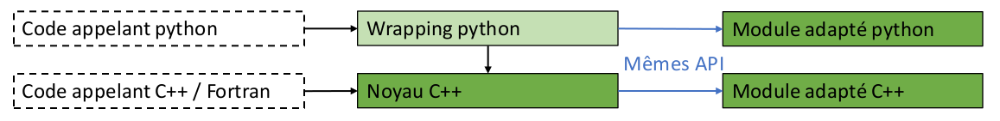

.. _core_architecture:

Structure et rôle du noyau
==========================

Définitions
-----------

Pour les cas d'usage qui vont suivre, on a deux acteurs "système" qui peuvent agir sur le noyau (voir :numref:`arch-img-1`):

    * les *modules adaptés*: logiciels qui sont développés par les partenaires, et leur propriété, et qui viennent se greffer sur le noyau. Il y en a deux types: les *modules adaptés C++* et les *modules adaptés python*

    * les *codes client*: ce sont les logiciels des partenaires susceptibles d'appeler Mordicus (e.g. Salome, Scilab, ODYSSEE...). On distingue ceux écrit en langage compilé et ceux écrits en python

    * les *autres dépendances logicielles*: tous les éléments logiciels dont dépend un module

    Position du noyau en lien avec les autres éléments logiciels

Cas d'usage du noyau
--------------------

Z.01 - Un module adapté A appelle une fonction d'un module adapté B
~~~~~~~~~~~~~~~~~~~~~~~~~~~~~~~~~~~~~~~~~~~~~~~~~~~~~~~~~~~~~~~~~~~

Exigence fonctionnelle: les versions de A et B doivent être compatible. Si B change d'API, A doit pouvoir savoir qu'il doit utiliser une ancienne version de A et pouvoir la charger.

Z.02 - Un module adapté A transmet des données à un module adapté B
~~~~~~~~~~~~~~~~~~~~~~~~~~~~~~~~~~~~~~~~~~~~~~~~~~~~~~~~~~~~~~~~~~~

Exigence fonctionnelle: ces données ne peuvent être que d'un type dont la structure interne est définie dans le noyau. Donc A et B dépendent d'une version du noyau.

Z.03 - Accéder à une fonction réccurrente du noyau depuis un module adapté
~~~~~~~~~~~~~~~~~~~~~~~~~~~~~~~~~~~~~~~~~~~~~~~~~~~~~~~~~~~~~~~~~~~~~~~~~~

Z.04 - Certifier qu'un module adapté est compatible avec une certaines version du noyau et de module dont il dépend 
~~~~~~~~~~~~~~~~~~~~~~~~~~~~~~~~~~~~~~~~~~~~~~~~~~~~~~~~~~~~~~~~~~~~~~~~~~~~~~~~~~~~~~~~~~~~~~~~~~~~~~~~~~~~~~~~~~~

Z.05 - Connaitre la version du noyau et des autres modules adaptés dont un module adapté A dépend
~~~~~~~~~~~~~~~~~~~~~~~~~~~~~~~~~~~~~~~~~~~~~~~~~~~~~~~~~~~~~~~~~~~~~~~~~~~~~~~~~~~~~~~~~~~~~~~~~

Z.06 - Un code client écrit en python appelle des implémentations de modules adaptés A et B
~~~~~~~~~~~~~~~~~~~~~~~~~~~~~~~~~~~~~~~~~~~~~~~~~~~~~~~~~~~~~~~~~~~~~~~~~~~~~~~~~~~~~~~~~~~

Z.07 - Un code client écrit en langage compilé appelle des implémentations de modules adaptés A et B
~~~~~~~~~~~~~~~~~~~~~~~~~~~~~~~~~~~~~~~~~~~~~~~~~~~~~~~~~~~~~~~~~~~~~~~~~~~~~~~~~~~~~~~~~~~~~~~~~~~~

Z.08 - Un code client écrit en langage compilé appelle une exécution de modèle réduit directement dans un module adapté (sans passer par un intermédiaire du noyau)
~~~~~~~~~~~~~~~~~~~~~~~~~~~~~~~~~~~~~~~~~~~~~~~~~~~~~~~~~~~~~~~~~~~~~~~~~~~~~~~~~~~~~~~~~~~~~~~~~~~~~~~~~~~~~~~~~~~~~~~~~~~~~~~~~~~~~~~~~~~~~~~~~~~~~~~~~~~~~~~~~~~

Z.09 - Un code client python générique écrit dans le noyau appelle des implémentations de modules adaptés A et B pour les opérations spécifiques
~~~~~~~~~~~~~~~~~~~~~~~~~~~~~~~~~~~~~~~~~~~~~~~~~~~~~~~~~~~~~~~~~~~~~~~~~~~~~~~~~~~~~~~~~~~~~~~~~~~~~~~~~~~~~~~~~~~~~~~~~~~~~~~~~~~~~~~~~~~~~~~~

Z.10 - Idem que Z.06 ou Z.09, mais les résultats (champs et maillages) sont lus dans un format différent de celui qui les manipule ensuite
~~~~~~~~~~~~~~~~~~~~~~~~~~~~~~~~~~~~~~~~~~~~~~~~~~~~~~~~~~~~~~~~~~~~~~~~~~~~~~~~~~~~~~~~~~~~~~~~~~~~~~~~~~~~~~~~~~~~~~~~~~~~~~~~~~~~~~~~~~

Z.11 - Connaître les modules adaptés disponibles par défaut dans une installation de Mordicus
~~~~~~~~~~~~~~~~~~~~~~~~~~~~~~~~~~~~~~~~~~~~~~~~~~~~~~~~~~~~~~~~~~~~~~~~~~~~~~~~~~~~~~~~~~~~~

Z.12 - Connaître les modules adaptés chargeables en tant qu'extensions dans une installation de Mordicus
~~~~~~~~~~~~~~~~~~~~~~~~~~~~~~~~~~~~~~~~~~~~~~~~~~~~~~~~~~~~~~~~~~~~~~~~~~~~~~~~~~~~~~~~~~~~~~~~~~~~~~~~

Z.13 - Charger / décharger un module adapté disponible en tant qu'extension
~~~~~~~~~~~~~~~~~~~~~~~~~~~~~~~~~~~~~~~~~~~~~~~~~~~~~~~~~~~~~~~~~~~~~~~~~~~

Z.14 - Activer / désactiver les autres dépendances logicielles d'un module (appelé par Z.13)
~~~~~~~~~~~~~~~~~~~~~~~~~~~~~~~~~~~~~~~~~~~~~~~~~~~~~~~~~~~~~~~~~~~~~~~~~~~~~~~~~~~~~~~~~~~~

Z.15 - Compiler un module adapté en se basant sur une version du noyau
~~~~~~~~~~~~~~~~~~~~~~~~~~~~~~~~~~~~~~~~~~~~~~~~~~~~~~~~~~~~~~~~~~~~~~

"en se basant sur": fichiers d'en-tête, version des dépendances du noyau (numpy etc), version des implémentations du noyau.

La procédure de compilation est-elle entièrement écrite ou laissée à la main du développeur (lequel doit alors utiliser des variables d'environnement codifiées pour les paramètres dépendant du noyau) ?

Z.16 - Charger un module adapté en se basant sur un packaging binaire
~~~~~~~~~~~~~~~~~~~~~~~~~~~~~~~~~~~~~~~~~~~~~~~~~~~~~~~~~~~~~~~~~~~~~

On considère que le cas où on se base sur le code source est couvert par Z.15.

Z.17 - Fournir des informations pour la compilation d'un code client compilé dépendant de Mordicus
~~~~~~~~~~~~~~~~~~~~~~~~~~~~~~~~~~~~~~~~~~~~~~~~~~~~~~~~~~~~~~~~~~~~~~~~~~~~~~~~~~~~~~~~~~~~~~~~~~

Z.18 - Fournir des informations pour l'exécution d'un code client dépendant de Mordicus
~~~~~~~~~~~~~~~~~~~~~~~~~~~~~~~~~~~~~~~~~~~~~~~~~~~~~~~~~~~~~~~~~~~~~~~~~~~~~~~~~~~~~~~

Z.19 - Connaitre l'ensemble des modules chargés à un instant donné et leur version ("configuration" d'une install Mordicus)
~~~~~~~~~~~~~~~~~~~~~~~~~~~~~~~~~~~~~~~~~~~~~~~~~~~~~~~~~~~~~~~~~~~~~~~~~~~~~~~~~~~~~~~~~~~~~~~~~~~~~~~~~~~~~~~~~~~~~~~~~~~

Z.20 - Mettre une install de Mordicus dans une configuration donnée (en chargeant les modules qu'il faut)
~~~~~~~~~~~~~~~~~~~~~~~~~~~~~~~~~~~~~~~~~~~~~~~~~~~~~~~~~~~~~~~~~~~~~~~~~~~~~~~~~~~~~~~~~~~~~~~~~~~~~~~~~

Z.21 - Exposer au noyau l'API supplémentaire d'un module adapté
~~~~~~~~~~~~~~~~~~~~~~~~~~~~~~~~~~~~~~~~~~~~~~~~~~~~~~~~~~~~~~~

Z.22 - Exposer directement à un code client l'API supplémentaire d'un module adapté
~~~~~~~~~~~~~~~~~~~~~~~~~~~~~~~~~~~~~~~~~~~~~~~~~~~~~~~~~~~~~~~~~~~~~~~~~~~~~~~~~~~

**Cas d'usage sur la distribution et/ou le packaging**

Z.23 - Mettre à disposition le code source du noyau de Mordicus et les modules adaptés Open Source
~~~~~~~~~~~~~~~~~~~~~~~~~~~~~~~~~~~~~~~~~~~~~~~~~~~~~~~~~~~~~~~~~~~~~~~~~~~~~~~~~~~~~~~~~~~~~~~~~~

Rappel: le noyau de Mordicus est Open Source

Z.24 - Compiler le code source du noyau de Mordicus et les modules adaptés Open Source dans une certaine version
~~~~~~~~~~~~~~~~~~~~~~~~~~~~~~~~~~~~~~~~~~~~~~~~~~~~~~~~~~~~~~~~~~~~~~~~~~~~~~~~~~~~~~~~~~~~~~~~~~~~~~~~~~~~~~~~

Z.25 - Installer le code source du noyau de Mordicus et les modules adaptés Open Source en récupérant un "packaging" pré-compilé
~~~~~~~~~~~~~~~~~~~~~~~~~~~~~~~~~~~~~~~~~~~~~~~~~~~~~~~~~~~~~~~~~~~~~~~~~~~~~~~~~~~~~~~~~~~~~~~~~~~~~~~~~~~~~~~~~~~~~~~~~~~~~~~~

Z.26 - Produire un "packaging" du code source de Mordicus et MA Open Source
~~~~~~~~~~~~~~~~~~~~~~~~~~~~~~~~~~~~~~~~~~~~~~~~~~~~~~~~~~~~~~~~~~~~~~~~~~~

Z.27 - Produire un "packaging" d'un module adapté non Open Source
~~~~~~~~~~~~~~~~~~~~~~~~~~~~~~~~~~~~~~~~~~~~~~~~~~~~~~~~~~~~~~~~~

Non "Open source": donc ce packaging est nécessairement binaire.

Ebauche d'architecture
======================

Préambule: dans le travail sur l'architecture de Mordicus, il a été convenu que Mordicus comporte 4 **briques fonctionnelles de base**. Elles sont rappelés ci-dessous, ainsi que la correspondance avec la maquette actuelle:

    Briques fonctionnelles de base de Mordicus

Dans ce cadre, afin que les modules puissent interagir, le noyau définit des *interfaces* pour chacune de ces briques de base (voir plus loin) que les modules adaptés devront *implémenter*. Le travail de spécification fonctionnelle de ces *interfaces* a été mené séparément, depuis un an et demi, par une maquette python et un travail papier.

Architecture Python / C++
-------------------------

Les cas d'usage font remonter un usage python et C++. L'architecture d'ensemble retenue est la suivante:

    Position du noyau en lien avec les autres éléments logiciels

Cette architecture présente les avantages suivants:

   * elle est classique à mettre en oeuvre (il est classique d'appeler du C++ depuis du python, l'inverse est plus compliqué);

   * elle est portable.

Cette architecture permet de répondre aux cas d'usages Z.01 - Z.03 et Z.06 - Z.09. Néanmoins, pour ces cas d'usages, l'appel de *modules adaptés python* n'est pas possible depuis des *codes client compilé*. Il doivent être recodés. Néanmoins, cette transcription devrait être facile dans la mesure où les modules adaptés implémentent une interface définie dans le noyau, pour laquelle les structures de données manipulées et le mapping ont été définis.

Pour faciliter la transcription, il est recommandé au développeurs python d'utiliser dans la mesure du possible des outils qui ont un équivalent en C++. Il existe énormément d'outils disponibles librement en python, donc cette recommandation ne saurait être une obligation.

Composition du noyau
--------------------

Au vu des cas d'usage, on propose un noyau qui se composerait de 4 composants, voir :numref:`arch-img-3`:

   #. composant **Définition des types de données et prototypes de fonctions**

   #. composant **Implémentation de fonctions réccurrentes ou génériques**

   #. composant **Supervisuer de modules** qui supervise les relations entre code appelant et modules et entre les module entre eux

   #. composant **Procédure d'installation**.

    Composition et rôle du noyau en lien avec les autres acteurs

Dans la suite de cette section, on dit de quels fichiers sont constitués ces composants et comment ils sont agencés. On dira plus tard comment ces fichiers sont utilisés par les cas d'usage. On discute du choix de format pour ces fichiers pour envisager différentes solutions technos.

Règles de base de la logique de fonctionnement
~~~~~~~~~~~~~~~~~~~~~~~~~~~~~~~~~~~~~~~~~~~~~~

La logique de fonctionnement des modules adaptés est la suivante:

   * un module adapté **implémente** les fichiers contenus dans le composant **Définition des types de données et prototypes de fonctions** du noyau. Soit:

       - pour C++, des fichiers de définition des prototypes de fonctions et types de données

       - pour python, les fichiers python produits par le wrapping

   * le module adapté n'est pas obligé d'implémenter toute l'interface

   * le module adapté peut déclarer à l'extérieur d'autres fonctions et méthodes. Dans ce cas, il les affiche à l'aide de fichiers ``.h`` ou ``.py`` similaires à ceux du noyau.

   * tous les éléments publics d'un module adapté doivent être déclarés dans les fichiers ``.h`` soit du noyau, soit supplémentaires ci-dessus.

Les modules adaptés C++ sont constitués d'un ".so" par brique de base de Mordicus. Les ``.h`` supplémentaires peuvent définir de nouvelles fonctions mais pas de nouveaux objets.

La logique de fonctionnement du noyau est régie par les principes suivants:

.. tabularcolumns:: |l|l|

    +------------+------------------------------------------------------------------------+
    | Règle      | Enoncé                                                                 |
    +============+========================================================================+
    | Règle 1    | Une seule version d'un même module adapté peut être chargée à la fois  |
    +------------+------------------------------------------------------------------------+
    | Règle 2    | Les codes sources du noyau et des modules adaptés Open Source sont dans|
    |            | le même dépôt                                                          |
    +------------+------------------------------------------------------------------------+
    | Règle 3    | Un module est toujours compilé et testé en lien avec une installation  |
    |            | existante de Mordicus                                                  |
    +------------+------------------------------------------------------------------------+
    | Règle 4    | Une fois la première installation de Mordicus effectuée, il n'est plus |
    |            | possible de modifier les modules disponibles par défaut. Autrement     |
    |            | dit, un module disponible par défaut a été installé lors de la même    |
    |            | opération que l'installation du noyau                                  |
    +------------+------------------------------------------------------------------------+
    | Règle 5    | Il est possible d'ajouter un nouveau module, ou une nouvelle version   |
    |            | de module à une installation existante, en tant qu'extensions.         |
    |            | Les extensions sont stockées dans un sous-répertoire dédié             |
    |            | du répertoire d'installation                                           |
    +------------+------------------------------------------------------------------------+
    | Règle 6    | Il est possible de charger ou décharger dynamiquement des modules      |
    |            | qui font partie des extensions. Quand un module chargé est une autre   |
    |            | version d'un module par défaut, il la remplace (temporairement,        |
    |            | le temps que le module reste chargé)                                   |
    +------------+------------------------------------------------------------------------+
    | Règle 7    | A discuter: du point de vue du code client, les chargement/déchargement|
    |            | de modules adaptés se font *at run time*, c'est à dire juste avant     |
    |            | d'appeler l'exécutable du code client lié à Mordicus. C'est donc de la |
    |            | responsabilité du client de mettre Mordicus dans la configuration      |
    |            | voulue juste avant d'appeler son exécutable. Le noyau fournit des      |
    |            | fonctions pour cela.                                                   |
    +------------+------------------------------------------------------------------------+
    | Règle 8    | Le chargement/déchargement de modules ne doit pas se traduire par des  |
    |            | opérations sur le système de fichiers dans l'install Mordicus (cas où  |
    |            | l'install Mordicus est utilisée simultanément par plusieurs processus) |
    +------------+------------------------------------------------------------------------+

On peut voir sur le schéma ci-après la suite des opérations d'installation du noyau.

    Suite des opérations d'installation du noyau et de modules adaptés open source

On peut voir sur le schéma ci-après la suite des opération d'installation, ou de modification d'installation de Mordicus et ses modules.

    Suite des opérations d'installation du noyau et de modules adaptés open source

On résume ci-après ce qui relève de la responsabilité du noyau - et donc du consortium - et ce qui est de la responsabilité de chaque partenaire développeur de module (voir également :numref:`arch-img-4` et :numref:`arch-img-5`):

.. tabularcolumns:: |l|l|

    +------------+------------------------------------------------------------------------+
    |            | Fonctionnalités                                                        |
    +============+========================================================================+
    | De la responsabilité du noyau, donc du consortium                                   |
    +------------+------------------------------------------------------------------------+
    |            | L'hébergement du code source du noyau + modules adaptés Open Source    |
    |            | dans un dépôt unique                                                   |
    +------------+------------------------------------------------------------------------+
    |            | La compilation du code source du noyau + modules adaptés Open Source   |
    |            | dans une procédure indépendante de la plateforme (CMake, etc.)         |
    +------------+------------------------------------------------------------------------+
    |            | Structure et contenu du répertoire de build du noyau                   |
    +------------+------------------------------------------------------------------------+
    |            | Structure et contenu du répertoire de build d'un module                |
    +------------+------------------------------------------------------------------------+
    |            | Ajout d'un module en tant que dispo par défaut                         |
    +------------+------------------------------------------------------------------------+
    |            | Ajout d'un module en tant qu'extension, à partir d'un répertoire de    |
    |            | build                                                                  |
    +------------+------------------------------------------------------------------------+
    |            | Chargement/déchargement d'un module                                    |
    +------------+------------------------------------------------------------------------+
    | De la responsabilité de chaque partenaire                                           |
    +------------+------------------------------------------------------------------------+
    |            | Le packaging et la distribution du noyau + modules adaptés Open Source |
    +------------+------------------------------------------------------------------------+
    |            | L'hébergement du code source d'un module adapté non open source        |
    +------------+------------------------------------------------------------------------+
    |            | L'installation des autres dépendances logicielles d'un module adapté,  |
    |            | préalable à l'install de ce module adapté                              |
    +------------+------------------------------------------------------------------------+
    |            | La compilation du module adapté, tant que:                             |
    |            |                                                                        |
    |            |     -  la structure du répertoire de build produit est respectée       |
    |            |                                                                        |
    |            |     -  pour retrouver les éléments de l'install Mordicus existante dont|
    |            |        on a besoin, seules les variables d'environnement codifiées sont|
    |            |        utilisées                                                       |
    +------------+------------------------------------------------------------------------+
    |            | L'installation des autres dépendances logicielles d'un module adapté,  |
    |            | préalable à l'install de ce module adapté                              |
    +------------+------------------------------------------------------------------------+
    |            | Le packaging et la distribution d'un module adapté                     |
    +------------+------------------------------------------------------------------------+
    |            | Le téléchargement et la décompression (retour du format de package vers|
    |            | la structure du répertoire de build codifiée) d'un module adapté       |
    +------------+------------------------------------------------------------------------+

Constitution des différents composants + formats de fichiers possibles
~~~~~~~~~~~~~~~~~~~~~~~~~~~~~~~~~~~~~~~~~~~~~~~~~~~~~~~~~~~~~~~~~~~~~~

Le répertoire de build d'un module adapté est constitué des éléments suivants:

   * des **bibliothèques partagées** ``.so``, une par brique de base

   * un **fichier de version**: ce fichier indique la version du module, ainsi que la version du noyau et des modules dont on dépend qu'il est nécessaire d'avoir pour que le module adapté puisse fonctionner correctement. Ce fichier est généré à la compilation du module adapté, une fois que les tests sont passés. Il *certifie* la compatibilité du module adapté avec une certaine version du noyau et d'autres modules adaptés.

   * un **script d'activation des dépendances**: l'installation des dépendances est à la charge du partenaire qui installe le module. Néanmoins, certaines de ces dépendances peuvent être activées (par exemple via *module load* sous Linux) quand on active le module adapté. Le build du module doit donc fournir un script qui sera appelé par le noyau au moment de chargé le module, afin d'activer les dépendances. Le script peut contenir des variables qui ne seront remplies qu'à l'installation, en dépendance de la plateforme, via des substitutions de chaînes (post-installation).

    :label: arch-img-7
    :align: center
    :alt: Exemple de structure du répertoire source et répertoire de build d'un module adapté C++
    :figclass: align-center

    Exemple de structure du répertoire source et répertoire de build d'un module adapté C++

Composant par composant, le répertoire de build du noyau est constitué des éléments suivants:

   * le composant **Définition des types de données et prototypes de fonctions** est constitué de fichiers include, au format ``.h``, qui définissent des données internes (classes C++ avec attributs et fonctions), des objets manipulables uniquement par une interface (classes C++ avec uniquement des fonctions, l'attribut internal storage ne peut être affiché car on ne connaît pas son type), et des opérations (liste de fonctions C++).

   * le **wrapping python** de ces objets contient:
     
       - des fichiers qui définissent des classes et fonctions python, d'extension ``.py``. En général ils sont générés. Le contenu dépend de l'outil utilisé pour le wrapping.
        
       - des fichiers qui définissent le mapping : leur syntaxe dépend de l'outil utilisé (exemple fichiers ``.i`` pour SWIG)

       - des fichiers générés pour faire pour permettre au python d'appeler le C++, qui sont en général générés à partir des deux premiers.

   * le composant **Implémentation de fonction réccurente ou générique** est consistué d'une bibliothèque partagée ``.so`` ou ``.dll`` par brique de base de Mordicus

Enfin, dans le répertoire de build, le composant **Superviseur de modules** est constitué des éléments suivant:

   * un **fichier de configuration des modules par défaut**: nom et versions des modules disponibles par défaut. Ce fichier est généré à l'installation de Mordicus et ne doit plus changer ensuite.

   * un **fichier contenant les chemins relatifs des éléments logiciels** (chemins des exécutables, bibliothèques, packages python...) qui pourront être fournis à un code client: chemins à ajouter au ``PYTHONPATH``, au ``PKG_CONFIG_PATH``, au ``PATH``, à ``LD_LIBRARY_PATH``, flags de compilation pour que le code client dispose de tout ce qu'il faut pour ce linker avec ou appeler Mordicus. La syntaxe de ce fichier doit être unique. La méthode par laquelle l'installation finale (qui est gérée par chaque partenaire) fournit ces informations variera en fonction du packaging de chaque partenaire: fichier ``.pc`` si *pkg-config* est utilisé, fichier ``.lua`` pour une installation sous forme de modules Linux etc. Néanmoins, afin de trouver ces informations et pouvoir les traiter lors du packaging (pour générer ces ``.pc``, ``.lua``), elles doivent être données sous une forme unique dans le répertoire de build.

   * un **programme collectant ces chemins dans les différents modules adaptés** afin de de générer le fichier précédent en;

   * un **programme shell pour charger /décharger un module adapté** dynamiquement *at run time* (juste avant d’appeler l’exécutable du code client). Elle doit pouvoir appeler le script fourni par le module pour activer ses dépendances. Elle vérifie, à l'aide des fichiers de version des modules, que la cohérence des dépendences entre modules est préservée lors du chargement, à l'aide des fichiers de config des modules.

   * faut-il une fonction *C++*, que le développeur du code client pourra intégrer à son code, pour faire la même chose *durant l'exécution* du code client ? Par exemple en utilisant *dlopen*...

   * un **programme retournant l’ensemble des modules chargés à un instant dans une exécution de Mordicus**, sous forme d'un *fichier de configuration*. Le développeur du code client, une fois qu'il a compilé et testé son code qui appelle Mordicus, pourra ainsi générer ce fichier de configuration et le conserver dans les sources du code client. Ainsi, le code client pourra mettre une installation de Mordicus dans cet état avant de s'exécuter, de sorte que l'utilisateur du code client dispose toujours de la bonne version de Mordicus.

   * un **programme shell qui met une install de Mordicus dans un état donné** en chargeant / déchargeant les versions de modules spécifiés par un *fichier de configuration*, *at run time* (juste avant l'exécutable du code client). Faut-il une fonction C++ que le développeur du code client puisse intégrer dans son code pour faire la même chose *durant l'exécution* ?

   * une fonction qui vérifie la concordance entre une version de Mordicus et un *fichier de configuration*.

   * un **répertoire "default"** contenant tous les répertoires de build des modules par défaut

   * un **répertoire "extensions"** contenant tous les répertoires de build des modules chargeables comme extensions

    :label: arch-img-8
    :align: center
    :alt: Exemple de structure du répertoire source du noyau
    :figclass: align-center

    Exemple de structure du répertoire source du noyau. Le répertoire de build s'en déduit aisément

Utilisation des composants par les cas d'usage
~~~~~~~~~~~~~~~~~~~~~~~~~~~~~~~~~~~~~~~~~~~~~~

.. todo::

   A écrire

Découpage des tâches et choix des technos
~~~~~~~~~~~~~~~~~~~~~~~~~~~~~~~~~~~~~~~~~

Découpage des tâches:

   * réécrire les interface de la maquette actuelle en format ``.h``

   * spécifier le mapping et implémenter le wrapping python en partant d'un échantillon de l'interface actuel (pris sur la maquette python). Choix techno: *pybind11* ?

   * recoder en C++ les fonctions génériques et réccurentes de la maquette actuelle

   * implémenter les programmes du superviseur de modules listés ci-dessus. Choix techno ? Ne pas réinventer l'eau tiède, réutiliser un maximum d'outils libres existants

   * mettre en place un dépôt de source et une procédure de compilation (indépendante de la plateforme, et produisant à la fin un fichier de configuration par défaut. Choix techno ?) pour ce qui précède

   * coder un exemple de module adapté et sa procédure de compilation (produisant à la fin un fichier de version)

   * coder un exemple de packaging, distribution, installation du noyau, vérifier la fonctionnalité de l'ensemble de la chaine

   * coder un exemple de packaging, distribution, installation d'un module, vérifier la fonctionnalité de l'ensemble de la chaine 

   * etc.

.. todo:: 

  A compléter
