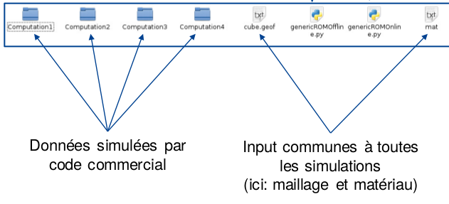

.. _class_diagram:

Description of version v0 of the datamodel
==========================================

Foreword
--------

This section summarizes the *domain model* of the scope that Mordicus should cover. It is not (yet) an *implementation model*: it does not say how things will effectively be implemented in Mordicus, though it gives a first hint. For instance, a *classifier* in this diagram will not necessarily lead to a *class* in Mordicus. But it does describe the structure of data that will be employed in Mordicus.

This *domain model* identifies all data Mordicus will need direct access to. It puts together the information pieces needed to get data science methods in Mordicus to work. Therefore, information about the modeled physics or about the PDE solving techniques scarcely appear in this data model. When not needed by the data science method, this information is deemed internal to the solver, or internal to a custom method called by Mordicus, and therefore it does appear in the data model.

Overview of the model
---------------------

The full *domain model* is presented under the form of a class diagram on :numref:`full_model`. In hard to read in this state, so we'll go into details in the coming paragraphs, and the data model is available for interactive consultation on the open software Modelio, with the zip file at this link :download:`zip <data/Mordicus_Datamodel.zip>`.

.. _full_model:
.. figure:: images/REFERENCE_CLASS_DIAGRAM.pdf

   Full representation of the data model

Data simulation part
--------------------

Model reduction technique (ROM) allow a tremendous reduction of the complexity of parametrized problems, by means of data treatments of pre-computed "high-dimentional" solutions. The treatment often depends on the nature of the equations underlying the given problem.

.. _case_data:

Defining the case
^^^^^^^^^^^^^^^^^

Making use of this techniques, the first step consists in specifying the parametrized problem - at least the features ROM techniques depend on - and the possibly available pre-computed "high-dimentional" solutions.

This is achieved by means of **CASE_DATA**, which is the "root" class of the data model, see :numref:`v0_zoom1`. It gathers the numerical description of the physical problem to solve. It defines as attributes the *inputs* and *outputs* that will be made public to the black-box user of the reduced-order model, as well as the available *computed_solutions*, either pre-computed or computed as part of the offline procedure. These will be detailed in io_indexing_.

.. _v0_zoom1:
.. figure:: images/v0_zoom1.pdf

    Zoom on the case definition

In addition, it owns:

 -case_reference       uniquely identifies the case in a catalog, or in all cases that were once opened with this installation of Mordicus
 -case_documentation   (optional) a file documenting the case

Except for this, the case contains all data not subjected to reduction. A **SOLVER_DATASET** object gathers all data to be provided to the external "high-dimentional" solver to reproduce (or merely produce) the solution of such a *nominal* case, i.e. with default values for varying parameters. For almost all solvers, it consists in:

 -instruction_file     a file of instructions that the solver is able to interprete
 -resolution_data      all supplementary data to the main instruction file. 

*Resolution data* have to be readable by the external solver and referenced by Mordicus, so only *ResolutionDataInTypes* are supported: those are the *builtin* data types (i.e. those of C++ or python, not the specific classes in Mordicus), or a file.

So the *SOLVER_DATASET* object owns all data provided to the solver according to which we can not reduce, even if we wanted to. For instance, a purely numerical parameter, or some solver configuration parameter, or a file decribing an initial state.

It references a **FIXED_PARAMETERS** object that could have varied - in the sense that the reduction method would be suitable for this, but we chose to keep it fixed. For instance, a fixed material coefficient. The attributes are:

 -value                the value of fixed parameter
 -ref_insertion_jdd    a string identifier that relates to the main instruction file and says how the value is used

 .. todo::
     In the *domain model* as drawn up, *FIXED_PARAMETER* and *VARIABLE_PARAMETER* only supports real values. It's important in the future to extend this at least to: input time signal and discrete support. Indeed, variable input time signals are the common varying data for a family of reduction techniques mainly for linear problems. As for discrete supports, they come into play in advanced method with a non-parametrized variable geometry. It's important to support both in Mordicus, which does seems too complicated given that the corresponding objects exist (respectively *QUANTITY_OF_INTEREST* and *DISCRETE_SUPPORT* to be explained later).

In addition, *SOLVER_DATASET* references an **EXTERNAL_SOLVING_PROCEDURE** object that caracterizes the external solving tool to Mordicus. This object does not represent the solver itself, that shall not be included in Mordicus, but it says how to call it. For this, it has the following attributes:

 -solver_name                  a unique identifier for this installation of this external solver tool
 -solver_version               a string indicating the version of the solver
 -environment_variables        an optional dictionary of environment variables to set before calling
 -root_install_dir             the root install directory of the solver (may be in environment_variables too)
 -solver_call_procedure_type   one of "Python", "shell", "FMI". Channel through which to call the solver
 -procedure_to_call_solver     the file implementing the calling procedure. It is the shell or python script calling the external tool.
 -postpro_datadriver_callback  a *STANDARD_FUNCTION_DECLARATION*, specifies the expected interface for
                               potential callback in the Mordicus standard that the user may want to call
                               after the solver, in order to convert the results to Mordicus data type.

Discrete support: a generalization of the mesh
^^^^^^^^^^^^^^^^^^^^^^^^^^^^^^^^^^^^^^^^^^^^^^

Among the objects assembled by *CASE_DATA*, one deserves special attention: the **DISCRETE_SUPPORT**. The numerical description of the problem to solve almost always relies on *discrete supports*, at least for time and space, that play specific roles during the reduction process and for the reconstruction of reduced results.

The *DISCRETE_SUPPORT* is a common data type to specify *definition domains* in space, time or parameter. *Definition domains* may also be defined by a cartesian product of discrete supports implicitely: the result *discrete support* of the cartesian product is not computed, it would be too heavy in memory.

.. _v0_zoom2:
.. figure:: images/v0_zoom2.pdf

   Zoom on the notion of discrete support

.. todo::
   Represent this ability to do cartesian products on the datamodel by a reference of *DISCRETE_SUPPORT* onto itself.

In this way, space, time and parameter-based *discrete supports* are instances of the same class. For instance, a 1D space mesh and a time discrete interval are represented by the same data structure. Nevertheless, *DISCRETE_SUPPORT* contains attributes (see :numref:`v0_zoom2`):

 -type                    into "space", "time", "parameter", "tensorial_product". Indicates the quantity the discrete support relates to.
 -topological_dimension   the dimention :math:`d` of the surrouding space, or the number of reals to give to define a point.
 -has_been_read           because mesh files can be heavy, their loading in memory can be delayed until needed:
                          this attributes tells wether the discrete support has been loaded in memory or it still has to be imported from a file
 -has_been_built          tells if the discrete support has been explicitely built or exists as a definition (e.g. "All points between 0 and 10 with a stride of 0.5")

.. todo::
    For not yet loaded mesh, add a file attribute.

A *DISCRETE_SUPPORT* is a hierarchy of entities in :math:`\mathbb{R}^N` (nodes, edges, faces,volumes), starting at the lowest level (dimension 0 objects) with *nodes* or *points*. **NODES** are defined straight by their *coordinates* attribute, whereas **POINTS** take their definition from a higher-level entity: consider the center of a finite-volume cell or a Gauss point (defined from a reference finite element) for instance.

The discrete support is conceptually a tree of **ENTITIES**, represented in the class diagram according to the composite design pattern (see :numref:`v0_zoom2`): leaf *entities* are nodes, and higher-level *entities* are defined from them on. Let take the example of a 3D mesh: in most cases, the volumes (level 3 entities) are defined straight from the nodes, intermediate entities (edges, surfaces) are omitted. They would be heavy in memory, and can be reconstructed by the viewer from the ordered list of "child" nodes. As for us, the support is merely defined as a tree of entities under the conditions that parent be at a strictly higher level than children, but no further condition. So, an entity has 2 attributes:

 -dim                          the "dimension" or "level" of the entity (0 for points and nodes, 1 for edges, 2 for faces, 3 for volumes)
 -reference_element_topology   a string qualifying the topology of the element. For instance: "triangle_3nodes", "triangle_6nodes", "hexaedron_8nodes" etc.
                               
 
 This *reference_element_topology* attribute allows to call a finite element logics, possibly coded by Mordicus modules, specifically for each type of element, for instance for specific reduction methods such as hyper-reduction. However, this logics is internal to such a module and the underlying internal data do not appear in Mordicus, which only needs to provide the module with a referenced element topology in a common list for each element in the mesh.

.. note::
    It is conceptually attractive to define each entity exclusively from the next lower level (edges from nodes, faces from edges etc), but as said this would imply heavy and unnecessary information: there is seldom the need, for instance, to define all faces of the mesh in the model. On the other side, it is comfortable for some methods to have faces available in the mesh, hence the choice to prescribe no further condition.

A *DISCRETE_SUPPORT* has the ability to tag groups of entities.

.. todo::
    Represent this ability in class diagram.

Only those features of *POINT* that persist after the local treatment of a finite element or a cell are published as attributes, as potential useful data to reduction procedures. For instance, for a Gauss point in the context of a finite element method, the reference coordinate, reference shape functions values and reference quadrature weights are *not* kept. They may be recovered upon request from the element characteristics, in particular *reference_element_topology*. But the real coordinates and quadrature weights are kept in a persistent *POINT* object: it will serve as a shortcut to reduction procedures such as empirical quadrature, which would then have not need to dig into the finite element logics.

.. _types_of_result:

Quantities of interest, fields and unknowns: the 3 kinds of results
^^^^^^^^^^^^^^^^^^^^^^^^^^^^^^^^^^^^^^^^^^^^^^^^^^^^^^^^^^^^^^^^^^^

The specified *outputs* to *CASE_DATA* may be of 3 kinds, see :numref:`v0_zoom3`, ranging from "closer to business user" to "closer to mathematical techniques":

    * quantities of interest

    * field

    * vector of unknowns.

.. _v0_zoom3:
.. figure:: images/v0_zoom3.pdf

   Zoom on the 3 kinds of results, and their structure in relation to the discrete support

The **QUANTITY_OF_INTEREST** class aims at equally representing signals from "physical" or "numerical" sensors of the case. In attribute *series_value*, it bears one value (possibly a vector, or a tensor) for each index in the indexing system of the case. It may originate from a post-processing of the simulation (for instance, flow through a section) or from experimental data. In other words, it is an observation on the system. Many times, the end business user is only interested in a few *quantities of interest* among the results of a simulation.

The semantic information giving context to these values is contained in the **QUANTITY_OF_INTEREST_STRUCTURE** object. That information is about:

    * the *physical nature* of the quantity, via a link to exactly one *PHYSICAL_QUANTITY* object,

    * the *origin* of data (the "sensor", in a broad sense, and its *localisation*),

    * the discrete support to associate with the series of data. It has to be 1D. In most cases, it represents *time* sampling, but not always: there are series based on frequencies or energy levels.

To support this information, *QUANTITY_OF_INTEREST_STRUCTURE* owns the following attributes:

 -experimental_or_simulation         does data originate from a physical sensor or numerical observation (post-processing)?
 -sensor_name                        a free label meant to use as a reference of the physical sensor. It needs not be unique, so that
                                     the same label can be used for different quantity measured at the same sensor location, or even
                                     by the same device (displacement and velocity, for instance)
 -integral_or_local                  in the simulation case, is the quantity of interest a punctual value of a field or is it obtained
                                     by an integral operation ?
 -description                        free field to describe the *type of measure*
 -series_or_value                    is the value a series (in most case) or just a value. In the latter case, no discrete support
                                     should be provided.

.. note::
    It is debatable that the *experimental_or_simulation* should be supported by *QUANTITY_OF_INTEREST_STRUCTURE*. One might want to have the same structure both for experimental and simulation data, in order to relate and compare them easily. For instance, for PBDW method, it is appreciable to know at a glance what the localisation operation is to get the numerical counterpart of an experimental signal.

.. todo::
    Put *experimental_or_simulation* in *QUANTITY_OF_INTEREST* instead ?

About the nature of the quantity, a *QUANTITY_OF_INTEREST_STRUCTURE* is associated with a single **PHYSICAL_QUANTITY**, an object that describes its physical *nature*. A physical quantity is composed of:

 -label                         explicit of the nature of the quantity. May be chosen in a preexisting list 
                                ("displacement", "velocity", "first Piloa-Kirschhoff stress"...) or a free value.
                                The preexisting list may be provided straight from other norms (CGNS) or systems of measurements.
                                One can never be exhaustive, so the user should still be able to provide a value not in a closed list.
 -unit                          Tells in what unit data is expected to be provided. Idem: adopt a system of measurement (SI, LH...) 
                                of one or the other norm.                      
 -tensor_order                  the order of the provided tensor values. 0 for scalars, 1 for vectors, 2 for matrices etc.
                                Not to be confused with the number of components in each direction,
                                that most of the times depends on the order of the underlying space (i.e.
                                the *topological dimension* N of the spatial discrete support.
 -extensive_or_intensive        Is the quantity intensive or extensive.
 -available_components          A exhaustive list with the names of possible component names for each value (for vectors and tensors).
                                For instance, for velocities, it will be 'Vx', 'Vy', 'Vz'

As for the support of the series of data, a series of data is nothing but a field with a support of topological dimension 1. So its structure is a special case of the *FIELD_STRUCTURE* to be seen next.

The **FIELD** class represents a set of "homogeneous" values (values corresponding to the same *PHYSICAL_QUANTITY*) spread out over a multi-dimensional discrete support. The physics of fields classically lays its interest in determining fields defined as a function of space, say :math:`f(\mathbf{X})`, with :math:`\mathbf{X}` the spatial coordinate. This is a continuous notion that needs a discrete representation to be usable by a computer. For this, an approximation space is used which consists in a finite combination of basis functions over the spatial domain :math:`\Omega`.

In all PDE discretizations methods, each coefficient related to a basis function is typically associated to an entity of the discrete support: in "standard" finite-volumes, that would be the center of the cells, in Lagrange or Hermite finite elements the nodes of the mesh, in some discontinuous Galerkin methods the edges and volumes etc.

These associations allow to build a discrete representation of the field under the form of a *vector of value* attribute qualified by a **FIELD_STRUCTURE**.

Following this, the *FIELD_STRUCTURE* references:

    * a single discrete support through *support* attribute;

    * a single *PHYSICAL_QUANTITY* through *quantity* attribute.

In addition to the expected size (*vector_size* attribute) of the vector of values, the *FIELD_STRUCTURE* is composed of *VALUE_SUPPORT*, each of which associates an index in the vector (*value_index* attribute) with an *entity* of the *discrete support*.

**VALUE_SUPPORT** has thus the following attributes:

 -value_index                    the index of the value of the first component associated with the entity
 -number_actual_components       the number of assigned components of the field at this entity
 -actual_components              the list of these assigned components, to be chosen among the *available_components* 
                                 of the *PHYSICAL_QUANTITY* of the field structure

The *FIELD_STRUCTURE* is also endowed with a *entity2validex* attribute, which provides the reverse connection of *value supports*: for a given entity, it returns the *value supports* relying on it. Through that information is conceptually redundant (it could be built from a reverse analysis of the *value supports*), it has to be kept in memory, and maintained up to date, for obvious performance purposes.

With this in mind, let us come back to the *localisation* description of *QUANTITY_OF_INTEREST_STRUCTURE*. For this, a new **RESTRICTION_FIELD_STRUCTURE** object is introduced. This object is used to qualify a vector of values that does not correspond to a full-dimensional field, but to the coordinates in a basis of a **subspace** of the original approximation space. There is a need for this in many circumstances:

    * performing DOF elimination (for instance a wall boundary condition in a CFD computation),
      
    * locating a sensor, specifying how to derive a *quantity of interest* from a *field*,
      
    * and obviously representing the reduced coordinates with respect to empirical modes.

The informations contained in *RESTRICTION_FIELD_STRUCTURE* allow to build a :math:`\mathbf{Z} \in \mathbb{R}^{N \times n}` matrix, that link the coordinates :math:`\mathbf{u} \in \mathbb{R}^N` of the full-space basis with the coordinates :math:`\mathbf{a} \in \mathbb{R}^n` in the reduced-space basis. This relation is:

    * typically :math:`\mathbf{u} = \mathbf{Z} \mathbf{a}` for DOF elimination, with :math:`\mathbf{Z}` a basis of the null-space of the the constraint matrix :math:`\mathbf{B}` (i.e. such that :math:`\mathbf{Z}` has full rank and :math:`\mathbf{B} \mathbf{Z} = 0`;

    * typically :math:`\mathbf{a} = \mathbf{Z}^T \mathbf{u}` to reproduce a sensor's signal from a field;

    * typically :math:`\mathbf{u} = \mathbf{Z} \mathbf{a}` for reduced coordinates with respect to modes, with :math:`\mathbf{Z}` the matrix of modes.

The full-space structure associated with :math:`\mathbf{u}` is provided with the *reference_field_structure* attribute. To support the above cases, the *RESTRICTION_FIELD_STRUCTURE* possesses a *left_or_right_Z* attribute that says whether the built :math:`\mathbf{Z}` matrix is defined as :math:`\mathbf{u} = \mathbf{Z} \mathbf{a}` (left) or :math:`\mathbf{a} = \mathbf{Z}^T \mathbf{u}` (right).

The columns of the Z-matrix can be defined:

    * as *FIELDS* by the *Z_columns* attribute,

    * as *VALUE_SUPPORTS* by the *trivial_Z_columns* attribute, that defines columns of the form :math:`\begin{pmatrix} \vdots \\ 0 \\ 1 \\ 0 \\ \vdots \end{pmatrix}` 

The *group* attribute allows to build a right :math:`\mathbf{Z}`-vector allowing to integrate the field over that group.

.. todo::
    Add attribute *excluded_supports* that would allow to include rather than exlude all *value supports* not specified, so that we can define a large Z by exclusion of some dofs, that corresponds to a few entities implied in linear constraints.

The third kind of result is the **VECTOR_OF_UNKNOWNS** class. This is often the primal unknown of the solver, the "state vector" (vector of discrete state variables) that the problem must determine and that may blend unknowns of different units: for instance, think of FSI cases with displacement, pressures etc. The values are contained in a *vector_of_doubles* attribute, qualified by a **VECTOR_OF_UNKNOWNS_STRUCTURE** class. This structure indicates, among the unknowns:

    * which ones correspond to *FIELD* values;

    * which one correspond to something else, i.e. *QUANTITY_OF_INTEREST* with or without associated localization of the discrete support. For instance, an algebraic Lagrange multiplier would have no link to the discrete support.

This is done by means of the following attributes:

 -primal_fields            an **ordered** list of fields, some values of which form part of the unknown vector
 -primal_qofs              an ordered list of quantities of interest, some values of which form part of the unknown vector
 -index2field              for an index in the *vector_of_doubles*, returns the field or quantity of interest it corresponds (remember these were ordered)
 -index2fieldindex         for an index in the *vector_of_doubles*, returns the corresponding index in the *field structure*

In addition to that, a *field_fieldindex2index* array is also provided as an attribute. For an input (field number, index in field structure), it returns the index in the unknown structure. Though this could be build from reverse analysis of the above, it has to be kept in memory and up-to-date for obvious performance purposes.

Say there are :math:`\mathcal{N}` unknowns. The same way we did for *RESTRICTION_FIELD_STRUCTURE*, we may be able to define a restriction mechanism *RESTRICTION_UNKNOWNS_STRUCTURE* to describe smaller vectors of unknows representing coordinates in subspaces of :math:`\mathbb{R}^{\mathcal{N}}`, based on *vector of unknowns* representing Z-columns. For the sake of clarity, int is not represented on the current data model.

.. _io_indexing:

Description of inputs and outputs, indexing mechanism
^^^^^^^^^^^^^^^^^^^^^^^^^^^^^^^^^^^^^^^^^^^^^^^^^^^^^

As was said in case_data_, the *CASE_DATA* object includes information about the *model* to be reduced. In other words, it has to describe the input/output of the transfer function, a reduced representation of which which be built by a "model reduction user", see :numref:`v0_zoom4`.

.. _v0_zoom4:
.. figure:: images/v0_zoom4.pdf

    Zoom on the input, outputs and indexing mechanism of the case

For this, the parameters according to which reduction will take place are defined as instances of the **VARIABLE_PARAMETERS** class. They have attribute:

 -name                         unique to identify the parameter in a function defining a definition domain, for instance
 -ref_insertion_jdd            as in case_data_, a string identifier that says how the the main instruction file of the external solver is affected by a change of this parameter
 -nature                       references a *PHYSICAL_QUANTITY*, thus giving the physical nature of the parameter and its unit

For a given case, these parameters are allowed to vary within a definition domain, which is represented by a **SUPPORT_INDEXATION** class. This is represented by attributes:

 -domain_axes                  **ordered** backward references to the parameters (possibly only by a name), in order to define the axes of the underlying parameter space
 -cartesian_bounds             for an axis, defines bounds for the parameters. The domain is then defined by cartesian product with the others.
 -bound_function               under the form of a *FUNCTION_OF_PARAMETER*, provides function :math:`f (\mu)` so that the parameter is within domain if :math:`f (\mu) \leq 0`

The *SUPPORT_INDEXATION* class also contains information on the expected evaluations of the *model*, by means of attributes:

 -design_of_experiments        a set of points, in the form of a *DISCRETE_SUPPORT*, that gives the evaluations that the reduction method will **all** expect to be done 
 -training_set                 a set of points, in the form of a *DISCRETE_SUPPORT*, defining all **possible** points for the reduction method at which to evaluate the model.
                               Particularly useful for RB methods, most of the times the high-dimentional model will only be evaluated on a few points in the end

.. todo::
    As mentioned in case_data_, *VARIABLE_PARAMETER* should support not only real values, but also series and discrete supports.

This describes the *input* of the model. As for the published *outputs*, there are qualified by an **OUTPUT_DESCRIPTION** object. This object has attributes:

 -returned_type                       among the three types defined in types_of_result_: "QUANTITY_OF_INTEREST", "FIELD" or "VECTOR_OF_UNKNOWNS"
 -structure_of_returned_obj           the structure of the returned object. Depending on the *returned_type*, should be an instance of *QUANTITY_OF_INTEREST_STRUCTURE*,
                                      *FIELD_STRUCTURE* or *VECTOR_OF_UNKNOWNS_STRUCTURE*
 -output_name                         an identifier for the output
 -ref_insertion_jdd                   (optional) potential identifier in the main instruction file

As the high-dimensional model is evaluated, it produces a collection of solutions **COLLECTION_SOLUTIONS_CAS** that aggregates instances of **INDEXED_SOLUTION**. As indexed solution is a solution corresponding to an expected *OUTPUT_DESCRIPTION* for the model (through *description* attribute), that is indexed by a point in the *domain of definition*, through *indexation* attribute. These *indexed solutions* are the type of data used for the snapshots in snapshot methods.

The **INDEXATION** object gives:

 -indexation_support                  reference to the indexation support
 -parameters_value                    a point in the definition domain
 -ordinal_number                      or alternatively, for indexing empirical modes (they do not correspond to a particular value of parameters), the ordinal number of the modes
                                      (1 being higher energy mode)

.. _offline_treatments:

Offline treatments
------------------

In the previous part, we have seen all structures related to the high-dimensional simulation - even if we'll see next that structures with reduced dimension rely on them too. This data serves as input to the *offline* procedures, that is to say all procedures necessary to build a reduced-order model from & high-dimentional one and its existing solutions.

Internal solving procedures and standard functions
^^^^^^^^^^^^^^^^^^^^^^^^^^^^^^^^^^^^^^^^^^^^^^^^^^

In the data model in its current state, the high-dimensional problem is solved by an external solver. As for the reduced model, for a maximal genericity the resolution code of the associated equations (ODEs, more often) will often be included in the Mordicus library: these approaches are called *non-intrusive*, and particularly useful when there is limited or no possible interaction with the external solver (e.g. commercial software). Moreover, a functional requirement of Mordicus is to support exporting the reduced-order model to standard formats (PXDMF, FMI...).

So besides the *EXTERNAL_SOLVING_PROCEDURE*, we introduce an *INTERNAL_SOLVING_PROCEDURE*, each of which is derived from an abstract **SOLVING_PROCEDURE**, see :numref:`v0_zoom5`.

.. _v0_zoom5:
.. figure:: images/v0_zoom5.pdf

   Offline treatments: zoom on custom procedures and functions

Conceptually, a *solving procedure* is a program that is able to evaluate a model - **reduced-order** or **full-order** - at a point of the parametric space. For now, in this *domain model*, *full-order* models are evaluated by *external procedures* and *reduced-order* models are by internal procedures. This is a restriction to be lifted in the future.

.. todo::
    Include in the *domain model* the case when the reduced resolution procedure calls an external solver (intrusive), still very useful in some cases

In practice, when the "model reducing user" will need to include a new kind of resolution in Mordicus (e.g. add a reduced resolution of thermal transient problems), he will have to create a new *RESOLUTION_PROCEDURE*. A *RESOLUTION_PROCEDURE* is the top-level "function" object of Mordicus datamodel. It's the only one that can be created by:

    * an end user or a module developer (for *EXTERNAL_SOLVING_PROCEDURE*)

    * a module developer (for *INTERNAL_SOLVING_PROCEDURE*)
 
So an **INTERNAL_SOLVING_PROCEDURE** is the top-level "custom function" object (functions not developed as a member of an existing Mordicus class). It deserves a peculiar treatment, with additional context and constrains because:

    * it should have a form that makes conversion to external formats (PXDMF, FMI...) easy

    * it should have enough information to be archived in a shared catalog of reduced-order models

    * there is many ODE's resolution procedures, of various techniques, and its not reasonable to ask the developer to do it by subclassing

    * developing a new solving procedure is expected to be, by far, the most frequent kind of development of module developers. It deserves a specific frame.

So that it can be found and called straight from its name, its implementation has to follow Mordicus guidelines (yet to be written). For instance, some demands to the module developer would read::

    Call it Internal_Procedure_NAME, implement in C++ and declare as extern "C" in a separate file Internal_Procedure_NAME.hpp
    Put source files in $MORDICUS_SOURCE_ROOT_DIR/src/internal_procedures
    Declare new procedure in the registry in $MORDICUS_SOURCE_ROOT_DIR/src/conf/registry.cfg

In addition to these coding principles and conventions, an *INTERNAL_SOLVING_PROCEDURE* declares its *interface*: its input arguments types should be chosen among acknowledged *offline* data structures. These are all types of *resolution data*, i.e. *offline* pre-computed data that is essential for the reduced-order model to run. For the reduction methods identified thus far in the hackathons, the comprehensive list is: *MATRIX*, *VECTOR_OF_UNKNOWN*, *REDUCED_DOMAIN*, *OPERATOR_DECOMPOSITION*, *COLLECTION_SOLUTION_CAS*, *STANDARD_FUNCTION_IMPLEMENTATION* (we'll come back to the latter case).

The attributes of the abstract *SOLVING_PROCEDURE* are:

 -procedure_reference            a identifier for the *procedure*, unique in the installation of Mordicus
 -nb_arguments                   the number of arguments of the procedure
 -resolution_data_type_in        the types of input arguments. By default, only the standard type and *File* type are supported
                                 However, in the *internal* case, additional data types are supported for input:
                                 *MATRIX*, *VECTOR_OF_UNKNOWN*, *REDUCED_DOMAIN*, *OPERATOR_DECOMPOSITION*, *COLLECTION_SOLUTION_CAS*, *STANDARD_FUNCTION_IMPLEMENTATION*

.. todo::
    Expand on the rules to implement internal procedures and conventions to reference them in the Mordicus installation.

In fact, ODE's resolution (possibly resulting from a disretization of PDE) is not the only *goal* we may have when writing a *SOLVING_PROCEDURE*. The other *goal* would be the computation of high-dimentional useful data to the reduction procedure (a mass matrix, for instance).

.. todo::
    Add *goal* attribute, with possible values "reduced-order model resolution" or "computing related data"

The *INTERNAL_SOLVING_PROCEDURE* owns attributes:

 -description_ode_pde               indicative attribute, describes the kind of ODE/PDE being solved, for easy indexing in a catalog
 -description_kind_of_problem       indicative attribute, describes the kind of physical problem being solved

.. note::
    In the current *domain model*, a frozen interface is not prescribed per goal. Doing so would require, for instance, for all reduced-order model resolution procedures to have interface ``SOLUTION_REDUITE* = Internal_Procedure_NAME(CAS_REDUIT_A_RESOUDRE*)``. We chose not to impose that because we believe it is not the module developer's responsability to extract the *offline* data from CAS_REDUIT_A_RESOUDRE, before running through the ODE's resolution. It is a standard operation Mordicus kernel should be in charge of.

The global registry of an installation of Mordicus registers two kinds of objects *SOLVING_PROCEDURE* and **STANDARD_FUNCTION_IMPLEMENTATION**. The *STANDARD_FUNCTION_IMPLEMENTATION* is the lower-level "custom function" object of Mordicus data model. By "custom function", we still mean a function that is not developed as a member of an existing class. *STANDARD_FUNCTION_IMPLEMENTATION* are meant for internal use, to fill in blanks in a higher level functions, for instance existing reduction methods or resolution procedure. Therefore, the developer has more freedom than with *INTERNAL_SOLVING_PROCEDURE* :

   * *STANDARD_FUNCTION_IMPLEMENTATION* have free interface among the data type of Mordicus, while *INTERNAL_SOLVING_PROCEDURE* has only a limited number of compatible data types;

   * *STANDARD_FUNCTION_IMPLEMENTATION* are subjected to lighter developement guidelines and conventions, and may be provided by the user during execution while *INTERNAL_SOLVING_PROCEDURE* should be loaded at runtime

For instance, some demands to the user could read::
    Be implemented in C++ and compiled separately, the file path being declared to Mordicus registry with a specific Mordicus instruction
    Abide by the interface of one of the "blank" operations known to mordicus registry
 
    We do not (yet) say how *STANDARD_FUNCTION_IMPLEMENTATION* and *INTERNAL_SOLVING_PROCEDURE* will be loaded or unloaded at runtime or even during execution (for the latter). But there are standard ways to do it even in compiled languages as C++, see e.g. here_.

.. _here: https://theopnv.com/dynamic-loading/

The *STANDARD_FUNCTION_IMPLEMENTATION* owns the following attributes:

 -implementor_id           an identifier for the registry, identifying this implementation among those sharing the same declaration 
 -implementor_file         the file implementing the function
 -expression               or a literal expression for the function (in simple cases)
 -implementor_language     the programming language used (C++ or python)

In order to verify that the provided implementations match the known blanks, calling and called functions should compare their interfaces. This is achieved by means of a **STANDARD_FUNCTION_DECLARATION** object, included in every implementation. It owns attributes:

 -func_name         function name, serves for Mordicus registry to generate the interface
 -input_types       types of input arguments, among all standard and Mordicus types
 -output_types      types of output arguments, among all standard and Mordicus types
 -namespace         the Mordicus namespace (package / class) the function should be put to

In the case of a calling *INTERNAL_RESOLUTION_PROCEDURES*, the expected prototypes of their *STANDARD_FUNCTION_IMPLEMENTATION* arguments is given by the *prototype_of_called_functions* attribute. Member functions of Mordicus classes, when declaring a "blank to be filled by a custom function", should provide the expected prototype hat goes along.

.. _compression:

Compression of data and compression of operators
^^^^^^^^^^^^^^^^^^^^^^^^^^^^^^^^^^^^^^^^^^^^^^^^

A reduction procedure is often made of two steps, see :numref:`v0_zoom6`:

   * a *data compression* phase, in which one or several *reduced-order bases* are generated,

   * an *operator compression* phase, which relies on these bases to build reduced-order *resolution data*, to be employed in a reduced-order resolution procedure

.. _v0_zoom6:
.. figure:: images/v0_zoom6.pdf

    Offline treatments: zoom on the reduction methods

A **COMPRESSION_OF_DATA** procedure uses high-dimensional solutions (snapshots) to build a few space functions, making up a *reduced order basis* (*BASE_ORDRE_REDUIT*), defining a smaller subspace where to look for the solution. Let :math:`Q \in \mathbb{R}^{N \times n_s}` be the snapshot matrix, with :math:`n_s` the number of snapshots. The autocorrelation matrix can be built as :math:`Q^T M Q`, with :math:`M` the matrix of the scalar product deemed relevant to the problem, or as :math:`Q Q^T` (method of snapshots).

Possible procedure parameters are:

 -method                     among the available algorithms available for this in the install (kernel+modules) of Mordicus
 -has_fixed_basis_size       True if the user wants to build fixed-size bases
 -fixed_basis_size           if so, the number of vectors to generate in the basis
 -scalar_product_matrix      the matrix of the scalar product to use to generate the covariance matrix

Two popular families of methods are the **METHOD_POD** and **RB_METHOD**. The first has procedure parameters:

 -is_snapshot_mathod         True if the snapshot method is used
 -SVD_variant                variant of the singular value decomposition algorithm used (full SVD, thin SVD...)
 -SVD_tolerance              the relative tolerance at which SVD should be truncated (if not *has_fixed_basis_size*)

The latter encompasses greedy selection / reorthogonalization method to build a reduce basis. An argument is the relative tolerance above which the current element should be selected to enrich the basis.

While the mechanisms of *COMPRESSION_OF_DATA* are somewhat independent of the kind of problem (they mostly rely on the correlation between computed solutions), the **COMPRESSION_OF_OPERATORS** methods are much more diverse and dependent of the features of the problem.

To be as common as possible, they take as inputs:

   * a *reduced order basis*,

   * high-dimensional resolution data, the size or complexity of which shall be reduced after they have been applied.

The **RESOLUTION_DATA_OBJECT** terminology encompasses all possible data thus taken as an input. It has a *type* attribute, to be chosen (for now) among "MATRIX", "VECTOR_OF_UNKNOWNS", "DECOMPOSITION_OF_OPERATORS" or "COLLECTION_SOLUTION_CAS". In the latter case, we refer to additional pre-computed results (dual fields, typically).

The *COMPRESSION_OF_OPERATORS* returns an object with a type listed by the **REDUCED_RESOLUTION_DATA_OBJECT**: "DOMAINE_REDUIT", "SOLUTION_REDUITE_CAS" (e.g. initial condition in reduced coordinates), "BASE_ORDRE_REDUIT" (additional basis necessary to the online phase, e.g. decomposition of a non-linear term by EIM) and the 3 types listed above.

These choices stem from the analysis of input and return types for the indentified *operator compression* methods thus far, summarized in the following table:

=====================================  ======================================================  =========================================
Method                                 Types of input resolution data                          Types of output resolution data
=====================================  ======================================================  =========================================
EIM (Empirical Interpolation Method)   COLLECTION_SOLUTION_CAS, VECTOR_OF_UNKNOWNS             DECOMPOSITION_OF_OPERATORS
EQM (Empirical Quadrature Method)      COLLECTION_SOLUTION_CAS                                 REDUCED_DOMAIN
PROJECTION                             MATRIX, VECTOR_OF_UNKNOWNS (full size)                  MATRIX, VECTOR_OF_UNKNOWNS (reduced size)
HYPER_REDUCTION                        COLLECTION_SOLUTION_CAS                                 REDUCED_DOMAIN
ECSW                                   COLLECTION_SOLUTION_CAS                                 REDUCED_DOMAIN, VECTOR_OF_UNKNOWNS
=====================================  ======================================================  =========================================

Decomposition of operators
^^^^^^^^^^^^^^^^^^^^^^^^^^

Among those types, the **DECOMPOSITION_OF_OPERATORS** data type deserves some attention, see :numref:`v0_zoom5`. It describes an operator expansion that splits variables, as:

.. math::

   A(x, \mu) \approx A_1 (x) f_1 (\mu) + A_2 (x) f_2 (\mu) + ... + A_n (x) f_n (\mu)`

Of course affine decomposition of the operators falls into that case. Notably, this kind of data structure is produced by an EIM. 

It consists of an ordered list of:
   * first, *resolution_data*, representing the :math:`A_i` terms in the expansion
    
   * and *functions of parameter*, representing the :math:`f_i (\mu)` terms in the expansion
     
A **FUNCTION_OF_PARAMETER** is a means to compute :math:`f_i (\mu)` as a subclass of *STANDARD_FUNCTION_INMPLEMENTATION* where all functions arguments are parameters idenfified by their names.

It is worth pointing that *COMPRESSION_OF_OPERATORS*, as well as *DECOMPOSITION_OF_OPERATORS*, may be provided with *means* to build the *resolution data* (instead of *resolution data* itself), with possible invokation of FEM or FV asemblers. In such cases, a *RESOLUTION_PROCEDURE* is given as argument, as the *build_HD_resolution_data* attribute of *COMPRESSION_OF_OPERATORS* shows.

.. todo::
    Enrich the datamodel to allow such feature for *DECOMPOSITION_OF_OPERATORS* as well. The expected return type (among *resolution data*) is also to be added in the data model.

Online treatments
-----------------

Once the compression phases of offline_treatments_ are achieved, the *offline* part of Mordicus should act as a "generator of reduced case". In other words, it should put together all useful data to the online phase, in a formalized data structure **CAS_REDUIT_A_RESOUDRE**.

Functional requirement on *CAS_REDUIT_A_RESOUDRE*: it should be self-contained, in order to be transfered and deployed on another architecture than Mordicus. In concrete terms, the *CAS_REDUIT_A_RESOUDRE* should have access to all necessary information for the completion of the *online* phase. It's somehow the "root" object of the *online* part of the *domain model*.

The data model for the *online* part has been designed according to the following principles:

    * as far as possible, data takes the same arrangement as the corresponding high-dimensional data. This mirroring structure has several advantages:

        - clarify the meaning of the objects and the reading of the data model,

        - enable a natural reconstruction of full-field solutions from their representation in reduced coordinates,

        - easy implementation of procedures equally applicable to full-size and reduced data

    * the *online* / *offline* distinction of the operations is made in terms of their complexity: an operation is prone to online treatment if the original size :math:`N` of the case does **not** appear in its complexity. As for the distinction on the data, a piece of data is said to belong to the *online* part if :math:`N` does not appear in its size. Note that this excludes the reduced-order basis. Data not fulfilling this condition should be avoided in *CAS_REDUIT_A_RESOUDRE*, however this is not always possible especially if autonomous reconstruction of full fields is desired.

.. todo::
    Move *BASE_ORDRE_REDUIT* on the *offline* side ?

The online data structures are summarized on :numref:`v0_zoom7`

.. _v0_zoom7:
.. figure:: images/v0_zoom7.pdf

    Zoom on the online treatments

Links of the reduced case with the resolution part
^^^^^^^^^^^^^^^^^^^^^^^^^^^^^^^^^^^^^^^^^^^^^^^^^^

This information is made of the reduced solver *REDUCED_RESOLUTION_PROCEDURE*, accompanied by the case-specific *REDUCED_RESOLUTION_DATA* that complement it (see compression_), both of which are gathered by the **REDUCED_SOLVER_DATASET** object, through its attributes, itself referenced by *CAS_REDUIT_A_RESOUDRE*. 

In accordance with the above, it can be easily seen that data is thus arranged as *SOLVER_DATASET* was around *INTERNAL_REDUCTION_PROCEDURE*: *REDUCED_SOLVER_DATASET* inherits *INTERNAL_SOLVER_DATASET* in order to include support for base *RESOLUTION_DATA_OBJECTS* (which the have reduced size) and *STANDARD_FUNCTION_IMPLEMENTATION*. 

.. note::
    For now, *REDUCED_RESOLUTION_DATA* does not inherit *RESOLUTION_DATA_OBJECT* so that types only used in the reduced case are clearly put apart.

Links of the reduced case with the input/output definition
^^^^^^^^^^^^^^^^^^^^^^^^^^^^^^^^^^^^^^^^^^^^^^^^^^^^^^^^^^

The mechanism for qualifying the user inputs and outputs of the reduced-order model (*CAS_REDUIT_A_RESOUDRE*) take a cue on the full-size counterpart (*CASE_DATA*), see io_indexing_. Indeed, variable input parameters are specified by *VARIABLE_PARAMETER* objects, referencing their *domain of definition* through an *INDEXING_SUPPORT*. Fixed parameters are now hidden, or available for consultation only. Outputs are qualified by a reference to *OUTPUT_DESCRIPTION* objects.

The indexing mechanism for classifying evaluations of the reduced-order model follow the very same rules as in io_indexing_: a *CAS_REDUIT_A_RESOUDRE* contains its evaluation through a **SOLUTION_REDUITE_CAS**, a class that inherits *INDEXED_SOLUTION* and its indexing mechanism.

.. note::
    For now, *CAS_REDUIT_A_RESOUDRE* does not inherit *CASE_DATA*, so that it can "hide" or "filter" information from the full size model. To be discussed. Add at least a possible reference to the original case?
   
    Attributes *case_reference* and *case_documentation* are nevertheless kept for obvious indicative purposes.

The reduced basis and representation in reduced coordinates
^^^^^^^^^^^^^^^^^^^^^^^^^^^^^^^^^^^^^^^^^^^^^^^^^^^^^^^^^^^

So that the solution can be easily reconstructed, *SOLUTION_REDUITE_CAS* is based on restricted structures (*RESTRICTION_FIELD_STRUCTURE* and *RESTRICTION_UNKNOWNS_STRUCTURE*), the underlying columns being nothing but the vectors of the reduced basis, see types_of_result_. Two cases can be indentified here:

   * the case when reconstruction has to be autonomous, the whole *field structure* and *discrete support* are then embarked when the reduced-order model is exported;

   * the case when performance is preferred. Then, when exported, the reduced-order model only keeps meta data about the *field structure* object (including a checksum), but does not embark futher information. Reconstruction of a field is then no longer possible, except if that structure is provided by some other means on the deployement side. Metadata then ensures some verifications.

The reduced basis is represented by **BASE_ORDRE_REDUIT** object that aggregates *VECTEUR_BASE_ORDRE_REDUIT* and owns qualifying attributes:

  -nb_dofs                   the size :math:`N` of each vector in the basis
  -dof_weights               (optional) in the case of a diagonal scalar product matrix,
                             the corresponding coefficient of each dof
  -is_orthogonal             True if the basis is orthogonal
  -role                      role of the basis in the *reduction of operators* mechanism
                             among "Galerkin", "Petrov-Galerkin left", "Petrov-Galerkin right"...
  -singular_values           the ordered list of singular values for each empirical mode

.. note::
    *BASE_ORDRE_REDUIT* does not inherit *COLLECTION_SOLUTION_CAS* for now, for clarity and because the attributes they own are quite different. Inheritance happens between the objects they aggregate

The **VECTEUR_BASE_ORDRE_REDUIT** object basically inherits the *INDEXED_SOLUTION* case, the indexation happening by *ordinal_number* attribute: the first (higher singular value) mode is indexed 1, the next 2 and so on.

The reduced domain object
^^^^^^^^^^^^^^^^^^^^^^^^^

Many reduction methods (Hyper-reduction, EQM, ECSW...) appeal to a selection of a few entities in the original *DISCRETE_SUPPORT* to compute relevant approximations of the integrals and operators. Therefore, a **REDUCED_DOMAIN** class is introduced to represent this notion.

The *REDUCED_DOMAIN* references its original *DISCRETE_SUPPORT*. However, this "filter" has itself to be a self-contained *DISCRETE_SUPPORT*, because it should be possible to export the reduced-order model without embarking the whole original *support* for performance purposes. In this case, only metadata about the original support are kept when exporting.

According to the method, the *REDUCED_DOMAIN* can be a subdomain with the same kind of entities as the original support: in other words, it's a true FEM mesh, as in the *HYPER_REDUCTION* method for instance. In other cases, it is merely a cloud of *POINTS* defining a global quadrature scheme, the associated weights being then borne by a *quadrature_weights* attributes.

What piece of data each use case employs
========================================

A.01 - Usage d'un modèle réduit pour réaliser un plan d'expérience
------------------------------------------------------------------

*Pour une évaluation du modèle réduit*

On utilise l'objet **CAS_REDUIT_A_RESOUDRE**, qui par définition doit contenir l'ensemble des données et instructions nécessaires pour évaluer le modèle réduit en un point. Le système commence par remplacer la configuration variable par la valeur fournie par l'utilisateur à l'aide du nom de paramètre, en substituant la *ref_insertion_jdd* par la valeur fournie par l'utilisateur. Le système exécute les instructions du **REDUCED_SOLVER_DATASET** en faisant appel à une **INTERNAL_SOLVING_PROCEDURE**. Ces instructions utilisent les opérateurs et données de complexité réduites qui ont été générées *offline* et sont connues du **REDUCED_SOLVER_DATASET**. Concrètement, il peut s'agir d'objets de nature diverses: matrices (**MATRIX**) et vecteur (**VECTOR_OF_UNKNOWS**) de complexité réduite dans le cas non intrusif, pour lequel la résolution temporelle a été recodée pour le modèle réduit, et approximation des opérateurs non-linéaires par décomposition affine ou autres séries de fonctions **DECOMPOSITION_OF_OPERATORS**. Dans d'autres cas, les opérateurs sont recalculés/assemblés à l'intérieur de la **INTERNAL_SOVING_PROCEDURE**, auquel cas ils ne sont pas "vus" par le modèle de données de Mordicus. Dans ce cas, les données dont a besoin la procédure de résolution sont des quantités moins directement liées à la résolution algébrique ms permettant de calculer le système à résoudre, comme un domaine de calcul réduit ou un schéma de quadrature par exemple.

*Pour l"utilisation en plan d'expérience*

L'utilisateur donne le plan d'expérience via un **DISCRETE_SUPPORT** qui doit être en cohérence avec le **SUPPORT_INDEXATION** fourni dans le modèle réduit. Les évaluations du modèle réduit peuvent être appelées en distribué (dans des threads différents). Les solutions, de type **SOLUTION_REDUITE_CAS** sont ajoutées à l'objet **CAS_REDUIT_A_RESOUDRE** du processus maître (celui de l'application Mordicus qui a lancé les calculs distribués) au fur et à mesure qu'elles arrivent. 

A.02 - Utilisation d'un modèle réduit avec des mesures in-situ (en laboratoire, sur site de production...)
----------------------------------------------------------------------------------------------------------

L'idée est de pouvoir appeler l'objet **CAS_REDUIT_A_RESOUDRE** dans un environnement tourné vers l'expérimental ou la mesure. Par exemple Labview, Simulink... Pour cela, un export du modèle réduit comme FMU dans le standard FMI permettrait-il d'interagir avec ces systèmes ? Liste des logiciels supportés par le FMI ici https://fmi-standard.org/tools/

Cela impliquerait:

   * que Mordicus sache exporter un **CAS_REDUIT_A_RESOUDRE** au format FMU, ou autre format cible du système de contrôle commande, à certaines conditions (par exemple que l'intégralité des instructions d'évaluation du modèles soient écrites en langage C);

   * que le système de contrôle/commande et acquisition de données sache fournir à ce FMU les signaux expérimentaux sous la forme attendue par le FMU, qui est celle de **QUANTITY_OF_INTEREST** de Mordicus.

.. todo::

   Demander aux partenaires utilisateurs du use case quels sont leurs logiciels de test, contrôle / commande pour les systèmes concernés

Par "interaction avec des mesures", on entend:

   #. donner au modèle réduit un signal d'entrée provenant de mesures (dans le cas où la variabilité est "non paramétrique" ou "mixte"), et l'appeler dans l'environnement logiciel dédié. Ceci inclut le cas où le "modèle réduit" est en fait une procédure d'assimilation de données et les modèles réduits de systèmes d'état. Le modèle réduit est alors une brique de la chaîne de contrôle commande.

   #. comparer une quantité d'intérêt (**QUANTITY_OF_INTEREST**) calculée en sortie d'un modèle réduit avec la même quantité mesurée expérimentalement, et calculer des indicateurs d'écart sur cette comparaison.

.. todo::

    Adapter le modèle de données pour prendre en compte le cas où le "modèle réduit" est en fait une procédure d'assimilation de données. Pour inclure le cas où la variabilité d'entrée est non paramétrique, il faut que *parameter_value* d'indexation puisse être une valeur de type **QUANTITY_OF_INTEREST**. Il faut revoir aussi le sens de l'objet intermédiaire **SUPPORT_INDEXATION**

A.03 - Utilisation d'un modèle réduit comme brique d'un "clone digital" ou d'un code système
--------------------------------------------------------------------------------------------

Il s'agit de pouvoir appeler un objet **CAS_REDUIT_A_RESOUDRE** dans un logiciel de modélisation de systèmes complexes, par exemple Modelica, EMTP, Simulink... La discussion précédente sur l'environnement tourné vers l'expérimental s'applique.

A.04 - Reconstruire un champ complet à partir des sorties d'un modèle réduit
----------------------------------------------------------------------------

On part d'une **SOLUTION_REDUITE_CAS** de type champ (**FIELD**) qui est une représentation "compressée" d'un champ. Suivant les cas et les méthodes, il peut s'agir:

   * des coefficients de la solution dans une base réduite (**BASE_ORDRE_REDUIT**)
    
   * de la valeur du champ en certains points (noeuds ou points de Gauss), ou de certains moments du champ (intégrale fois une fonction spatiale)

On souhaite transformer cet information en un champ **INDEXED_SOLUTION** (avec un attribut *reconstructed*) sur le maillage complet original, afin de visualiser une information qui a un sens physique clair. Pour reconstruire ce champ complet, on va respectivement:

   * appliquer la combinaison des coefficients et modes de la base (combinaison linéaire par défaut), sinon la décomposition est donnée par un objet de type **DECOMPOSITION_OF_OPERATORS**

   * appliquer une méthode de type "moindre carrées" sur une base de fonctions données (Gappy POD), laquelle est donnée par un objet **BASE_ORDRE_REDUIT**

Dans le second cas, il est nécessaire de disposer de la localisation des valeurs données, ou du moins de la façon d'extraire cette valeur pour chaque mode (afin de calculer les opérateurs de la Gappy POD). Cette information est donnée par un objet **RESTRICTION** donnant dans un seul **FIELD** la valeur de cette fonction spatiale. On doit également dire si l'extraction se fait par un produit scalaire :math:`L^2 (\Omega)` (ce qui sera le cas pour les moments) ou un produit scalaire algébrique :math:`l^2` (ce qui sera le cas pour les extractions de valeurs ponctuelles).

.. todo::

   Reporter cette dernière information dans le modèle de données

A.05 - Permettre la visualisation HPC des résultats du modèle réduit
--------------------------------------------------------------------

Ce cas se présente, particulièrement en CFD, lorsque le champ complet du cas A.04 est trop volumineux pour être visualisé sur un seul noeud (une seule barrette mémoire, bon je ne maîtrise âs trop tout ces concepts).

On dispose alors d'un outil de visualisation permettant de faire les traitements de visualisation en parallèle. Ceci est hors resposabilité de Mordicus.

En revanche, dans cette perspective, Mordicus doit être capable de fournir un champ complet par sous-domaine (on parle de parallèlisme MPI). Il faudra discuter des données connues de chaque processeur dans ce cas:

   * soit chaque processeur a une copie de l'ensemble des données, le **DISCRETE_SUPPORT** représentant uniquement le sous-domaine, les **FIELD**, les **VECTEUR_BASE_ORDRE_REDUIT** de type FIELD devant être considérés comme la restriction au sous-domaine considéré. Dans cette approche, tout est local, il n'y a aucune information de correspondance locale -> globale sur la numérotation. Ce n'est pas gênant si on cherche uniquement à calculer des intégrales en parallèle par exemple, c'est donc l'approche suivie dans la maquette actuelle. Cela devient gênant si on veut imposer des traitements inter-domaines qui on besoin de cette correspondance, par exemple si on souhaite imposer des relations entre deux inconnues de deux sous-domaines différents. Pour ce use case, cette approche suffit donc. Elle a l'avantage de ne nécessiter aucun changement au modèle de données actuel.

   * soit, seul un processus 0 possède l'ensemble du modèle de données, y compris un maillage en numérotation globale avec des informations de correspondance pour chacun des sous-domaines. Les autres processeurs voient uniquement le maillage du sous-domaine, les **FIELD** et les **VECTEUR_BASE_ORDRE_REDUIT** sur le sous-domaine. Ce processeur 0 est capable de reconstruire des champs complets en numérotation globale. Néanmoins, cela nécessiterait de modifier le modèle de données pour faire apparaître ces correspondances de numérotation.

A.06 - Exporter (sérialiser) un modèle réduit au format d'échange
-----------------------------------------------------------------

Il s'agit d'écrire sur disque dans un format pérenne l'objet **CAS_REDUIT_A_RESOUDRE** et toutes ses dépendances nécessaires pour pouvoir évaluer une nouvelle configuration (une nouvelle valeur de paramètre) du modèle réduit. 

Ce qui nous donnerait les objets suivants à sauvegarder:

.. todo::

   Sous-modèle de données des quantités à sauvegarder

Parmi ces quantités, certaines sont strictement nécessaire pour appeler le modèle réduit et sont de complexité minimales, et d'autres (comme la **BASE_ORDRE_REDUIT**) sont des informations de contexte plus volumineuses utiles pour reconstruire des champs complets (ms pas strictement nécessaires si tel n'est pas le but).

A discuter: la procédure interne de résolution capable d'exécuter les instructions peut être:

    * embarquée dans la sauvegarde, ce qui ne paraît réaliste qu'à condition que cette procédure soit écrite sous une certaine forme et puisse dire sous une certaine forme quelles sont ses dépendances. Par exemple: script python autoportant avec un fichier requirements.txt de pip disant quelles sont les autres modules python nécessaire pour exécuter ce script. Idem par exemple pour un script shell avec les paquets Debian.

    * pré-enregistrée dans une installation de Mordicus. On imagine que chaque installation de Mordicus a un "registre" où on peut ajouter des procédures de résolution. On appelera alors la procédure du registre. Au moment où le développeur (utilisateur C) termine une nouvelle méthode de résolution interne, il peut l'intégrer par défaut à la version de Mordicus de son entité (via les modules adaptés), et les futurs utilisateurs A qui installeront Mordicus y auront accès. Il faut aussi que ce développeur puisse contacter les utilisateurs A qui ont une ancienne version de Mordicus pour qu'ils ajoutent cette nouvelle méthode au registre.

A.07 - Importer (désérialiser) un modèle réduit au format d'échange
-------------------------------------------------------------------

L'opération inverse de ce qui précède.

A.08 - Archiver un modèle réduit ou une liste de modèles réduits
----------------------------------------------------------------

Ce use case utilise A.06 et A.07 et utilise par conséquent les mêmes données.

De plus, il implique un certains nombre d'informations:

   * pour indentifier de façon non ambigüe le modèle réduit à récupérer,

   * pour le retrouver.

Pour identifier, c'est l'attribut *case_reference* de **CAS_REDUIT_A_RESOUDRE** qui s'en occupe. Doit-on séparer en *case_reference* (l'objet d'étude, le cas métier, par ex "réduction du calcul thermique du clapet X") et *case_version* (la version de l'étude qui peut avoir plusieurs variantes, par exemple s'il a été traité par différentes méthodes de réduction "traitement par POD classique"), la combinaison des deux devant être unique parmi les objets archivés.

Pour le retrouver, il est nécessaire d'avoir des informations "documentaires" sur le cas métier: champ de description libre *case_documentation*, mot-clés (à ajouter) 

A.09 - Contrôler qu'un modèle réduit conserve certaines propriétés mathématiques du modèle haute fidélité sur un sous-domaine
-----------------------------------------------------------------------------------------------------------------------------

Dans ce cas, veut vérifier que certaines propriétés du modèle haute fidélité sont respectées. Par exemple: stabilité d'un système linéaire invariant (tous les pôles sont à partie réelle négative), stabilité :math:`L^2` ou :math:`L^\infty` d'un schéma en temps, stabilité inf-sup dans la discrétisation d'un problème de point-selle (typiquement Navier-Stokes incompressible), positivité des solutions et négativité des multiplicateurs d'une inégalité variationnelle, conservation d'une énergie totale...

On peut classer en deux cas:

   * le respect de cette propriété est évaluable par une fonction de post-traitement sur les solutions et/ou les opérateurs du modèle réduit. Par exemple: on calcule les pôles de la fonction de transfert réduite, on vérifie qu'une température se trouve entre des bornes min et max... Cela implique bien sûr que l'appel de cette fonction a un coût raisonnable. Cette fonction est fournie par l'utilisateur C avec le modèle réduit

   * le respect de cette propriété n'est pas évaluable par une fonction de post-traitement. Par exemple, juger de la stabilité inf-sup d'une discrétisation implique au moins deux maillages différents et des calculs de valeurs propres avec un coût élevé, et même avec cette information on ne peut pas conclure de façon univoque. Dans ce cas, c'est l'expertise de l'utilisateur C à la vue des solutions qui fournira une réponse (par exemple oscillation non-physique de la solution).

On parle ici uniquement du cas 1, le 2 est traité via A.05 "visualiser un champ complet".

La fonction de post-traitement est donnée via un **QUALITY_INDICATOR** de type *mathematical_property* (à ajouter). Elle contient un lien vers le **REDUCED_POSTPROCESSING_DATASET**, qui lui-même contient tous les opérateurs (matrices et vecteurs, contenus dans **REDUCED_RESOLUTION_DATA**) nécessaires pour ce calcul. En plus de ces opérateurs, on a aussi accès à ceux de la résolution **REDUCED_SOLVER_DATASET**, et bien entendu à la solution réduite.

Les **REDUCED_POSTPROCESSING_DATASET** sont produits en même temps que le modèle réduit et sont conçus pour fonctionner à la suite d'une certaine méthode de résolution réduite. Ces objets sont donc contenus dans **REDUCED_SOLVER_DATASET**, comme des post-traitements possibles de cette résolution.

.. todo::

    Reporter tout ça dans le modèle de données plutôt qu'un usage des **STANDARD_FUNCTION_IMPLEMENTATION** réservées aux fonctions fournies par un utilisateur. S'il n'y a aucune partie de l'indicateur d'erreur qui ont été précodées, et donc que l'usage d'une **STANDARD_FUNCTION_IMPLEMENTATION** serait le plus direct, on peut facilement déduire ce cas avec un *dataset* vide qui appelle la fonction. 

.. todo::
    
    Faut-il envisager des sous-types (energy conservation, mass conservation, stability of time scheme...) ?

A.10 - Couplage spatial entre un modèle réduit et un modèle haute fidélité
--------------------------------------------------------------------------

Dans ce cas, on couple dans la résolution un modèle haute-fidélité pour couvrir une zone d'intérêt et un modéle réduit pour la majeure partie du système. C'est le cas par exemple quand on fait des modèles réduits en mécanique des fluides avec une géométrie variable uniquement sur une petite partie du domaine.

A première vue, cela implique de faire communiquer un **CASE_DATA** avec un **CAS_REDUIT_A_RESOUDRE** ?

Les méthodes peuvent différer sur la façon de faire ce couplage. On note en général:

   * nécessité de faire un calcul HF en donnant comme conditions limite un field sur un domaine plus grand (et discrétisé plus grossièrement, souvent)

   * reconstruire par Gappy POD les coefficients à partir de valeurs dans un zoom -> couvert par le use case A.04

   * construire des solutions hybrides en prenant un champ calculé sur un sous-domaine et un champ reconstruit ailleurs

   * projection de Galerkin pour partie avec des modes et pour partie avec des vraies fonctions éléments finis ou volumes finis.

On est dans le même cas que la méthode NIRB, où on a besoin de calculer des solutions HF sur un autre domaine, ou une autre discrétisation du domaine. Cet appel ne peut pas être entièrement boîte noire, car il faut avoir certaines informations pour effectuer les traitements sur cette solution. Il faut avoir le sous-domaine de calcul, et savoir faire des produits scalaires avec les modes (pour la Gappy POD). Cela prend la forme d'un **SOLVER_DATASET** contenu dans les **REDUCED_RESOLUTION_DATA**, contenant comme *resolution_data* un **REDUCED_DOMAIN**. Pour corser le tout, celui peut être donné comme paramètre d'entrée du modèle réduit (exemple avec géométrie variable).

.. todo::

   Demander un exemple à CT, ils en avaient un

A.11 - Calculer des quantités physiques d'intérêt macroscopiques, par post-traitement (par ex durée de vie)
-----------------------------------------------------------------------------------------------------------

Note: il faut exhiber les formes linéaires x les vecteurs de la base pour exhiber les quantités intégrales linéaires qui vont servir pour le calcul des quantités. Une fois qu'on les a, on applique une **STANDARD_FUNCTION_IMPLEMENTATION**, afin que **QUANTITY_OF_INTEREST_STRUCTURE** ne référence plus **RESTRICTION_FIELD_STRUCTURE** directement. 

.. todo::

    Il faut ajouter des objets **QUANTITY_OF_INTEREST_COMPUTATION** et **REDUCED_QUANTITY_OF_INTEREST_COMPUTATION** dans le modèle de données.

A.12 - Optimiser le placement des capteurs dans un système
----------------------------------------------------------

Très souvent, on part d'un ensemble discret (mais de grandes taille) de positions possibles pour les capteurs.

On peut distinguer deux cas:

   * celui où on dispose effectivement de signaux expérimentaux ou de synthèse pour tous ces capteurs

   * celui où on ne dispose pas de tels signaux.

On boucle sur les signaux en ajoutant incrémentalement le signal le moins bien approximé. Je ne connais pas d'exemple dans le premier cas. Dans le second, cela se fait à l'aide du supremizer de la constante inf-sup pour la méthode PBDW (cf thèse Amina Benaceur) et l'approximation des snapshots par la base réduite en cours de construction pour GEIM.

On a donc besoin:

   * de la **BASE_ORDRE_REDUIT**

   * du **RESTRICTION_FIELD_STRUCTURE** représentant la localisation pour chaque capteur,

   * d'un **QUALITY_INDICATOR** de type "approximation of signal" avec une **STANDARD_FUNCTION_IMPLEMENTATION** qui connait ces deux premiers éléments.

A.13 - Evaluer le modèle réduit en un point (cas d'usage de plus bas niveau)
----------------------------------------------------------------------------

Traité en A.01

A.14 - Calculer un indicateur de qualité a posteriori pour un appel de modèle reduit
------------------------------------------------------------------------------------

L'usage des données est identique à A.09: On définit un **QUALITY_INDICATOR** de type "a posteriori" qui va appeler un **REDUCED_POSTPROCESSING_DATASET**. L'indicateur peut nécessiter la solution duale, la solution primale ou les deux. Dans certains cas, une procédure *offline* a permis d'évaluer ces indicateurs de façon rapide, qui sont données sous forme de **REDUCED_RESOLUTION_DATA**.

B - Utilisateur connaissant le modèle complet
=============================================

B.01 - Création d'un modèle réduit avec garantie de fiabilité sur un domaine paramétrique donné
-----------------------------------------------------------------------------------------------

Les use case de création d'un modèle réduit suivent le processus suivant:

    1. l'utilisateur fournit les information pour caractériser le problème et sa variabilité;

    2. l'utilisateur récupère ou fait calculer par le solveur haute-fidélité les opérateurs HF qui sont des données d'entrée pour la phase d'apprentissage;

    3. l'utilisateur récolte et caractérise les résultats haute-fidélité depuis des fichiers résultats;

    4. l'utilisateur lance la phase d'apprentissage (phase offline), en spécifiant *certaines options*;

    5. le système effectue la phase d'aprentissage et produit les objets constituant le modèle réduit **CAS_REDUIT_A_RESOUDRE**.

Dans ce use case, on ne spécifie pas explicitement une méthode d'apprentissage pour la phase 4. On donne en revanche un **QUALITY_INDICATOR**. Néanmoins, concrètement toutes les méthodes de réduction ne sont pas applicables à tous les problèmes (beaucoup sont spécifiques à un problème particulier, comme les méthodes de projection de Galerkin par exemple). Il faut donc que l'utilisateur fournisse, pour son type de problème:

    * les méthodes de réduction **COMPRESSION_OF_DATA** et **COMPRESSION_OF_OPERATORS** qui sont applicables en 4;

    * une procédure de réduction "maître" (**REDUCTION_PROCEDURE**) qui dira comment effectuer les étapes 3-4 afin d'arriver à l'objectif fixé sur l'indicateur de qualité. Ces étapes 3-4 sont parfois effectuées à l'intérieur d'une boucle, c'est-à-dire en traitant l'aprentissage d'un résultat haute-fidélité à la fois, avant de calculer le prochain. Dans ce cas, la procédure de réduction "maître" s'occupe aussi de l'échantillonage des calculs HF.

On a déjà un premier problème à ce stade: l'utilisateur B n'est pas sensé avoir les compétences pour dire quelles sont les méthodes applicables pour son problème, en tout cas pas sans l'aide de l'utilisateur C. Il faudrait pour cela ajouter dans l'objet **REDUCTION_PROCEDURE** les méthodes de réduction des données et des opérateurs qui sont applicables, information qui serait à renseigner par l'utilisateur C quand il écrit la **REDUCTION_PROCEDURE**.

.. todo::

   Ajouter dans l'objet **REDUCTION_PROCEDURE** les méthodes de réduction des données et des opérateurs qui sont applicables

On peut imaginer que le système lance plusieurs méthodes de réduction en même temps (ce qui est coûteux), et s'arrête dès qu'il y en a une qui atteint la précision demandée. Pour éviter le coût, on peut lancer une première phase d'essai avec une précision très lâche uniquement afin de sélectionner la meilleure méthode.

*Caractérisation du problème et de sa variabilité*

Cette phase est déclarative: l'utilisateur créé l'objet racine *CASE_DATA* avec sa documentation et une référence (voir use case A.08). Il caractérise les sorties attendues du problème (les résultats) en remplissant des objets **OUTPUT_DESCRIPTION**. Il dit également quels sont les paramètres du problème: ils peuvent être réels - par abus de langage on parlera de "cas paramétrique" - ou non. On les renseigne via **VARIABLE_PARAMETER**, et la quantité physique associée **PHYSICAL_QUANTITY**, mis à part l'attribut *available_components* qui est sans objet dans ce cas.

Dans le cas paramétrique, on donne le domaine paramétrique **SUPPORT_INDEXATION** via des bornes sur chaque valeur, ou la référence d'une fonction prenant les paramètres en argument et retournant un booléen d'appartenance au domaine de définition. Plus tard, en 3, on renseignera dans ce domaine paramétrique les points où une solution HF doit être disponible (le *design of experiment* et les points où une solution HF est susceptible d'être calculée (le *training set*).

On définit aussi des maillages **DISCRETE_SUPPORT** de référence pour la discrétisation spatiale et temporelle. Ils serviront pour la compression des donées.

Le contenu détaillé des objets n'est pas rappelé ici car il est décrit dans le datamodel.

.. note::

    On notera que l'**OUTPUT_DESCRIPTION** contient un objet **RESTRICTION_FIELD_STRUCTURE**, ou équivalent pour les sorties qui ne sont pas de type field, qui donnent la structure fixe attendue pour les résultats. En effet, pour pouvoir compresser les résultats, il faut qu'ils aient tous la même structure. Celle-ci dit à quelle *entité du maillage* et à quelle *composante de la grandeur* se rapporte chaque valeur dans le champ. Cependant, donner cette structure avant d'avoir lu le moindre résultat peut être compliqué en pratique, c'est pourquoi on laisse également la possibilité de ne la remplir qu'à la lecture du premier résultat (étape 2).

*Récupération ou calcul des opérateurs HF*

La procédure à utiliser pour produire ces opérateurs est contenue dans un objet **PREPROCESSING_DATASET**, lequel référence le solveur à utiliser (**SOLVING_PROCEDURE**). En revanche, les liens de cet objet **SOLVER_DATASET** sont différents du cas **REDUCED_POSTPROCESSING_DATASET**. En effet, cet objet **PREPROCESSING_DATASET** n'est pas relié au **SOLVER_DATASET**, car on put vouloir calculer des opérateurs (matrice d'un produit scalaire sur un certain maillage par exemple) indépendamment d'un cas de calcul explicite avec le solveur. En outre, dans certains cas, on n'a pas accès au solveur dataset: imaginons par exemple un cas dont on récupère les résultats sans avoit les fichiers qui les ont générés. Si on a le maillage, on peut toujours calculer la matrice du produit scalaire par un autre outil externe.

Un objet **PREPROCESSING_DATASET** produit les **RESOLUTION_DATA_OBJECT** spécifique à une méthode de réduction **REDUCTION_PROCEDURE** pour un certain cas **CASE_DATA**.

Un **PREPROCESSING_DATASET** à une **REDUCTION_PROCEDURE**, et par cet intermédiaire à un **CASE_DATA**. Plusieurs méthodes pouvant être utilisées sur un **CASE_DATA** (l'objet **CASE_DATA** est agnostique de la méthode d'aprentissage qui sera utilisée, il se contente de décrire le problème et sa variabilité), le lien à cet objet à lui seul ne suffit pas.

.. todo:: 

    Dans le modèle de données, mettre le lien HD_resolution_data à **REDUCTION_PROCEDURE** au lieu de **COMPRESSION_OF_OPERATORS** (exemple matrice d'un produit scalaire)

Une méthodologie de réduction est prévue pour fonctionner pour une classe de problèmes (exemple "thermique linéaire instationnaire depuis calculs Code_Aster"), avec des modification mineures en fonction du cas étudié dans cette classe (exemple "clapet A"): seul des noms de groupes d'éléments du maillage ou certaines options de calcul changeront. On a donc intérêt à mettre en place une structure de *template* d'une procédure de réduction pour une *classe de problème*.

Concrètement, **REDUCTION_PROCEDURE** peut avoir été créé en remplissant un **REDUCTION_PROCEDURE_TEMPLATE**, lequel s'applique à une **CLASS_OF_PROBLEMS**.

Sur un schéma identique, un **PREPROCESSING_DATASET** peut avoir été créé depuis un **PREPROCESSING_DATASET_TEMPLATE** qui s'applique à une classe de problèmes, et laisse vide certaines caractéristiques dépendantes du cas.

.. todo::

   A reporter dans le modèle de données

Dans ce use case, l'utilisateur B va donc adapter un **PREPROCESSING_DATASET_TEMPLATE** (qui aura été écrit par l'utilisateur C), et lancer le calcul des **RESOLUTION_DATA_OBJECT** qui seront nécessaires pour la procédure d'apprentissage.

*Récolte des résultats haute-fidélité*

En dépendance de la procédure de réduction, l'utilisateur peut disposer des résultats haute-fidélité au début ou les faire calculer par le solveur (cas ...).

Typiquement, l'utilisateur aura une arborescence avec un dossier pour chaque configuration (valeur de paramètre) comme en :numref:`reading_results_folder`.

.. _reading_results_folder:

    Typical folder structure with input HF results, mesh and other operators

Pour chaque résultat, l'utilisateur va appeler un *reader* qui va transformer le résultats sur disque (au format du solveur qui l'a produit), en une **INDEXED_SOLUTION**. L'utilisateur fournit pour chaque configuration la valeur de paramètre, que le système va transformer en objet **INDEXATION** dont il se servira pour accèder aux différentes *solutions*. L'utilisateur fournit également le type de résultat qui est attendu pour chaque lecture, parmi **QUANTITY_OF_INTEREST**, **VECTOR_OF_UNKNOWN**, **FIELD**.

Il y a en effet des méthodes de réduction adaptées à chacun des 3: le plus courant est sans doute **FIELD** (POD...), mais on peut faire par exemple de la reconstruction de fonction de transfert à partir de **QUANTITY_OF_INTEREST** (méthode de Loewner...) ou des POD par composantes à partir d'un **VECTOR_OF_UNKNOWN**.

Pour que la compression de données puisse marcher - et c'est une exigence commune à toutes les méthodes à ma connaissance - il faut que tous les résultats du même type aient la même *structure*. Si celle-ci n'a pas été déduite lors de la phase 1 (voir note plus haut), elle est déduite de la première lecture de résultat via le *reader* et vérifiée pour les lectures suivantes ensuite.

*Options de la phase d'apprentissage*

Pour ce use case, l'utilisateur va partir d'un *template* d'une **REDUCTION_PROCEDURE** compatible avec sa classe de problème **CLASS_OF_PROBLEMS**. Il adapte ce template, en se faisant aider si besoin par l'utilisateur C, les modifications étant en général mineures (sinon, il s'agit d'une nouvelle classe de problèmes).

La **REDUCTION_PROCEDURE** fait appel à des méthodes de compression des données et des méthodes de compression des opérateurs **COMPRESSION_OF_DATA** et **COMPRESSION_OF_OPERATORS**, avec certaines options (tolérances etc.). Dans ce use case, l'utilisateur souhaite en tester plusieurs, il va donc pour chaque test dire quelle méthodes **COMPRESSION_OF_DATA** et **COMPRESSION_OF_OPERATORS** il souhaite utiliser, parmi celles que le template autorise, et avec quelles options.

L'utilisateur B donne enfin la précision désirée sur la réduction, ainsi que le **QUALITY_INDICATOR** (parmi ceux qui se réfèrent à la **REDUCTION_PROCEDURE**) qui sera utilisé pour l'évaluer. Il faut que la procédure de réduction se base sur ces évaluations pour enrichir l'approximation (par exemple méthodes de bases réduites).

.. todo::

   Ajouter à l'objet **REDUCTION_PROCEDURE**:

      - la précision désirée sur la réduction

      - les méthodes **COMPRESSION_OF_DATA** et **COMPRESSION_OF_OPERATORS** supportées.

*Exécution de la phase d'apprentissage*

On peut distinguer les méthodes "en bloc" des méthodes incrémentales.

La **REDUCTION_PROCEDURE** va typiquement appliquer une première phase de compression des données **COMPRESSION_OF_DATA**. Elle va prendre en entrée le dictionnaire des solutions HF **COLLECTION_SOLUTIONS_CAS**. Elle va ensuite déterminer un espace vectoriel de dimension réduite (ou une variété de dimnension réduite, pour les méthodes non linéaires), matérialisé par une **BASE_ORDRE_REDUIT**, telle que la distance des solution à cet espace soit faible.

Dans un deuxième temps, une méthode **COMPRESSION_OF_OPERATORS** va produire des opérateurs de résolution approchée de complexité moindre, en prenant en entrée des **RESOLUTION_DATA_OBJECT** obtenus à l'étape 1 ainsi que la **BASE_ORDRE_REDUIT**, afin de produire des **REDUCED_RESOLUTION_DATA**.

Enfin, l'objet résultat final **CAS_REDUIT_A_RESOUDRE** est "assemblé" à partir:

   * d'un **REDUCED_SOLVER_DATASET** qui sera copié depuis la **REDUCTION_PROCEDURE**, éventuellement adapté également à partir d'un *template* comme cette dernière;

   * de la **BASE_ORDRE_REDUIT**

   * du **CASE_DATA** afin d'avoir les informations pour qualifier le problème et sa variabilité

   * des **REDUCED_RESOLUTION_DATA**.

.. todo::

    Montrer dans le modèle de données que **REDUCED_SOLVER_DATASET** est contenu dans la **REDUCTION_PROCEDURE**. 

Pour être plus exhaustif sur les différents algorithmes possibles et leur usage des données, on pourra se référer au tableau dédié. 

B.02 - Comparer un modèle réduit romA avec un modèle haute-fidélité A
---------------------------------------------------------------------

L'utilisateur B va commencer à reconstruire la solution en utilisant le use case A.04, ce qui va transformer la **SOLUTION_REDUITE_CAS** en **INDEXED_SOLUTION** :math:`u_r`.

Puis le système va comparer deux **INDEXED_SOLUTION** (une *reconstructed* et une *high-fidelity*) à l'aide d'une méthode **COMPARISON_OF_FIELDS** qui a accès à **COLLECTION_SOLUTION_CAS** et peut donc:

    * accéder aux solutions disponibles par valeurs de paramètres. Pour être sûr de comparer des solutions à valeur de paramètre égale, il faut que les solutions *reconstructed* soit indexées comme les solutions *high-fidelity*, et par conséquent, il faut en amont que les **SOLUTION_REDUITE_CAS** aient été indexées de cette façon: c'est une exigence sur le use case A.04.

    * disposer d'une *scalar_product_matrix* :math:`K`

Ceci va produire un **QUALITY_INDICATOR** de type *a priori error*. Cet indicateur calcule :math:`\dfrac{\| u_r - u \|}{\| u \|}` avec :math:`\| u \| = u^T K u`.

.. todo::

   Ajouter cet accés des solutions réduites par valeur de paramètre dans le modèle de données

B.03 - Comparer un modèle réduit romA avec un modèle haute fidélité B
---------------------------------------------------------------------

Plusieurs cas de figure:

   * soit les résultats des modèles haute-fidélité A et B ont la même structure, et on peut alors appliquer tel quel B.02

   * soit pas, et on va alors comparer des **QUANTITY_OF_INTEREST** de A et B dont l'utilisateur estime qu'elles doivent être semblables entre les deux modèles.

Pour créer la **QUANTITY_OF_INTEREST** issue de A, on fait appel au use case A.11. On fait ensuite appel à une méthode **COMPARISON_OF_SIGNALS** qui compare deux **QUANTITY_OF_INTEREST** (réduites ou non) et produit un indicateur scalaire **QUALITY_INDICATOR**, qui sera de type *validation with other computation* pour ce use case.

B.04 - Comparer un modèle réduit romA avec des expériences (validation)
-----------------------------------------------------------------------

Idem que B.03, l'indicateur produit est de type *validation with experimental data*.

B.05 - Faire interagir un modèle réduit et des opérations de Data Science, typiquement pour obtenir un estimateur d'état
------------------------------------------------------------------------------------------------------------------------

Dans ce use case, on souhaite utiliser un modèle réduit avec des méthodes d'assimilation de donées. L'ojectif est d'obtenir un estimateur d'état sur la base:

   * des méthodes PBDW ou GEIM;

   * de méthodes variationnelles (3D-Var, 4D-Var) ou de contrôle optimal.

Commençons par le premier cas, on suppose que la sélection de la base réduite et des capteurs est réalisée par le use case A.12, qui peut être vu comme la "phase offline" de la méthode. Reste donc la phase online à effectuer.

Pour cela, il faut donc une **BASE_ORDRE_REDUIT** et des **QUANTITY_OF_INTEREST_STRUCTURE** afin d'avoir la forme linéaire permettant de reconstruire les signaux à partir des champs. Typiquement, la phase online consiste à résoudre un petit système linéaire (taille de la base réduite + nombre de mesures). La phase *offline* peut avoir pré-calculé certains opérateurs en tant que **REDUCED_RESOLUTION_DATA**, par exemple la matrice de ce système et sa factorisation.

Dans le second cas, on résoud un problème qui couple les opérateurs du modèle réduit (dont les opérateurs sont en général supposés linéaires à paramètre donné), les mesures et les formes linéaires qui localisent les mesures. Donc on a une procédure qui couple **REDUCED_RESOLUTION_DATA**, **QUANTITY_OF_INTEREST** et **QUANTITY_OF_INTEREST_STRUCTURE**.

Dans ce seond cas, la phase *offline* doit donc également être traitée par ce use case. On peut imaginer qu'on part d'une **REDUCTION_PROCEDURE** existante, et on y ajoute des opérateurs mixte modèle données et une nouvelle procédure de réduction online.

.. todo::

   Concrètement, compression of operators doit donc pouvoir accèder aux **QUANTITY_OF_INTEREST_STRUCTURE** qui définissent le lien (forme linéaire) entre champs et mesures.

B.06 - Utilisation in-situ pour accélérer la convergence du solveur non-linéaire HF
-----------------------------------------------------------------------------------

Ce cas test est très intrusif (codage dans le solveur en question) et potentiellement impactant. Il n'est pas inclus dans le modèle du domaine actuellement.

B.07 - Création d'un modèle réduit pour un nouveau cas métier à partir d'un template existant de méthodologie de réduction
--------------------------------------------------------------------------------------------------------------------------

Identique à B.01 sauf qu'on donne explicitement les méthodes **COMPRESSION_OF_DATA** et **COMPRESSION_OF_OPERATORS** à utiliser au lieu de les tester parmi celles disponibles (c'est donc plus simple).

B.08 - Utilisation d'un modèle réduit dans une boucle d'optimisation ou d'incertitude
-------------------------------------------------------------------------------------

Ce cas appelle A.13, il s'agit d'appeler un modèle réduit à la place d'un modèle complet pour le traitement d'incertitude ou d'optimisation. Il faut que le code d'optimisation ou d'incertitude puisse évaluer le modèle réduit comme s'il s'agissait du modèle complet.

Difficile d'en tirer des conclusions génériques sur un format d'export du modèle réduit tant les codes d'optimisation ou de traitement d'incertitudes sont variés, et tant les façons d'appeler le comdèle complet sont variées.

C - Utilisateur sachant établir un modèle réduit
================================================

C.01 - Création d'un modèle réduit en choisissant la méthode, pour un problème à variabilité paramétrique
---------------------------------------------------------------------------------------------------------

On rappelle les 5 étapes de la création d'un modèle réduit de B.01:

    1. l'utilisateur fournit les information pour caractériser le problème et sa variabilité;

    2. l'utilisateur récupère ou fait calculer par le solveur haute-fidélité les opérateurs HF qui sont des données d'entrée pour la phase d'apprentissage;

    3. l'utilisateur récolte et caractérise les résultats haute-fidélité depuis des fichiers résultats;

    4. l'utilisateur *écrit* la phase d'apprentissage (phase offline);

    5. le système effectue la phase d'aprentissage et produit les objets constituant le modèle réduit **CAS_REDUIT_A_RESOUDRE**.

La seule différence avec B.01 est l'étape 4: cette fois-ci, plutôt que d'adapter à la marge un template, l'utilisateur C écrit sa phase d'apprentissage, éventuellement en réutilisant à certaines étapes des méthodes de **COMPRESSION_OF_DATA** et **COMPRESSION_OF_OPERATORS** existantes par ailleurs dans la bibliothèque ou ses modules.

*Cas où l'utilisateur C souhaite enregistrer son code comme template*

    * on doit qualifier les informations qui seront à compléter par B.07 (leur type et leur rôle)

    * on doit enregistrer le template. Dans un premier temps en vue de la prochaine sortie de version de Mordicus, au moins dans la sortie de version pour un partenaire en question, avec son environnement logiciel propre. Dans un second temps dans une base de données commune à tous ?

*Notes:*

    * à propos de l'écriture d'un reader pour 2 et 3: l'utilisateur se conforme à une API avec des entrées et des sorties obligées (ms il peut en rajouter)

    * les phases 2 - 5 peuvent faire appels à des outils externes **EXTERNAL_SOLVING_PROCEDURE** qui viennent avec leur environnement logiciel, et peuvent être propriétaires ou non (exemple ZSet, Medcoupling...). La procédure "d'enregistrement" d'une **EXTERNAL_SOLVING_PROCEDURE** doit ensuite permettre de construire Mordicus avec les dépendances correspondantes, de sorte que chaque partenaire du projet puisse ensuite construire Mordicus de façon différenciée selon les **EXTERNAL_SOLVING_PROCEDURE** qui ont été enregistrées.

C.02 - Création d'un modèle réduit en choisissant la méthode, pour un problème à variabilité non paramétrique
-------------------------------------------------------------------------------------------------------------

L'utilisateur renseigne un **VARIABLE_PARAMETER** avec un type qui n'est pas *float* mais peut être n'importe quel **RESOLUTION_DATA_OBJECT**. Il n'y a alors pas de *design of experiments*, directement un **PARAMETER_VALUE** qui met en lien la valeur avec une *string* unique pour l'identifier.

.. todo::

   Ajouter tout ça dans le modèle de données, qui jusqu'alors était écrit pour le cas paramétrique uniquement

C.03 - Création d'un modèle réduit en choisissant la méthode, pour un problème à variablité mixte paramétrique / non paramétrique
---------------------------------------------------------------------------------------------------------------------------------

Combinaison naturelle de C.01 et C.02, le *support d'indexation* ne s'applique qu'aux paramètres réels.

C.04 - Création d'un modèle réduit à partir de mesures ou de signaux I/O d'un modèle inconnu
--------------------------------------------------------------------------------------------

Dans ce cas, il n'y a pas de solveur ni de **RESOLUTION_DATA_OBJECT**, la méthode **COMPRESSION_OF_OPERATORS** (on devrait plutôt dire *construction of operators* dans ce cas) repose uniquement sur des **INDEXED_SOLUTIONS**.

C.05 - Faire calculer une nouvelle simulation HF par le solveur "à la volée" pour une procédure de réduction qui le demande (bas niveau)
----------------------------------------------------------------------------------------------------------------------------------------

C'est le cas notamment de toutes les méthodes où l'échantillonage se fait de façon incrémentale. On doit faire calculer par **REDUCTION_PROCEDURE** de nouvelles **INDEXED_SOLUTION**. On utilise pour cela le lien de **REDUCTION_PROCEDURE** à **CASE_DATA**.

Pour ça, on doit avoir "déclaré" au registre de Mordicus le solveur externe. On peut noter deux types de déclaration, selon qu'on envisage d'utiliser ou non le solveur sur la durée:

   * enregistrement uniquement pour la durée de la session Mordicus (peut-on dire *enregistrement dynamique*?),

   * enregistrement durable pour construire Mordicus en lien avec le solveur (*enregistrement statique*). Le solveur sera alors disponible à la prochaine sortie version de Mordicus *du partenaire* (avec ses modules et dépendances). Au passage, cela signifie qu'il faut pouvoir avoir une procédure de construction différenciée pour chaque partenaire.

Cette déclaration prend la forme d'un objet **EXTERNAL_SOLVING_PROCEDURE** léger qui contient des informations pour savoir comment appeler le solveur pour :

   * cette session en particulier dans le *cas dynamique*;

   * cette installation de Mordicus en particulier dans le *cas statique*.

Ces informations sont typiquement: des variables d'environnement, un chemin d'installation, un script de lancement...

L'appel au solveur est fait via une API imposée, afin de pouvoir changer de solveur sans changer le code de la **REDUCTION_PROCEDURE**. Il faut donc adapter:

   * les entrées: **INDEXATION**, **SOLVER_DATASET**

   * les sorties: **INDEXED_SOLUTIONS**

On va donc trouver dans les méthodes de **EXTERNAL_SOLVING_PROCEDURE** des *adaptateurs*, à écrire par l'utilisateur C qui déclare ce solveur:

   * permettant l'appel au solveur avec les données de **SOLVER_DATASET** et **INDEXATION**, et les informations de **EXTERNAL_SOLVING_PROCEDURE**

   * permattant la conversion des résultats du format du solveur en **INDEXED_SOLUTION** de Mordicus.

C.06 - Modifier un modèle réduit pour (i) intégrer de nouvelles informations ou (ii) appliquer un niveau de réduction supplémentaire
------------------------------------------------------------------------------------------------------------------------------------

Comme nous l'avons déjà dit, une procédure de réduction se compose souvent d'une première phase de compression des données et une seconde phase de compression des opérateurs. Parfois, on peut déjà obtenir un modèle réduit à partir de la phase de compression des données et d'une compression des opérateurs très sommaire (et pas efficace). La réduction se fait donc en deux temps, en appliquant un second niveau de réduction à un **CAS_REDUIT_A_RESOUDRE** déjà existant.

.. todo::

   Ajouter dans le modèle de données que **COMPRESSION_OF_OPERATORS** peut travailler sur un **CAS_REDUIT_A_RESOUDRE**

Par ailleurs, il arrive qu'on veuille améliorer l'approximation d'un **CAS_REDUIT_A_RESOUDRE** en incluant de nouvelles données haute-fidélité (qu'on vient de recevoir, par exemple).

Dans ce cas, la méthode **COMPRESSION_OF_DATA** vient enrichir en place la **BASE_ORDRE_REDUIT**, puis la méthode **COMPRESSION_OF_OPERATORS** vient enrichir en place les **REDUCED_RESOLUTION_DATA**. C'est ce qui est fait pour chaque **INDEXED_SOLUTION** par les algorithmes incrémentaux.

L'intérêt de procéder de la sorte (construire **CAS_REDUIT_A_RESOUDRE** incrémentalement par des modifications en place, et non à la fin) est que si une itération échoue, on dispose toujours du modèle réduit construit jusqu'alors.

C.07 - Permettre le calcul multi-échelles ou multi-physiques de systèmes représentés par des modèles réduits
------------------------------------------------------------------------------------------------------------

On peut distinguer deux cas de figure:

    * on dispose de cette même physique multi-représentée avec des modèles complet, et un couplage logiciel fonctionnel,

    * on n'en dispose pas.

Dans le premier cas, l'utilisateur cherchera sans doute à conserver le chaînage logiciel existant et à remplacer les appels aux solveurs complets par des appels à Mordicus. Compte-tenu des nombreuses façon possibles d'appeler un solveur, c'est hors cadre de Mordicus (comme B.08).

En ce qui concerne le second cas, concrètement, un **CAS_REDUIT_A_RESOUDRE** contient alors plusieurs **REDUCED_SOLVER_DATASET**. A propos de l'impact sur le modèle de données, tout dépend de ce qui est transmis dans ce chaînage: **VECTOR_OF_UNKNOWNS** (par exemple un chargement), **MATRIX**, **FIELD** (températures en entrée d'un calcul mécanique)..., qui sont à un format réduit (sinon on retombe sur le premier cas).

Le problème est alors la cohérence sémantique des données qui sont transférées, exemple:

   * **FIELD** du modèle 1 qui a une base dans le modèle 2 ms qui vivent sur des maillages différents ou dans des bases différentes (IFS). Il faut arriver à les projecter d'une base à une autre, et pour cela repasser faire des projections de champs via les **APPROXIMATION_SPACE** des maillages complets est le plus sûr. Pour cela, on doit déclarer à l'utilitaire qui fait les projections de champs (par exemple Medcoupling) les caractéristiques des **APPROXIMATION_SPACE** (élément de référence, coordonnées de références des points des Gauss, poids de référence des points de Gauss) des modèles complets. Si la localisation des champs à tranférer est toujours la même, cela peut être fait en offline, on peut assimiler ça à une **COMPRESSION_OF_OPERATORS**.

   * **FIELD** du modèle 1 qui n'a pas de base dans le modèle 2 (température donnée en entrée d'un calcul mécanique). En général, il suffit de transférer ce champ sur le sous-maillage (points de quadrature empirique, de l'EIM...) utile à la résolution offline. Si la localisation ne change pas, c'est un opérateur linéaire, et ça peut être fait en *offline* (avec les mêmes informations que le cas précédent).

C.08 - Affichage ergonomique des informations contenues dans le modèle réduit (bases etc)
-----------------------------------------------------------------------------------------

Visualisation des **REDUCED_RESOLUTION_DATA** (base réduite y compris) pour débugger. Chaque partenaire est libre de l'implémenter dans son viewer sur la base d'une API commune, laquelle dépendra forcément de la sérialisation de A.07.

C.09 - Construire un modèle réduit 3 en combinant deux modèles réduits 1 et 2 du même système
---------------------------------------------------------------------------------------------

*Voir par exemple le cas versé par Safran dans la maquette*

Dans ce cas d'usage, pour un seul **CAS_REDUIT_A_RESOUDRE** et un seul **REDUCED_SOLVER_DATASET**, on a plusieurs **BASE_ORDRE_REDUIT** et même plus largement plusieurs **REDUCED_RESOLUTION_DATA** que l'on sélectionne en fonction de la région du domaine paramétrique dans laquelle on se trouve.

La sélection se fait sur la base d'une **FUNCTION_OF_PARAMETERS** (avec éventuellement le temps comme argument supplémentaire).

Cette structure peut être construite comme telle à la base (prévu dans l'algorithme de la **REDUCTION_PROCEDURE**), ou construit à partir de deux **CAS_REDUIT_A_RESOUDRE** se basant sur un même **CASE_DATA**. Il faut dans ce cas que les **CAS_REDUIT_A_RESOUDRE** originaux contiennent chacun un **SUPPORT_INDEXATION** indiquant leur domaine de validité, lequel peut être produit dynamiquement par des algorithmes de classification. Le **CAS_REDUIT_A_RESOUDRE** sera obtenu en fusionnant les deux domaines.

Il faut ajouter dans le **REDUCED_SOLVER_DATASET** des **REDUCED_RESOLUTION_DATA** particulier permettant de faire le passage de la solution réduite d'une représentation (une **BASE_ORDRE_REDUIT**) à une autre quand on change de région en cours de calcul online.

.. todo::

   Ajouter ce qui précède dans le modèle de données

C.10 - Évaluer l'intérêt de la démarche "Offline+Modèle réduit" par rapport à l'utilisation directe du modèle haute fidélité
----------------------------------------------------------------------------------------------------------------------------

Ce cas d'usage se présente quand on anticipe un petit nombre d'évaluations du modèle réduit. On doit pouvoir mesurer le temps CPU d'un appel du modèle complet et le temps CPU de l'appel à la **REDUCTION_PROCEDURE** (phase offline) + appel au modèle réduit. Peut se faire dans le noyau de Mordicus, pas vraiment d'impact sur le modèle de données.

C.11 - Construire un modèle réduit lorsque le maillage (voire la géométrie) change entre les différents snapshots
-----------------------------------------------------------------------------------------------------------------

Différent de A.10 dans le sens où on veut compresser des *solutions* qui ne vivent pas sur le même maillage. Pour cela, il faut que l'utilisateur applique un opérateur de *morphing* pour ramener tous les snapshots sur le même maillage de référence (*reference_support*).

Ce morphing est a priori hors du modèle de données de Mordicus. Néanmoins, il peut entrer dans la composition de la **REDUCTION_PROCEDURE**. Il est alors implémenté comme une **STANDARD_FUNCTION_IMPLEMENTATION** par l'utilisateur C développeur.

C.12 - Utilisation d'itérés de calcul comme snapshots pour effectuer la réduction
---------------------------------------------------------------------------------

Dans ce use case, c'est le code de calcul qui appelle les API de Mordicus et non l'inverse.

Ce les choix technologiques, cela plaide pour une implémentation du noyau en C++. En ce qui concerne le modèle de données, on ne peut pas prévoir la faisabilité de l'appel depuis n'importe quel code de calcul (il y en a énormément, et on ne maîtrise par leur structure), il faut uniquement prévoir des **INDEXED_SOLUTION** qui se sont pas indexées par les valeurs de paramètre ms uniquement par un numéro d'ordre *ordinal_number*.

C.13 - Création d'un modèle réduit à partir d'un DoE déjà disponible (et sans possibilité de faire de nouveaux calculs HF)
--------------------------------------------------------------------------------------------------------------------------

Ce use case est prévu par le modèle de données: le **CASE_DATA** n'a pas de **SOLVER_DATASET**. On ne peut pas calculer de **RESOLUTION_DATA_OBJECT** nécessitant un appel au code de calcul, donc ceux que la méthode de réduction demande doivent pouvoir être déduit du seul **DISCRETE_SUPPORT**.

C.14 - Développer / brancher dans Mordicus une nouvelle méthodologie de réduction de modèles ou une variante d'une méthode existante
------------------------------------------------------------------------------------------------------------------------------------

L'utilisateur C développeur doit implémenter une **REDUCTION_PROCEDURE** ou une **REDUCTION_PROCEDURE_TEMPLATE**. Il peut appeler les **COMPRESSION_OF_DATA** et **COMPRESSION_OF_OPERATORS** disponibles dans la bibliothèque. La **REDUCTION_PROCEDURE** prend un **CASE_DATA** et des **RESOLUTION_DATA_OBJECTS** en entrée et produit un **CAS_REDUIT_A_RESOUDRE**.

Il adapte la procédure de construction de Mordicus de son entité (avec les modules de son entité et ceux dont la PI est disponible) par rapport aux dépendances de cette **REDUCTION_PROCEDURE**. 

Idem pour l'écrite d'une **INTERNAL_SOLVING_PROCEDURE** dont l'écriture se fait sans API normalisée. C'est a priori le **CAS_REDUIT_A_RESOUDRE** qui sait comment appeler **INTERNAL_SOLVING_PROCEDURE** en lui fournissant le **REDUCED_SOLVER_DATASET** dont il a besoin.

C.15 - Générer une base réduite à partir d'un jeu de données de simulation (cas plus bas niveau)
------------------------------------------------------------------------------------------------

Ceci est matérialisé par l'opération **COMPRESSION_OF_DATA** du modèle de données, elle prend en entrée un objet **COLLECTION_SOLUTION_CAS** contenant les données de simulation et produit un objet **BASE_ORDRE_REDUIT**. 

Les **INDEXED_SOLUTION** de la **COLLECTION_SOLUTION_CAS** (en entrée) et les **VECTEUR_BASE_ORDRE_REDUIT** de la **BASE_ORDRE_REDUIT** (en sortie) ont la même **OUTPUT_DESCRIPTION** (même gradeur physique, même structures des champs etc.)

Cette opération peut être incrémentale (voir C.06), auquel cas **COMPRESSION_OF_DATA** vient enrichir en place la **BASE_ORDRE_REDUIT**, qui fait alors également partie des entrées.

C.16 - Enrichir un plan d'expérience à partir d'un premier jeu de données de simulation
---------------------------------------------------------------------------------------

Dans ce use case, on imagine que l'utilisateur C a déjà fait tourner une **REDUCTION_PROCEDURE** sur un premier jeu de simulations complètes, correspondant à un ensemble de valeurs des paramètres (objet *available_values* de **SUPPORT_INDEXATION**). Cette **REDUCTION_PROCEDURE** peut procéder en utilisant les équations de la physique ou être une procédure simplifiée de régression statistique qui tourne très rapidement. Il souhaite à présent enrichir **COLLECTION_SOLUTION_CAS** avec de nouvelles simulations, choisies pour apporter un maximum d'information en un minimum de tirages. Il va pour cela exploiter le **CAS_REDUIT_A_RESOUDRE** issu de cette reduction procedure pour produire un *design_of_experiments* dans **SUPPORT_INDEXATION**.

Cas 1: pour la **REDUCTION_PROCEDURE**, on dispose d'un indicateur de qualité *a posteriori*. On va alors faire tourner le **CAS_REDUIT_A_RESOUDRE** sur un ensemble large (c'est l'attribut *training_set* de **SUPPORT_INDEXATION**), et choisir pour le *design_of_experiments* les :math:`N` valeurs pour lesquelles l'indicateur *as posteriori* est le plus élevé, avec souvent des indicateurs de distance en plus entre les valeurs, pour ne pas toutes les choisir dans la même région.

Cas 2: on se base sur des indicateurs statistiques (typiquement le maximum de l'estimation de la variance d'un modèle de régression statistique) pour choisir ces valeurs. Au niveau du modèle de données, c'est la même chose que le Cas 1, sauf que le **CAS_REDUIT_A_RESOUDRE** est issu d'une méthode statistique et possède un **QUALITY_INDICATOR** de type *estimated_variance*.

C.17 - Appeler une fonction utilisateur ou du code utilisateur lors de la phase online (bas niveau)
---------------------------------------------------------------------------------------------------

Dans ce cas d'usage, la méthode de résolution **INTERNAL_SOLVING_PROCEDURE** qui est utilisée lors de l'évaluation d'un modèle réduit ne prend pas en arguments uniquement des objets *statiques* (un vecteur, une matrice... je ne sait pas si le vocabulaire est le bon), mais également des fonctions fournie par l'utilisateur C au cours de C.01 ou C.02. Typiquement, cela va être le cas quand la **INTERNAL_SOLVING_PROCEDURE** doit appeler une loi de comportement externe.

Dans ce cas, l'utilisateur C va déclarer "un blanc" au moment de développer son **INTERNAL_SOLVING_PROCEDURE** (use case C.14), l'interface de la fonction à fournir étant spécifiée par une **STANDARD_FUNCTION_DECLARATION**. 

L'appel de la **STANDARD_FUNCTION_IMPLEMENTATION** doit être autoportante quand l'utilisateur A récupère le modèle réduit.

Récapitulons le déroulement de l'utilisation d'une fonction utilisateur:

   * C.14: l'utilisateur C développeur développe une procédure de résolution pour un type de modèle réduit, il déclare certains blancs à remplir par des fonctions utilisateurs dans son algorithmes par les **STANDARD_FUNCTION_DECLARATION**

   * C.01 ou C.02: l'utilisateur C génère un **CAS_REDUIT_A_RESOUDRE**, il fournit dans la **RESOLUTION_PROCEDURE** la fonction utilisateur **STANDARD_FUNCTION_IMPLEMENTATION** à utiliser

   * A.13: la **STANDARD_FUNCTION_IMPLEMENTATION** est appelée par le **CAS_REDUIT_A_RESOUDRE** qui a été récupéré par l'utilisateur A 

C.18 - Construire une base réduite distribuée en mémoire (par DD) à partir de données de calcul distribuées en mémoire
----------------------------------------------------------------------------------------------------------------------

A mettre en lien avec A.05.

Du point de vue de la compression des données **COMPRESSION_OF_DATA**:

    * le maillage est distribué sur les sous-domaines: chaque processeur possède un maillage **DISCRETE_SUPPORT** qui est le maillage du sous-domaine;

    * les résultats de type **FIELD** sont distribués par sous-domaine sur les processeur, ainsi que les modes **VECTEUR_BASE_ORDRE_REDUIT** de type **FIELD**.

Pour les algorithmes MPI de **COMPRESSION_OF_DATA** (typiquement snapshot-POD), les opérations principales sont des intégrales (opérateurs d'auto-corrélation, projection sur une base...) qui peuvent être calculées par sous-domaine et sommées, de sorte qu'il n'est pas besoin pour cette étape de disposer de la correspondance de numérotation locale -> globale du maillage et des champs.

Du point de vue de la compression des opérateurs **COMPRESSION_OF_OPERATORS**, cette distribution de données est faite de la même façon. En revanche, la méthode **COMPRESSION_OF_OPERATORS** calcule des **REDUCED_RESOLUTION_DATA** par *sous-domaine*, lesquels doivent ensuite être "rassemblés" (selon une logique à coder par le développeur de la méthode) en un **REDUCED_RESOLUTION_DATA** final, car le modèle réduit final tourne sur un seul processeur. Cette opération de "rassemblement" fait presque toujours appel à la correspondance de numérotation local -> global.

Par exemple, une procédure type quadrature empirique ou hyperréduction va produire un maillage réduit par sous-domaines, lesquels doivent ensuite être assemblés en un unique maillage réduit.

C.19 - Garantir qu'un modèle réduit conserve certaines propriétés mathématiques du modèle haute fidélité sur un sous-domaine
----------------------------------------------------------------------------------------------------------------------------

A mettre en lien avec A.09.

L'utilisateur C doit développer un **REDUCED_POSTPROCESSING_DATASET** ou un **REDUCED_POSTPROCESSING_DATASET_TEMPLATE** en même temps que le développement de la **REDUCTION_PROCEDURE** dans C.14. Comme décrit dans A.09, le **REDUCED_POSTPROCESSING_DATASET** à droit en données d'entrée aux **REDUCED_RESOLUTION_DATA** du **CAS_REDUIT_A_RESOUDRE**, et à des **REDUCED_RESOLUTION_DATA** qu'il peut faire calculer par la procédure de réduction.

A la fin de la **REDUCTION_PROCEDURE** (voir le use case B.01), le **QUALITY_INDICATOR** et **REDUCED_POSTPROCESSING_DATASET** sont intégrés à l'assmblage du **CAS_REDUIT_A_RESOUDRE**.

C.20 - Gérer une taille mémoire prescrite pour l'élaboration d'un modèle réduit
-------------------------------------------------------------------------------

Les méthodes **COMPRESSION_OF_DATA** et **COMPRESSSION_OF_OPERATORS** possèdent certaines options "de contrôle" (tolérance de la SVD, taille de la base réduite à produire, précision de l'EIM...). L'idée est d'utiliser les options de contrôle qui peuvent facilement être reliée à une estimation de la consommation mémoire (typiquement des tailles de bases ou nombres de fonctions dans une décomposition en série d'une fonction). On ajuste itérativement ces options de contrôle de façon à ne pas dépasser une consommation mémoire limite. 

Exemple type: on contrôle la taille de la base réduite en estimant le coût mémoire de générer vecteur supplémentaire dans la base.

Il faut pour cela que le développeur de la méthode **COMPRESSION_OF_DATA** ait implémenté une fonction d'estimation de la consommation mémoire en fonction de certaines options de contrôle, grâce à une analyse de complexité mémoire (même sommaire) de son algorithme. L'utilisateur peut alors paramétrer sa **REDUCTION_PROCEDURE** en fonction de ces options de contrôle et contrôler par ce biais la consommation mémoire avant de lancer la **REDUCTION_PROCEDURE**.
