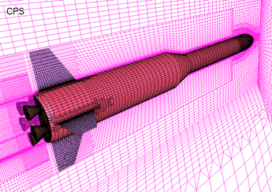
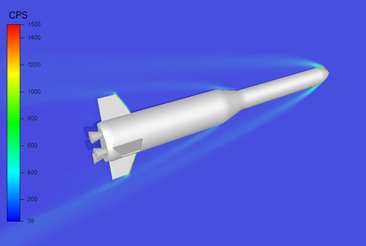

.. _UC_CT01:

CT Use Case : aérodynamique externe de lanceur spatial
------------------------------------------------------

Dans le contexte d’optimisation (par modeFRONTIER) d’un lanceur mono-moteur (effet du culot) mono-diamètre, le processus automatique de simulation intègre un calcul de trajectoire optimale, qui s’appuie sur une table de coefficients aérodynamiques Ca et Cn dépendant du mach et de l’incidence. Cette table est déterminée par une série de calculs CFD préliminaires, réalisés pour différentes orientations (i.e. incidences) du maillage de la géométrie (prescrite par l’optimiseur) du lanceur et différentes conditions de vitesse (i.e. nombres de mach).

Pour mieux prendre en compte les conditions réelles où évolue le lanceur au cours de sa trajectoire (plutôt qu’un seul jeu de conditions), il faut réaliser (pour « chaque couche d’altitude » de points d’intégration de la trajectoire) un calcul CFD, dont la configuration (de pré-traitement, calcul, post-traitement) existe :

* Prenant en entrée des valeurs données de
   - Géométrie du lanceur (longueur, diamètre)
   - Mach : condition de vitesse, 
   - Incidence : effet sur le maillage
   - Altitude : 4 à 5 paramètres atmosphériques statiques comme Rho, P, T ; le modèle de calcul est valable sur une gamme d’altitude de 0 à 60 km

* Fournissant les sorties d’intérêt
   - champ de P autour/sur le contour du lanceur
   - grandeurs intégrales déduites : coefficients globaux de trainée et portance Ca et Cn (ou courbes en fonction de Mach/incidence)
   
* Intégrant un critère d’arrêt automatisé, qui converge en quelques dizaines de mn à quelques h sur 24 coeurs 

.. _CT_img1:

    Maillage externe de lanceur

.. _CT_img2:

    Calcul aérodynamique externe autour du lanceur

.. .. tabularcolumns:: |L|L|L|L|

.. table:: CT use case
  :class: longtable
  
  +---------------------+----------+------------------------+-------------------------------------------------+
  | USE CASE CT01       |   Apply (DoE specification, realisation and) reduction of a nonlinear parametric    |
  |                     |   problem                                                                           |
  +---------------------+----------+------------------------+-------------------------------------------------+
  | Context of use      |   For example aerodynamic of space launcher, light version needed to be used inside |
  |                     |   trajectory optimisation defining system's performance                             |
  |                     |                                                                                     |
  +---------------------+----------+------------------------+-------------------------------------------------+
  | Scope               |   CPS, Mordicus                                                                     |
  +---------------------+----------+------------------------+-------------------------------------------------+
  | Level               |                                                                                     |
  +---------------------+----------+------------------------+-------------------------------------------------+
  | Primary actor       |   User with knowledge of context and aim of use ; and knowledge of reduction        |
  |                     |   modelling principles                                                              |
  +---------------------+----------+------------------------+-------------------------------------------------+
  | Stakeholders and    |   Stakeholders                    | Interests                                       |
  | interests           |                                   |                                                 |
  +---------------------+----------+------------------------+-------------------------------------------------+
  |                     |   System-oriented,                | - wants a ROM giving results close to physics   |
  |                     |   may be on Linux or windows      |   for a set of parameters (including geometry or|
  |                     |                                   |   mesh)                                         |
  |                     |                                   |                                                 |
  |                     |                                   | - wants a ROM easily callable from another code |
  +---------------------+----------+------------------------+-------------------------------------------------+
  | Preconditions       |  Space launcher's CFD model, parametrized: Mach, incidence, altitude,               |
  |                     |  + geometry: (length, diameter)xstage_nbr                                           |
  +---------------------+----------+------------------------+-------------------------------------------------+
  | Success end cond    |  Stand-alone ROM able to be called for different values of several parameters       |
  +---------------------+----------+------------------------+-------------------------------------------------+
  | Failed end          |  (yet to be filled)                                                                 |
  | protection          |                                                                                     |
  +---------------------+----------+------------------------+-------------------------------------------------+
  | Trigger             |  (yet to be filled)                                                                 |
  +---------------------+----------+------------------------+-------------------------------------------------+
  | Description         | Step     | Action                                                                   |
  +---------------------+----------+------------------------+-------------------------------------------------+
  |                     | 1        | User sets the parameters and their range + available results if any.     |
  |                     |          | Gets a dedicated DoE table (from Mordicus guidelines on methods or other |
  |                     |          | tool)                                                                    |
  +---------------------+----------+------------------------+-------------------------------------------------+
  |                     | 2        | User computes (automatic computation campaign on parametrized model)     |
  |                     |          | and gathers results for quantities of interest in the table              |
  +---------------------+----------+------------------------+-------------------------------------------------+
  |                     | 3        | User creates Mordicus case and provides results of the DoE: table        |
  |                     |          | *Mach incidence altitude* Ca Cn Xcp                                      |
  +---------------------+----------+------------------------+-------------------------------------------------+
  |                     | 4        | Mordicus builds reduced order bases, according to various methods.       |
  |                     |          | Each reduction method results in an error estimation.                    |
  +---------------------+----------+------------------------+-------------------------------------------------+
  |                     | 5        | Within Space Launch Vehicle design loop, aero coefficients tables are    |
  |                     |          | replaced by ROM calls (operation executable in command line)             |
  +---------------------+----------+------------------------+-------------------------------------------------+
  |                     | 5bis     | Next ROM is called within trajectory optimisation/performance assessment |
  |                     |          | (Fortran or C++ codes ; maybe given as a refined table)                  |
  +---------------------+----------+------------------------+-------------------------------------------------+
  |                     | 5ter     | ROM of aerodynamic is integrated within a 6 DOF simulator                |
  +---------------------+----------+------------------------+-------------------------------------------------+
  | Extensions          | Step     | Branching action                                                         |
  +---------------------+----------+------------------------+-------------------------------------------------+
  |                     |          | (yet to be filled)                                                       |
  +---------------------+----------+------------------------+-------------------------------------------------+

