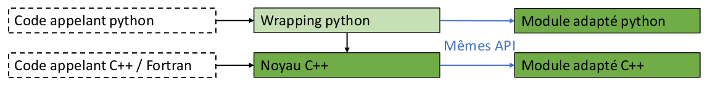

.. _meeting_2020_05_25:

========================================================================
Appel de Mordicus depuis un code C++ ou Fortran (en tout cas pas python)
========================================================================

Le noyau de la future bibliothèque Mordicus =

   * une interface (un fichier include ".h"). C'est une norme pour standardiser l'appel des fonctions. Ce n'est pas "techniquement défini": on ne dit pas comment doivent être implémentés les algorithmes. Son rôle = standardiser l'accès au données.

   * un "middleware" qui fait l'intermédiaire entre le code appelant et les modules adaptés. Gère l'enregistrement et les versions des modules adaptés. En effet, que se passe-t-il si un module adapté A ou un code appelant A veut appeler un module adapté B? 
        
       - si on n'a pas de "middleware", il faut garantir que l'API soit stable. Typiquement, ça se fait par un contrat de service, ça va quand ça ne bouge pas trop (exemple: Lapack)

       - sinon, c'est le middleware qui va se charger des changements d'API et des gestions de versions de Modules, *via* une supervision idoine des chargements de module

Comment les participants envisagent de s'interfacer avec la future bibliothèque Mordicus industrielle
-----------------------------------------------------------------------------------------------------

CT
^^

Rappel des 3 composants qui avait été identifiés dans l'architecture sommaire de Mordicus:

   * Création de données (on avait appelé ça *Pilote de données de simulation*)

   * Création d'un modèle réduit (on avait appelé ça *Compression / décompression* ou *Traitements offline*)

   * Exécution d'un modèle réduit (on avait appelé ça *Gestion de données compressées* ou *Traitements online*)

Pour le dernier cas, il est nécessaire de pouvoir appeler directement un module adapté, sans passer par le middleware, pour des questions de perfs et simplicité de mise en oeuvre (par exemple système embarqué). Dans ce cas, c'est le développeur du code appelant qui aura la responsabilité de maintenir la compatibilité avec le module adapté dans le temps.

Pour les autres cas (là où se trouve la plus grande partie de la sophistication algorithmique), passer par un middleware n'est pas gênant.

On doit pouvoir appeler un modèle réduit comme une sous-fonction. Exemple: générer du code C temps réel pour Simulink.

Ok pour link à un ".so". Sans doute, il faudra distinguer entre plusieurs ".so": certains génériques, d'autres spécifique à chaque modèle (par exemple ".so" généré dans la création d'un modèle réduit)

Scilab
^^^^^^

Idem. Besoin = se linker à un ".so". Même point de vue que CT: il y a des use cases appel modèle réduit depuis un code système. Il faut que ce soit fait directement pour des questions d'efficacité. Le code appelant est du C++.

Phiméca
^^^^^^^

Idem, appel ".so". Le plus compliqué sera sans doute dans le mapping des tyes entre C++ et python. Exemple: vecteur numpy, attention à ne pas faire de recopie (exemple utilisation de *pybuffer*).

CADLM
^^^^^

Idem, ok appel librairie dynamique. Même config que Dakota. 

Architecture python vs C++
--------------------------

OK pour tout le monde pour l'architecture 1 présentée, voir :numref:`meeting_img1`: le noyau de Mordicus industriel sera en C++, avec un wrapping python. Les modules adaptés pourront être écrits en Python ou C++. Les partenaires qui voudront appeler des modules python depuis du C++ devront les recoder. Ce recodage se bornera à une transcription sans difficulté si :

   * il y a des prescriptions fonctionnelles (mêmes API et structure de données pour communiquer avec le noyau): ce sera le cas, c'est tout le travail mené actuellement,
    
   * il y a des "règles facilitatrices" de programmation demandées au développeur de module adapté python, pour faciliter le travail d'un autre partenaire qui voudrait recoder en C++ (et aurait acquis les droits).

.. _meeting_img1:

   Proposition de stratégie C++/python pour la future librairie Mordicus

.. note::

   Qui aurait quelques exemples concrets de telles "règles facilitatrices" ?

Bon compromis entre deux mondes: académiques/industriels (beaucoup de python) vs ETI/PME (python est un conccurent)

A plus long terme
-----------------

Adresser directement des fonctionnalités de Mordicus en situation HPC: le "middleware" doit pouvoir être mis de côté. Ms la *priorité* à pouvoir appeler sans le middleware est pour la martie "Exécution de modèles réduits".
