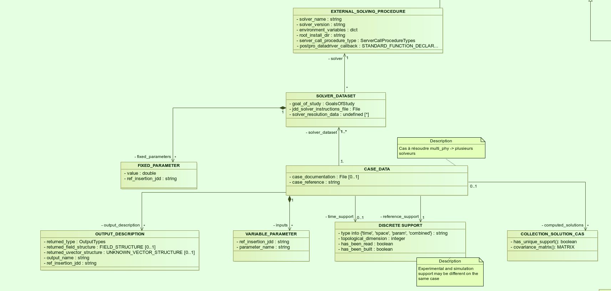
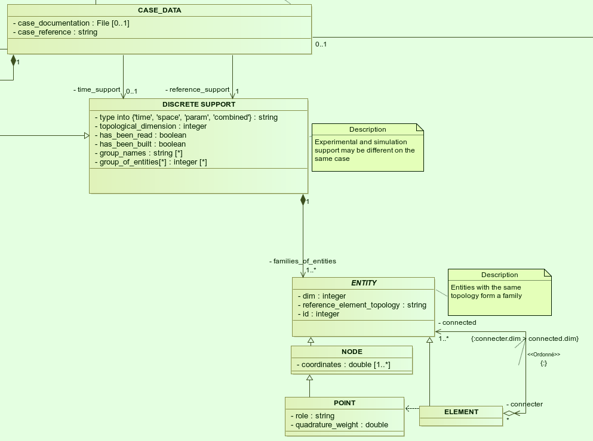

.. _class_diagram:

Description of version v0 of the datamodel
==========================================

Foreword
--------

This section summarizes the *domain model* for the scope that Mordicus should cover. It is not (yet) an *implementation model*: it does not say how things will effectively be implemented in Mordicus, though it gives a first hint. For instance, a *classifier* in this diagram will not necessarily lead to a *class* in Mordicus. But it does describe the structure of data that will be employed in Mordicus.

This *domain model* identifies all data Mordicus will need direct access to. It encompasses the whole information needed to get the data science methods in Mordicus to work. Therefore, information about the modeled physics, or the PDE solving techniques scarcely appear in this data model. When not needed by the data science method, this information is internal to the solver or a custom method that Mordicus will call, and therefore it does appear in the data model.

Overview of the model
---------------------

Here is the *domain model* under the form of a class diagram:

.. image:: images/REFERENCE_CLASS_DIAGRAM.png

For modification in Modelio, the zip file is available at this link :download:`zip <data/Mordicus_Datamodel.zip>`.

Data simulation part
--------------------

Model reduction technique (ROM) allow to tremedously reduce the complexity of parametrized problems by means of treatments of pre-computed "high-dimentional" solutions. The treatment often depends on the nature of the equations underlying the given problem.

.. _case_data:

Defining the case
^^^^^^^^^^^^^^^^^

Making use of this techniques, the first step consists in specifying the parametrized problem - at least the features ROM techniques depend on - and the possibly available pre-computed "high-dimentional" solutions.

This is achieved by means of **CASE_DATA**, which is the "root" class of the data model, see :numref:`v0_zoom1`. It gathers the numerical description of the physical problem to solve. It defines as attributes the *inputs* and *outputs* that will be made public to the black-box user of the reduced-order model, as well as the available *computed_solutions*, either pre-computed or computed as part of the offline procedure. These will be detailed in io_indexing_.

.. _v0_zoom1:

In addition, it owns:

 -case_reference       uniquely identifies the case in a catalog, or in all those that were open with this installation of Mordicus
 -case_documentation   (optional) a file documenting the case

Except for this, the case contains all data not subjected to reduction. A **SOLVER_DATASET** object gathers all data to be provided to the external "high-dimentional" solver to reproduce (or merely produce) the solution of such a *nominal* case, i.e. with default values for varying parameters. For almost all solvers, it consists in:

 -instruction_file     a file of instructions that the solver is able to interprete
 -resolution_data      all supplementary data to the main instruction file. 

*Resolution data* have to be readable by the external solver and referenced by Mordicus, so only *ResolutionDataInTypes* are suported: those are the *builtin* data types (i.e. those of C++ or python, not the specific classes in Mordicus), or a file.

So the *SOLVER_DATASET* object owns all data provided to the solver according to which we can not reduce, even if we wanted to. For instance, a purely numerical parameter, or some solver configuration parameter, or a file decribing an initial state.

It references a **FIXED_PARAMETERS** objects that we could have made variable - in the sense that the reduction method is suitable for this, but we chose not to. For instance, a fixed material coefficient. The attributes are:

 -value                the value of fixed parameter
 -ref_insertion_jdd    a string identifier that relates to the main instruction file and says how the value is used

 .. todo::
     In the *domain model* as drawn up, *FIXED_PARAMETER* and *VARIABLE_PARAMETER* only supports real values. It's important in the future to extend this to support at least: input time signal and discrete support. Indeed, input time signals are the varying data for a family of model mainly for linear problems. As for discrete supports, they come into play in advanced method with a non-parametrized variable geometry. It's important to support both in Mordicus, which seems not too complicated given that the corresponding objects exist in Mordicus (respectively *QUANTITY_OF_INTEREST* and *DISCRETE_SUPPORT* to be explained later).

In addition, *SOLVER_DATASET* references an **EXTERNAL_SOLVING_PROCEDURE** object that caracterizes the external solving tool to Mordicus. This object does not represent the solver itself, that shall not be included in Mordicus, but it says how to call it. For this, it has the following attributes:

 -solver_name                  a unique identifier for this installation of this external solver tool
 -solver_version               a string indicating the version of the solver
 -environment_variables        an optional dictionary of environment variables to set before calling
 -root_install_dir             the root install directory of the solver (may be in environment_variables too)
 -solver_call_procedure_type   one of "Python", "shell", "FMI". Channel through which to call the solver
 -postpro_datadriver_callback  a *STANDARD_FUNCTION_DECLARATION*, specifies the expected interface for
                               potential callback in the Mordicus standard that the user may want to call
                               after the solver in order to convert the results to Mordicus data type.

Discrete support: a generalization of the mesh
^^^^^^^^^^^^^^^^^^^^^^^^^^^^^^^^^^^^^^^^^^^^^^

Among the data gathered by *CASE_DATA*, one deserves special attention: the ones with **DISCRETE_SUPPORT** data type. The numerical description of the problem to solve almost always relies on *discrete supports*, at least for time and space, that plays a specific role during the reduction process and for the reconstruction of reduced results.

The *DISCRETE_SUPPORT* is a common data type to specify *definition domains* in space, time or parameter. *Definition domains* may also be defined by a cartesian product of discrete supports implicitely: the result *discrete support* of the cartesian product is not computed, it would be too heavy in memory.

.. _v0_zoom2:

.. todo::
   Represent this ability to do cartesian products on the datamodel by a reference of *DISCRETE_SUPPORT* onto itself.

In this way, space, time and parameter-based *discrete supports* are instances of the same class. For instance, a 1D space mesh and a time discrete interval are represented by the same data structure. Nevertheless, *DISCRETE_SUPPORT* contains attributes (see :numref:`v0_zoom2`):

 -type                    into "space", "time", "parameter", "tensorial_product". Indicates the quantity the discrete support relates to.
 -topological_dimension   the dimention N of the surrouding space, or the number of reals to give to define a point.
 -has_been_read           because mesh files can be heavy, their loading in memory can be delayed until needed:
                          this attributes tells wether the discrete support has been loaded in memory or it still has to be imported from a file
 -has_been_built          tells if the discrete support has been explicitely built or exists as a definition (e.g. "All points between 0 and 10 with a stride of 0.5")

.. todo::
    For not yet loaded mesh, add a file attribute.

A *DISCRETE_SUPPORT* is a hierarchy of entities in :math:`\mathbb{R}^N` (nodes, edges, faces,volumes), starting at the lowest level (dimension 0 objects) with *nodes* or *points*. **NODES** are defined straight by their *coordinates* attribute, whereas **POINTS** take their definition from a higher-level entity: consider the center of a finite-volume cell or a Gauss point (defined from a reference finite element) for instance.

The discrete support is conceptually a tree of **ENTITIES**, represented in the class diagram according to the composite design pattern (see :numref:`v0_zoom2`): leaf *entities* are nodes, and higher-level *entities* are defined from them on. Let take the example of a 3D mesh: in most cases, the volumes (level 3 entities) are defined straight from the nodes, intermediate entities (edges, surfaces) are omitted. They would be heavy in memory, and can be reconstructed by the viewer from the ordered list of "child" nodes. As for us, the support is merely defined as a tree of entities under the conditions that parent be at a strictly higher level than children, but no further condition. So, an entity has 2 attributes:

 -dim                          the "dimension" or "level" of the entity (0 for points and nodes, 1 for edges, 2 for faces, 3 for volumes)
 -reference_element_topology   a string qualifying the topology of the element. For instance: "triangle_3nodes", "triangle_6nodes", "hexaedron_8nodes" etc.
                               
 
 This *reference_element_topology* attribute allows to call a finite element logics, possibly coded by Mordicus modules, specifically for each type of element, for instance for specific reduction methods such as hyper-reduction. However, this logics is internal to such a module and the underlying internal data do not appear in Mordicus, which only needs to provide the module with a referenced element topology in a common list for each element in the mesh.

.. note::
    It is conceptually attractive to define each entity exclusively from the next lower level (edges from nodes, faces from edges etc), but as said this would imply heavy and unnecessary information: there is seldom the need, for instance, to define all faces of the mesh in the model. On the other side, it is comfortable for some methods (special finite volume) to have faces available in the mesh, hence the choice to prescribe no further condition.

A *DISCRETE_SUPPORT* has the ability to tag groups of entities.

.. todo::
    Represent this ability in class diagram.

Only those features of *POINT* that persist after the local element treatment are published as attributes, as potential useful data to reduction procedures. For instance, for a Gauss point in the context of a finite element method, the reference coordinate, reference shape functions values and reference quadrature weights are *not* kept. They may be recovered upon request from the element characteristics, in particular *reference_element_topology*. But the real coordinates and quadrature weights are kept in a persistent point object: it will serve as a shortcut to reduction procedures such as empirical quadrature, which would then have not need to dig into the finite element logics.

.. _types_of_result:

Quantities of interest, fields and unknowns: the 3 kinds of results
^^^^^^^^^^^^^^^^^^^^^^^^^^^^^^^^^^^^^^^^^^^^^^^^^^^^^^^^^^^^^^^^^^^

The specified *outputs* to *CASE_DATA* may be of 3 kinds, ranging from "closer to business user" to "closer to mathematical techniques":

    * quantities of interest

    * field

    * vector of unknown.

The **QUANTITY_OF_INTEREST** class aims at equally representing signals from "physical" or "numerical" sensors of the case. In attribute *series_value*, it bears one value (possibly a vector, or a tensor) for each index of the indexing system of the case. It may originate from a post-processing of the simulation (for instance, flow through a section) or from experimental data. In other words, it is an observation on the system. Many times, the end business user is only interested in a few *quantities of interest* in the result of a simulation.

The semantic information giving context to these values is contained in the **QUANTITY_OF_INTEREST_STRUCTURE** object. That information is about:

    * the *physical nature* of the quantity, via a link to exactly one *PHYSICAL_QUANTITY* object,

    * the *origin* of data (the "sensor", in a broad sense, and its *localisation*),

    * the discrete support to associate with the series of data. It has to be 1D. In most cases, it represents time sampling, but not always. The support is not necessarily of *time* kind: there are series based on frequencies or energy levels.

To support this information, *QUANTITY_OF_INTEREST_STRUCTURE* owns the following attributes:

 -experimental_or_simulation         does data originate from a physical sensor or numerical observation (post-processing)?
 -sensor_name                        a free label meant to serve as a reference of physical sensor. It needs to be unique, so that
                                     the same label can be used for different quantity measured at the same sensor location, or even
                                     by the same device (displacement and velocity, for instance)
 -integral_or_local                  in the simulation case, is the quantity of interest a punctual value of a field or is it obtained
                                     by an integral operation
 -description                        free field to describe the *type of measure*
 -series_or_value                    is the value a series (in most case) or just a value. In the latter case, no discrete support
                                     should be provided.

.. note::
    It is debatable that the *experimental_or_simulation* should be supported by *QUANTITY_OF_INTEREST_STRUCTURE*. One might want to have the same structure both for experimental and simulation data, in order to relate and compare them easily. For instance, for PBDW method, it is appreciable to know at a glance what the localisation operation is to get the numerical counterpart of an experimental signal.

.. todo::
    Put *experimental_or_simulation* in *QUANTITY_OF_INTEREST* instead ?

About the nature of the quantity, a *QUANTITY_OF_INTEREST_STRUCTURE* is associated with a single **PHYSICAL_QUANTITY**, an object that describes its physical *nature*. A physical quantity is composed of:

 -label                         explicit of the nature of the quantity. May be chosen in a preexisting list 
                                ("displacement", "velocity", "first Piloa-Kirschhoff stress"...) or a free value
                                The preexisting list may be provided straight from other norms (CGNS) or systems of measurements.
                                One can never be exhaustive, so the user should still be able to provide a value not in a closed list.
 -unit                          Tells in what unit data is expected to be provided. Idem: adopt a system of measurement (SI, LH...) 
                                of one or the other norm.                      
 -tensor_order                  it is the order of the provided tensor values. 0 for scalars, 1 for vectors, 2 for matrices etc.
                                Not to be confused with the number of components in each direction,
                                that most of the times depends on the order of the underlying space (i.e.
                                the *topological dimension* N of the spatial discrete support.
 -extensive_or_intensive        Is the quantity intensive or extensive.
 -available_components          A exhaustive list with the names of possible component names for each value (for vectors and tensors).
                                For instance, for velocities, it will be 'Vx', 'Vy', 'Vz'

As for the support of the series of data, a series of data is nothing but a field with a support of topological dimension 1. So its structure is a special case of the *FIELD_STRUCTURE* to be seen next.

The **FIELD** class represents a set of "homogeneous" values (values corresponding to the same *PHYSICAL_QUANTITY*) spread out over a multi-dimentional discrete support. The physics of fields classically lays its interest in determining fields defined as a function of space, say :math:`f(\mathbf{X})`, with :math:`\mathbf{X}` the spatial coordinate. This is a continuous notion that needs a discrete representation to be usable by a computer. For this, an approximation space is used which consists in a finite combination of basis functions over the spatial domain :math:`\Omega`.

In all PDE discretizations methods, each coefficient related to a basis function is typically associated to an entity of the discrete support: in "standard" finite-volumes, that would be the center of the cells, in Lagrange or Hermite finite elements the nodes of the mesh, in some discontinuous Galerkin methods the edges and volumes etc.

These associations allow to build a discrete representation of the field under the form of a *vector of value* attribute qualified by a **FIELD_STRUCTURE**.

Following this, the *FIELD_STRUCTURE* references:

    * a single discrete support through *support* attribute;

    * a single *PHYSICAL_QUANTITY* through *quantity* attribute.

In addition to the expected size (*vector_size* attribute) of the vector of values, the *FIELD_STRUCTURE* is composed of *VALUE_SUPPORT*, each of which associates an index in the vector (*value_index* attribute) with an *entity* of the *discrete support*.

**VALUE_SUPPORT** has thus the following attributes:

 -value_index                    the index of the value of the first component associated with the entity
 -number_actual_components       the number of assigned components of the field at this entity
 -actual_components              the list of these assigned components, to be chosen among the *available_components* 
                                 of the *PHYSICAL_QUANTITY* of the field structure

The *FIELD_STRUCTURE* is also endowed with a *entity2validex* attribute, which provides the reverse connection of *value supports*: for a given entity, it returns the *value suppors* relying on it. Through that information is conceptually redundant (it could be built from a reverse analysis of the *value supports*), it has to be kept in memory, and maintained up to date, for obvious performance purposes.

With this in mind, let us come back to the *localisation* description of *QUANTITY_OF_INTEREST_STRUCTURE*. For this, a new **RESTRICTION_FIELD_STRUCTURE** object is introduced. This object is used to qualify a vector of values that does not correspond to a full-dimensional field, but to the coordinates in a basis of a **subspace** of the original approximation space. There is a need for this in many circumstances:

    * performing DOF elimination (for instance a wall boundary condition in a CFD computation),
      
    * locating a sensor, specifying how to derive a *quantity of interest* from a *field*,
      
    * and obviously representing the reduced coordinates with respect to empirical modes.

The informations contained in *RESTRICTION_FIELD_STRUCTURE* allow to build a :math:`\mathbf{Z} \in \mathbb{R}^{N \times n}` matrix, that link the coordinates :math:`\mathbf{u} \in \mathbb{R}^N` of the full-space basis with the coordinates :math:`:mathbf{a} \in \mathbb{R}^n` in the reduced-space basis. This relation is:

    * typically :math:`\mathbf{u} = \mathbf{Z} \mathbf{a}` for DOF elimination, with :math:`\mathbf{Z}` a basis of the null-space of the the constraint matrix :math:`\mathbf{B}` (i.e. such that :math:`\mathbf{Z}` has full rank and :math:`\mathbf{B} \mathbf{Z} = 0`;

    * typically :math:`\mathbf{a} = \mathbf{Z}^T \mathbf{u}` to reproduce a sensor's signal from a field;

    * typically :math:`\mathbf{u} = \mathbf{Z} \mathbf{a}` for reduced coordinates with respect to modes, with :math:`\mathbf{Z}` the matrix of modes.

The full-space structure associated with :math:`\mathbf{u}` is provided with the *reference_field_structure* attribute. To support the above cases, the *RESTRICTION_FIELD_STRUCTURE* possesses a *left_or_right_Z* attribute that says whether the built :math:`\mathbf{Z}` matrix is defined as :math:`\mathbf{u} = \mathbf{Z} \mathbf{a}` (left) or :math:`\mathbf{a} = \mathbf{Z}^T \mathbf{u}` (right).

The columns of the Z-matrix can be defined:

    * as *FIELDS* by the *Z_columns* attribute,

    * as *VALUE_SUPPORTS* by the *trivial_Z_columns* attribute, that defines columns of the form :math:`\begin{pmatrix} \vdots \\ 0 \\ 1 \\ 0 \\ \vdots \end{pmatrix}` 

The *group* attribute allows to build a right :math:`\mathbf{Z}`-vector allowing to integrate the field over that group.

.. todo::
    Additional attribute *excluded_supports* that allows to include all *value supports* into the definition of Z except for those specified, that corresponds to entities implied in the linear constraint.

The third kind of result is the **VECTOR_OF_UNKNOWNS** class. This is often the primal unknown of the solver, the "state vector" (vector of discrete state variables) that the problem must determine and that may blend unknowns of different units: for instance, think of FSI cases with displacement, pressures etc. The values are contained in a *vector_of_doubles* attribute, qualified by a **VECTOR_OF_UNKNOWNS_STRUCTURE** class. This structure indicates, among the unknowns:

    * which ones correspond to *FIELD* values;

    * which one correspond to something else, i.e. *QUANTITY_OF_INTEREST* with or without associated localization of the discrete support. For instance, an algebraic Lagrange multiplier would have no link to the discrete support.

This is done by means of the following attributes:

 -primal_fields            an **ordered** list of fields, some values of which form part of the unknown vector
 -primal_qofs              an ordered list of quantities of interest, some values of which form part of the unknown vector
 -index2field              for an index in the *vector_of_doubles*, returns the field or quantity of interest it corresponds (remeber these were ordered)
 -index2fieldindex         for an index in the *vector_of_doubles*, returns the corresponding index in the *field structure*

In addition to that, a *field_fieldindex2index* array is also provided as an attribute. For an input (field number, index in field structure), it returns the index in the unknown structure. Though this could be build from reverse analysis of the above, it has to be kept in memory and up-to-date for obvious performance purposes.

Say there are :math:`\mathcal{N}` unknowns. The same way we did for *RESTRICTION_FIELD_STRUCTURE*, we may be able to define a restriction mechanism *RESTRICTION_UNKNOWNS_STRUCTURE* to describe smaller vectors of unknows representing coordinates in subspaces of :math:`mathbb{R}^{\mathcal{N}}`, based on *vector of unknowns* representing Z-columns. For the sake of clarity, int is not represented on the current data model.

.. _io_indexing:

Description of inputs and outputs, indexing mechanism
^^^^^^^^^^^^^^^^^^^^^^^^^^^^^^^^^^^^^^^^^^^^^^^^^^^^^

As was said in case_data_, the *CASE_DATA* object includes information about the *model* to be reduced. In other words, it has to describe the input/output of the transfer function, a reduced representation of which which be built by a "model reduction user".

For this, the parameters according to which reduction will take place are defined as instances of the **VARIABLE_PARAMETERS** class. They have attribute:

 -name                         unique to identify the parameter in a function defining a definition domain, for instance
 -ref_insertion_jdd            as in case_data_, a string identifier that says how the the main instruction file of the external solver is affected by a change of this parameter
 -nature                       references a *PHYSICAL_QUANTITY*, thus giving the physical nature of the parameter and its unit

For a given case, these parameters are allowed to vary within a definition domain, which is represented by a **SUPPORT_INDEXATION** class. This is represented by attributes:

 -domain_axes                  **ordered** backward references to the parameters (possibly only by a name), in order to define the axes of the underlying parameter space
 -cartesian_bounds             for an axis, defines bounds for the parameters. The domain is then defined by cartesian product with the others.
 -bound_function               under the form of a *FUNCTION_OF_PARAMETER*, provides function :math:`f (\mu)` so that the parameter is within domain if :math:`f (\mu) \leq 0`

The *SUPPORT_INDEXATION* class also contains information on the expected evaluations of the *model*, by means of attributes:

 -design_of_experiments        a set of points, in the form of a *DISCRETE_SUPPORT*, that gives the evaluations that the reduction method will **all** expect to be done 
 -training_set                 a set of points, in the form of a *DISCRETE_SUPPORT*, defining all **possible** points for the reduction method at which to evaluate the model.
                               Particularly useful for RB methods, most of the times the high-dimentional model will only be evaluated on a few points in the end

.. todo::
    As mentioned in case_data_, *VARIABLE_PARAMETER* should support not only real values, but also series and discrete supports.

This describes the *input* of the model. As for the published *outputs*, there are qualified by an **OUTPUT_DESCRIPTION** object. This object has attributes:

 -returned_type                       among the three types defined in types_of_result_: "QUANTITY_OF_INTEREST", "FIELD" or "VECTOR_OF_UNKNOWNS"
 -structure_of_returned_obj           the structure of the returned object. Depending on the *returned_type*, should be an instance of *QUANTITY_OF_INTEREST_STRUCTURE*,
                                      *FIELD_STRUCTURE* or *VECTOR_OF_UNKNOWNS_STRUCTURE*
 -output_name                         an identifier for the output
 -ref_insertion_jdd                   (optional) potential indentifier in the main instruction file

As the high-dimensional model is evaluated, it produces a collection of solutions **COLLECTION_SOLUTIONS_CAS** that aggregates instances of **INDEXED_SOLUTION**. As indexed solution is a solution corresponding to an expected *OUTPUT_DESCRIPTION* for the model (through *description* attribute), that is indexed by a point in the *domain of definition*, through *indexation* attribute. These *indexed solutions* are the type of data used for the snapshots in snapshot methods.

The **INDEXATION** object gives:

 -indexation_support                  reference to the indexation support
 -parameters_value                    a point in the definition domain
 -ordinal_number                      or alternatively, for indexing empirical modes (they do not correspond to a particular value of parameters), the ordinal number of the modes
                                      (1 being higher energy mode)

Offline treatments
------------------

in the previous part, we have seen all structures related to the high-dimensional simulation - even if we'll see next that structures with reduced dimension rely on them too. This data serves as input to the *offline* procedures, that is to say all procedures necessary to build to reduced-order model from the high-dimentional one and its existing solution.

Internal solving procedures and standard functions
^^^^^^^^^^^^^^^^^^^^^^^^^^^^^^^^^^^^^^^^^^^^^^^^^^

In the data model in its current state, the high-dimensional problem is solved by an external solver. As for the reduced model, for a maximal genericity the associated resolution code will often included in the Mordicus library: these approaches are called *non-intrusive*, and particularly useful when there is limited possible interaction or coding in the external solver (commercial software) and practical to consider exporting the reduced model in a number of formats (PXDMF, FMI...)

So besides the *EXTERNAL_SOLVING_PROCEDURE*, we introduce an *INTERNAL_SOLVING_PROCEDURE*, each of which is derived from an abstract **SOLVING_PROCEDURE**.

Conceptually, a *solving procedure* is a program that is able to evaluate a model - **reduced-order** or **full-order** - at a point of the parametric space. For now, in this *domain model*, *full-order* models are evaluated by *external procedures* and *reduced-order* models are by internal procedures. This is a restriction to be lifted in the future.

.. todo::
    Include in the *domain model* the case when the reduced resolution procedure calls an external solver (intrusive), still very useful in some cases

In practice, when the "model reducing user" will need to include a new kind of resolution in Mordicus (e.g. add a reduced resolution of thermal transient problems), he will have to create a new *RESOLUTION_PROCEDURE*.

.. old code from now on

Fonction du domaine de définition (paramètres x temps), qui donne en retourne une quantité d'intérêt pouvant être un champ. Tous les champs produits au final doivent se rapporter à un unique support discret « de référence » :math:`Omega_0`. La transformation avec d’éventuels supports discrets intermédiaires est masquée à l’intérieur de la fonction en quelque sorte.

A model is a function of the parameters x time domain, that returns a *field*. Whereas it can call on variable meshes :math:`\Omega_X` internally (according to a parameter or time value), all finally produced fields must relate to a single "reference" mesh :math:`\Omega_0`. The transformation between the two is hidden inside the function.

Each *DOF* is associated with a entity of the discrete support but it is not necessarily the value *at* this entity.

Question: does the model return a *field* or a *vector of unknowns*? A snapshot is which of the two?

 INDEXATION, COLLECTION_SOLUTION_CAS

