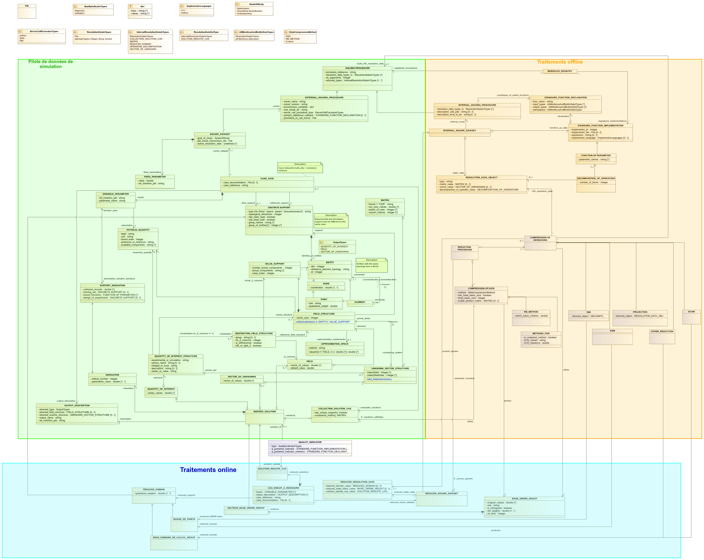
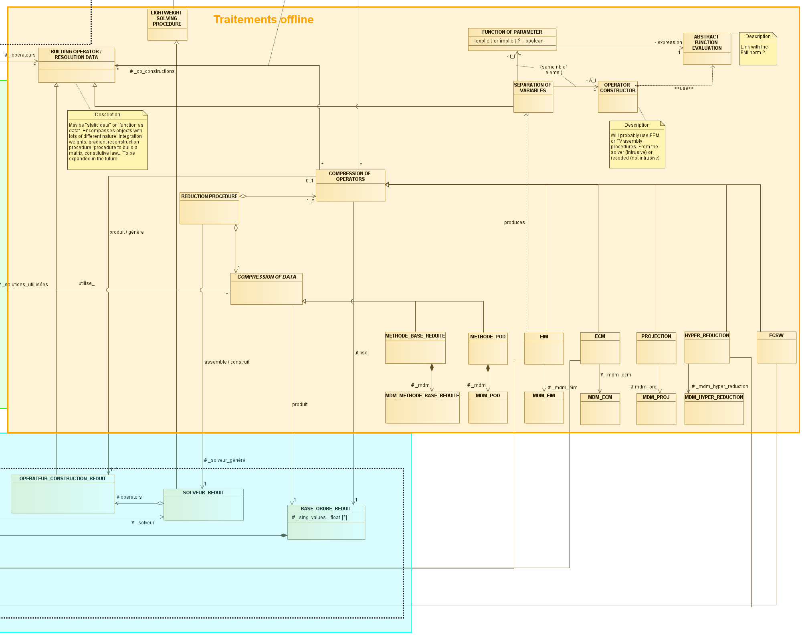

.. _class_diagram:

Dernière version en date du modèle de données
=============================================

Sous forme de diagramme de classe produit avec Modelio.

Le zip Modelio est téléchargeable au lien suivant :download:`zip <data/Mordicus_Datamodel.zip>`.

Zoom sur la partie "pilote de données de simulation"
----------------------------------------------------

.. image:: images/ZOOM_pilote_donnees_simulation.png
   :scale: 60 %

Zoom sur la partie "traitements offline"
----------------------------------------

Zoom sur la partie "traitements online"
---------------------------------------

.. image:: images/ZOOM_traitements_online.png
   :scale: 70 %

Annexes
=======

Travail préparatoire Safran
---------------------------

Safran sketch of a data model can be found here :download:`pdf <data/ROMDataModel.pdf>` or :download:`pptx <data/ROMDataModel.pptx>`.

Anciennes versions
------------------

Les anciennes versions sont conservées pour mémoire au lien suivant:

.. toctree::
    :maxdepth: 1

    old_class_diagrams
