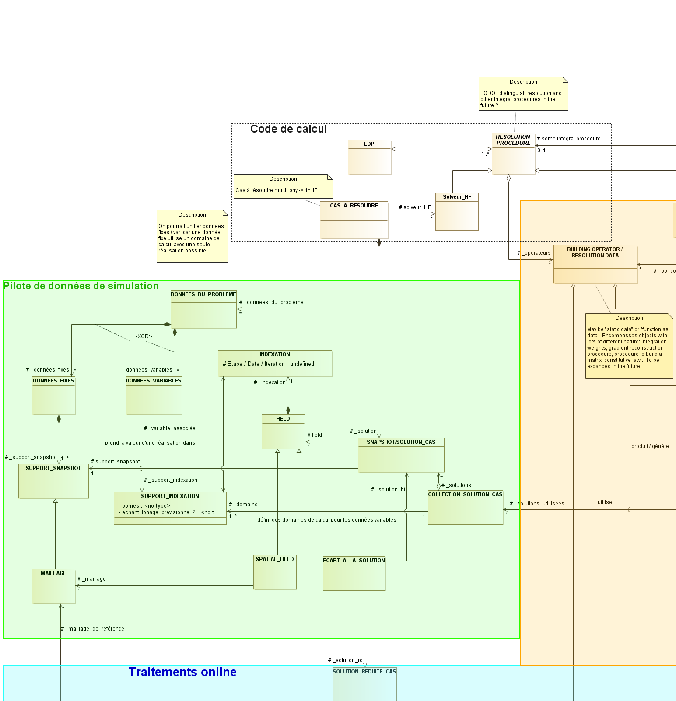

.. _class_diagram:

Dernière version en date du modèle de données
=============================================

Sous forme de diagramme de classe produit avec Modelio.

Le zip Modelio est téléchargeable au lien suivant :download:`zip <data/Mordicus_Datamodel.zip>`.

.. image:: images/REFERENCE_CLASS_DIAGRAM.png

.. _reflabel-simu-processing:

Zoom sur la partie "pilote de données de simulation"
----------------------------------------------------

Zoom over the "offline processing" part
---------------------------------------

To start identifying useful data to the offline part, we start identifying data from the "modelling data processing" that we need as an input.

Those are:

   * the *DISCRETE SUPPORT* (a generalization of mesh concept, see :ref:`reflabel-simu-processing`) 

   * the *PARAMETERS* (also called *VARIABLE DATA*) in the above

   * the *SNAPSHOTS*. As a reminder, each snapshot is a *field* with the (time, parameter) values as a qualifying information. A field being a simulation result with a discrete support in space.

   * the *OBSERVATIONS*. This data type is detailed below. It contain a *series*, which is an object with discrete support in time.

The *offline processing* part aims at producing a *reduced solver*, i.e. a data structure that contains "everything needed to run a reduced-order simulation for a new parameter value".

The *OBSERVATION* data type
~~~~~~~~~~~~~~~~~~~~~~~~~~~

The *OBSERVATION* data type aims at equally representing time signals from physical or "numerical" sensors. Each sensor has a *label* and may collect information of several kinds, each of which is described by a *physical quantity* type, the very same that is referred by *field* objects (:ref:`reflabel-simu-processing`). 

A *physical quantity* has attributes:

   - label (``str``) : should be explicit of the nature of the quantity, for instance "displacement", "velocity" etc. A list of those may be provided straight from other norms (CGNS) or systems of measurements. One can never be exhaustive, so the user should still be able to provide a value not in a closed list.

   - unit (``str``) : tells in what unit data is expected to be provided. Idem: adopt a system of measurement (SI, LH...) of one or the other norm.

   - tensor order (``int``) : it is the order of the provided tensor values. 0 for scalars, 1 for vectors, 2 for matrices etc. Not to be confused with the number of components in each direction, that most of the times depends on the order of the underlying space.

While the type of each signal is given by a *physical quantity* object, the values are enclosed by a *series* object that references a *dicrete support* in time.

Besides, each *observation* relates to a *localisation* of the sensor on the spatial *discrete support*. It may (seldomly) be a punctual value, more often is it given by an integral over a subdomain, or a linear form from nodal values. 

Hereafter is a class diagram summarizing this section:

.. todo:: insert class diagram here

As was mentioned in Hackathon 1, the offline process decomposes into a *generation of the reduced basis* phase and an *operator compression* phase.

For the sake of generality (there are methods were no reduced basis if generated, though they were disregarded in Hackathons so far), we talk about *data compression* phase rather than *generation of the reduced basis*.

Data compression phase
~~~~~~~~~~~~~~~~~~~~~~

As said before, the *data compression* phase aims at producing a reduced-order basis, or any intermediate mathematical object necessary to apply operator compression.

.. note:: in this respect, do not forget the oblique projection case (Petrov-Galerkin) in the data model. There are then 2 reduced-order bases.

The treatment workflow for this phase may be concisely represented by the following diagram:

.. todo:: add the word diagram here

A few comments:

   - 1rst step: consists of comparing discrete supports of all provided results, and bringing them all down to the same if not already the case. This is not always possible (and an area of research on its own). But there are two common cases:

       * when meshes are *topologically identical* one with another. Then a *mapping* exists (this concept is to be developed further, has it to be defined by the user ?) to bring all results down to the same mesh. This case commonly happens in the study of forming processes.

       * when a *projection operator* onto a unique reference mesh is provided by the user alongside with each result. This may be the case in advanced application (e.g. FSI)

   - 2nd step: a matrix is generated from fields :math:`\mathbf{u}`. One of:

       * the quadrangular snapshot matrix :math:`Q`

       * the square autocorrelation matrix :math:`A`

Note that the autocorrelation matrix :math:`A` may also be built from :math:`Q`, either:

       * alongside space-state dimension as :math:`Q^T M Q` (*classical method*) 
     
       * or alongside time-parameter-state dimension as :math:`Q Q^T` (*method of snapshots*).

   - 3rd step: the reduced basis is generated from :math:`Q` with a complete SVD and basis truncation, or an incomplete SVD. From :math:`A`, it is computed by means of the eigenvalues :math:`\lambda_i` and vectors `\mathbf{\xi}_i` and the results :math:`\mathbf{u}` according to :math:`\mathbf{\phi}_i (\mathbf{x}) = \dfrac{1}{\sqrt{\lambda_i}} \sum_{n=1}^{N_s} \xi_{i,n} \mathbf{u}_n (\mathbf{x})`, cf [Lorenzi16]_.

.. [Lorenzi16] S. Lorenzi, G. Rozza et al, POD-Galerkin Method for Finite Volume Approximation of Navier-Stokes and RANS equations, Computer Methods in Applied Mechanics and Engineering, (2016).

The data model for this phase should also take into account the greedy selection algos, where the basis is iteratively enriched with a new element if a criterion is fulfilled. Most of the time, an incremental SVD is involved.

The user options for the *data compression* part are listed below:

   * method to determine the reduced basis size:

      - fixed (enter an N)

      - tolerance for a complete SVD :math:`\left| \dfrac{\sum_{k=n}^{N_s} \sigma_k}{\sum_{k=1}^{N_s} \sigma_k} \right| < TOL`

      - tolerance for an incomplete SVD :math:`\left| \dfrac{\sigma_N}{\sigma_1} \right| < TOL`

   * method

   * matrix defining the scalar product

   * if POD method, classical or snapshots methods?

   * if incremental method, the criterion to enrich the basis or not

Operator compression part
~~~~~~~~~~~~~~~~~~~~~~~~~

Discussion about the datamodel for methods implying an operator decomposition of the form:

:math:`A(\mu) = A_1 f_1 (\mu) + A_2 f_2 (\mu) + ... + A_n f_n (\mu)`

Of course affine decomposition of the operators falls into that case.

Notably, this kind of data structure is produced by an EIM. 

A object *separation of variables* hosts the information for such a decomposition. It consists of an ordered list of *operator constructor* and *function of parameter*. An *operator constructor* is a means to build the :math:`A_i`, with possible invokation of FEM or FV asemblers. A *function of parameter*, is a means to compute :math:`f_i (\mu)`. It may be explicit (an analytical formula) of implicit via the invokation of an abstract function evaluation. 

The problematic of an standard for an abstract function evaluation is close to the FMI/FMU standard.

.. todo:: add the diagram

.. todo:: the datamodel for other compression algos as the EIM remain to be defined more in details.

Quality indicators
~~~~~~~~~~~~~~~~~~

Quality indicators may be separated into:

   - *diagnosis* : it is a verification step internal to reduction algorithms aimed at checking their internal implementation

   - *verification* : aimed at controlling that the implemented reduced-order representation is governed by the equations we think it is

   - *validation*: compares the reduced-order representation with an external reference. This includes the special case of comparison with the full-order model.

.. todo:: examples for each

For the latter case, the reduced-order results should come out under a format that the target external comparison tool can operate. The target Quantity of Interest for comparison should be easily accessible from the reduced-order result.

.. image:: images/ZOOM_traitements_offline.png
   :scale: 70 %

Zoom sur la partie "traitements online"
---------------------------------------

.. image:: images/ZOOM_traitements_online.png
   :scale: 70 %

Annexes
=======

Travail préparatoire Safran
---------------------------

Safran sketch of a data model can be found here :download:`pdf <data/ROMDataModel.pdf>` or :download:`pptx <data/ROMDataModel.pptx>`.

Anciennes versions
------------------

Les anciennes versions sont conservées pour mémoire au lien suivant:

.. toctree::
    :maxdepth: 1

    old_class_diagrams
