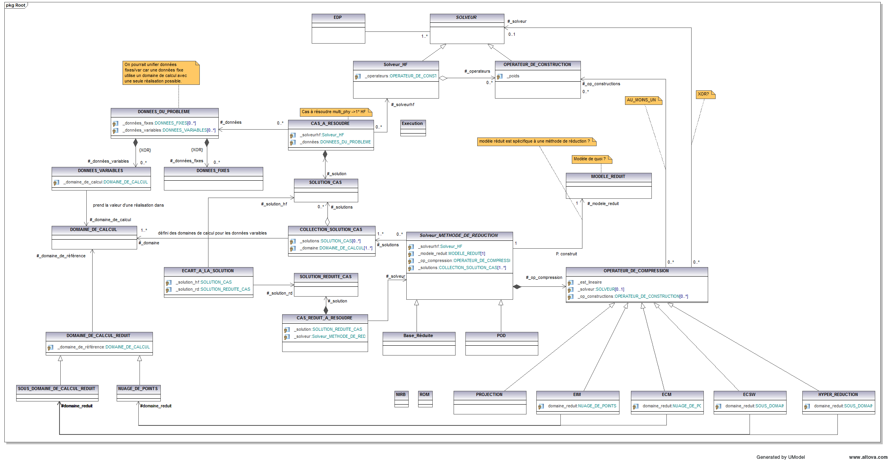
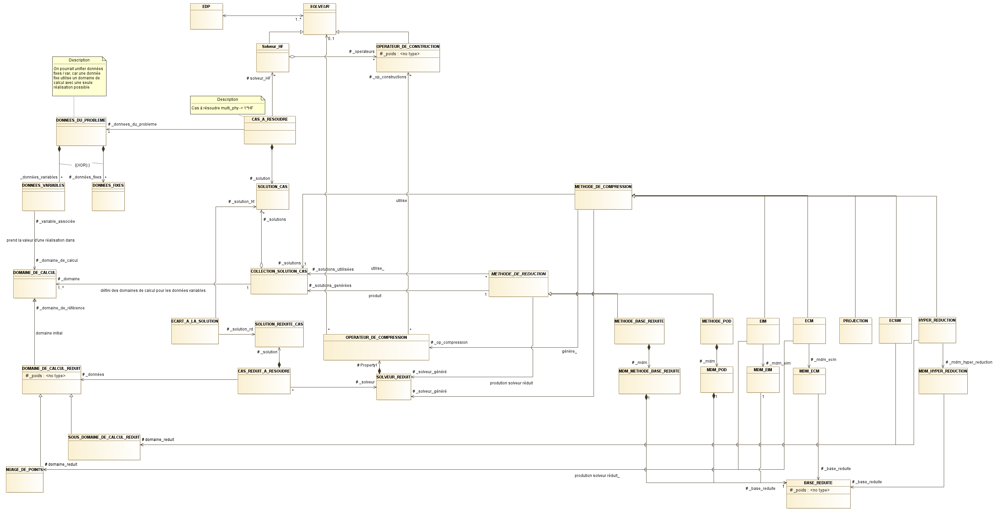
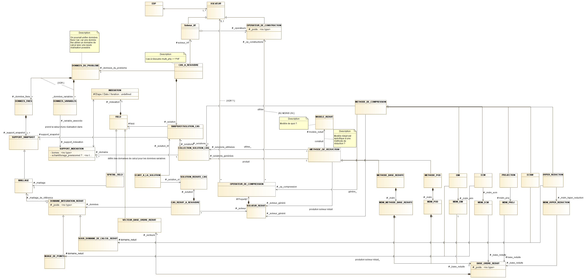

.. _class_diagram_1:

Diagramme de classe 1
---------------------

Fait en séance le 19/04/2018:

.. uml:: diagrams/class_diagram_1.uml

Diagramme de classe 2
---------------------

Fait en séance le 31/05/2018:

Retranscription "légère":

Archive contenant les sources modelio :download:`archive zip <data/Mordicus_Datamodel.zip>`.

Diagramme de classe 3
---------------------

Fait en séance le 28/06/2018:

Retranscriptions avec plantuml
------------------------------

.. warning:: 

   OBSOLETE, kept for illustration purposes (Modelio better than plantuml)
 
Diagramme 2

.. uml:: diagrams/class_diagram_2.uml

Une tentative de fusion

.. uml:: diagrams/class_diagram_3.uml
