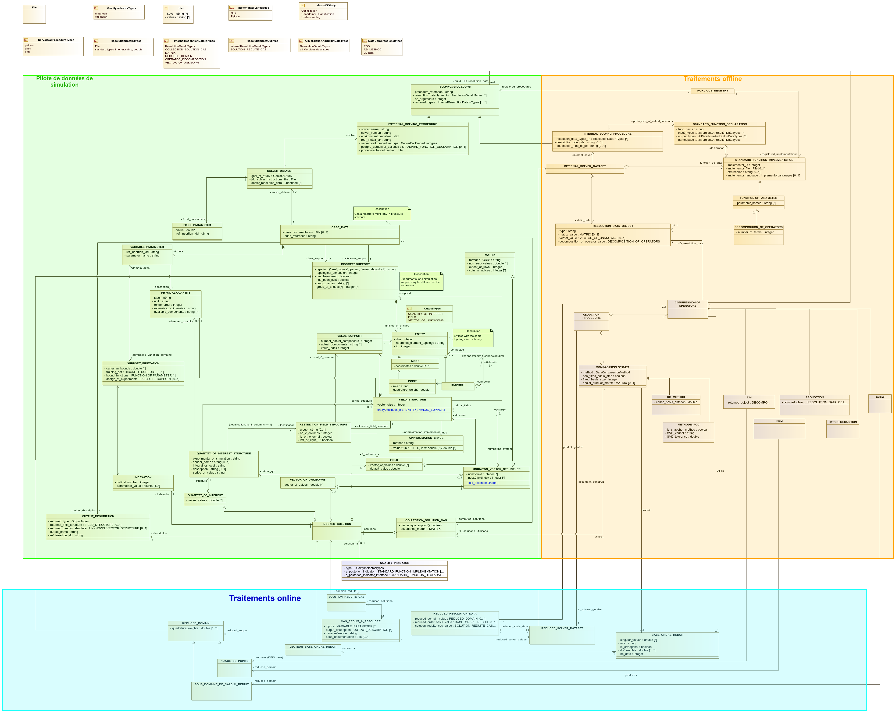
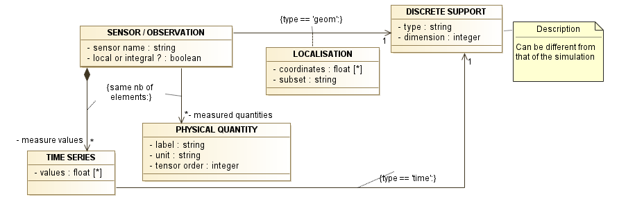
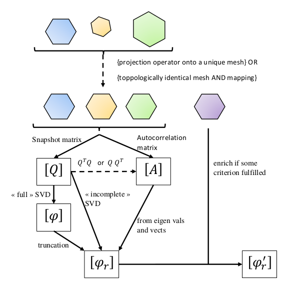
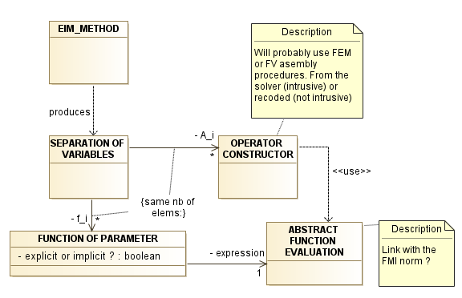
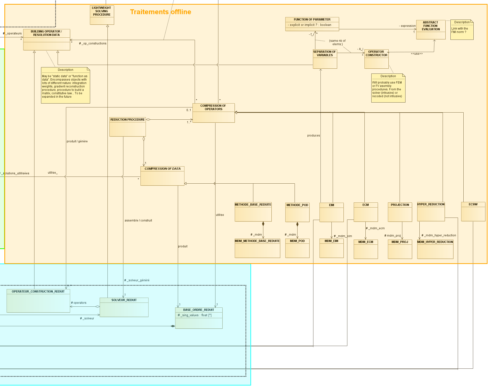
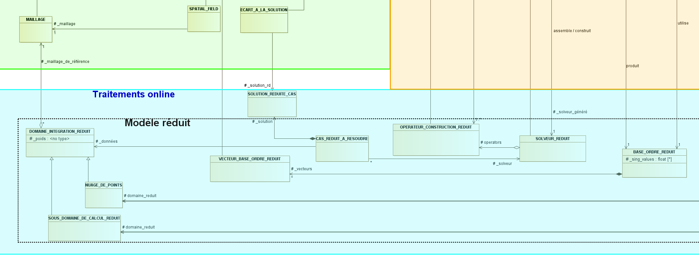

.. _class_diagram:

Dernière version en date du modèle de données
=============================================

Sous forme de diagramme de classe produit avec Modelio.

Le zip Modelio est téléchargeable au lien suivant :download:`zip <data/Mordicus_Datamodel.zip>`.

.. _reflabel-simu-processing:

Zoom sur la partie "pilote de données de simulation" (Hackathon 1)
------------------------------------------------------------------

Full notes about this are available here :download:`pdf <data/Notes_Modele_de_donnees.pdf>`.

There are 3 identified application for Mordicus library, namely:

   * model reduction: the number of unknown of the "fields to be reduced" has to be fixed from one field to another, because no SVD compression is possible on fields with variable sizes.

   * reconstruction from gappy data: in this case, the involved fields may not all have the same number of unknown.

   * inference from experimental data: the data structure must then allow for data not resulting from simulation to be treated.

Case data
~~~~~~~~~

**Case data** is the "business" description of the problem to be reduced. Most of the time, the "business" consists of modeling a physical phenomenon, so we may call it the *physical* description as well.

We distinguish between *case* and *raw* data.

**Raw data** designates the *mathematical* description of the problem. More concisely, it embraces every useful data to the "model reducer" user (that often does not know about the business rules who drove these equations) to apply a non-intrusive model order reduction method.

In a first guess, this raw data decomposes into:

   * unknowns;

   * equations to be solved;

   * definition domain (space - time - parameters)

Definition domain and discrete support
~~~~~~~~~~~~~~~~~~~~~~~~~~~~~~~~~~~~~~

The overall (again, space - time - parameters) *definition domain* is defined as cartesian product of *discrete supports*.

The space, time and parameter- *discrete supports* are instances of the same class. A 1D space mesh and a time discrete interval are represented by the same data structure, for instance. Nevertheless, this class contains a "type" attribute that indicates the quantity the discrete support relates to. There also exists a "tensorial product" attribute to represent derivate supports by cartesian products.

So we come to the notion of **discrete support**: it is a hierarchy of geometrical entities, starting at the lowest level (0-dimention objects) with *nodes* or *points*. Nodes are defined straight by their coordinates, whereas points take their definition from a higher-level entity: consider the center of a FV cell or a Gauss point (defined from a reference element) for instance.

It is enticing to define each entity exclusively from the next lower level: edges from nodes, faces from edges etc; thus forming a tree. But this would imply heavy and unnecessary information: there is seldom the need, for instance, to define all faces of the mesh in the model. The same holds for edges. But in both cases, the viewer has to be able to generate it upon request.

Therefore, we allow in the model entities to be defined with lower entities by several levels: a cube from 8 nodes for instance. There are then:

   * additional numbering conventions to generate the intermediate entities for non simplicial elements. These conventions indicate how intermediate elements (edges) should be generated

   * additional rules to be verified at this generation about the conformity of the element: a quadrilateral element should not cross itself, for instance.

Mesh topology may be completed with the definition of normals to the faces (2D space) or edges (1D space).

When an entity is defined hierarchically, the validity of the topology has to be checked from the lowest levels. Do these 4 edges represent a closed quadrilateral ?

When an entity is defined straight, the conformity of the intermediate generated elements has to be checked.

The overall mesh "conformity" (the intersection of two elements is always an entity) results from checking the topology of each element.

A *discrete support* should have the possibility to tag groups of entities.

A *discrete support* has to be considered as an aggregration of *DOF support*. A *DOF support* is a geometrical entity to associate with an unknown (a *DOF*) of the problem. In most cases, they are *nodes* (Finite Elements) or *points* (Finite Valumes), but not necessarily.

Requirement: indeed, we should not rule out associating *DOF* with edges or faces for particular discretization method (for instance, Nédélec elements often used in electromagnetics).

.. image:: images/ZOOM_pilote_donnees_simulation.png
   :scale: 60 %

Field and unknowns
~~~~~~~~~~~~~~~~~~

Then, we tried to define the notion of unknowns. Here are the first attempts:

    * Unknown = variable of a problem of given topological (geometrical) order

    * Unknown = tensor representing a physical quantity

Soon, we felt we needed to distinguish the notions of *unknowns* and *fields*.

We then tried to define the notion of unknowns. Herafter are the first attempts:

    * Field = distribution of a *quantity* over a discrete support

Requirement (in particular to support the "gappy data reconstruction" use case): a *field* must support variable number of components from one *DOF support* to another.

Requirement (to deal with FSI cases for instance): a *vector of unknowns* may host unknows with multiple units.

Finally, the following definitions were kept:

    * a *physical quantity* (or merely *quantity*) corresponds to a single unit, in the sense of the S.I

    * a *field*: values supported by a *discrete support*, most commonly on *nodes* or *points*. A *field* corresponds to a single *quantity*, that may be a tensor. May be from experimental or numerical origin, it is seldom the raw output of a simulation. All *points* on which the field bears a value (beware the case of missing data) have the same numer of components.

    * a *vector of unknowns*: it is the state vector :math:`X` (vector of discrete state variables) that the problem must determine. It is the primal output of the simulation. It can have unknowns of different units. In other words, it can have several *quantities*: displacement, pressure, Lagrange multipliers...

Alternative to define a *field*: something we can evaluate at any position inside the domain. It is an :math:`f (x)` basically.

Model
~~~~~

A model is a function of the parameters x time domain, that returns a *field*. Whereas it can call on variable meshes :math:`\Omega_X` internally (according to a parameter or time value), all finally produced fields must relate to a single "reference" mesh :math:`\Omega_0`. The transformation between the two is hidden inside the function.

Each *DOF* is associated with a entity of the discrete support but it is not necessarily the value *at* this entity.

Question: does the model return a *field* or a *vector of unknowns*? A snapshot is which of the two?

Snapshot
~~~~~~~~

A snapshot is a collection of input (parameter or time value)/ output (vector of unknown or field).

So we chose to support both kind of outputs (*field* or *vector of unknown*) for a snapshot.

Indeed, a snapshot is for building a basis of empirical modes :math:`\phi`. This basis will be used **somehow** to project the equations of the problem. There are two ways of projecting:

   * writing the projection in an integral form (intrusives or recoded approaches), or, to be more general, with a reduction method that demands to compute integrals:

.. math::

    \int_{\Omega} \phi_i A \phi_j d\Omega

Or:

    * writing the projection in the algebric form:

.. math::

   \phi^T A \phi

In the first case, the empirical basis in needed in the form of :math:`f(x)` *fields*, so that the integral forms can be written.

In the second case, the empirical basis in needed in the form of *vector of unknowns*, to have algebraic operations in line (from a dimension perspective) with that of the full problem.

In can happen that we have a model of one kind and a projection method of the other one. Then, we need to convert between the two. This is the issue of *field* / *vector of unknown* conversion

Field / vector of unknown conversion
~~~~~~~~~~~~~~~~~~~~~~~~~~~~~~~~~~~~

From *state variables* to *fields*
^^^^^^^^^^^^^^^^^^^^^^^^^^^^^^^^^^

As was said, a *vector of unknown* aggragates several *state variables* (displacement, multipliers), some of which may not have a spatial representation. A *state variable* may have a representation as a field by means of an *approximation space*, which itself relies on a *discrete support*.

Exemples of *approximation spaces*: polynomial spaces elementwise of Lagrange or Hermite finite elements

From *fields* to *state variables*
^^^^^^^^^^^^^^^^^^^^^^^^^^^^^^^^^^

Conversely, a *field* may have a representation as a *state variable* by means of an *interpolant* that defines a vector from operations (possibly integral) on the field values.

Each entry of the vector is associated with a *DOF support* via a *numbering system*. In general, a *DOF support* is constituted of a single *geometrical quantity*. Nevertheless, for some advanced kinds of discretizations (e.g. subparametric finite elements), it may be necessary to define a *DOF support* as combinations of geometrical entities to have univocal definition (ask Felipe Bordeu).

Open questions
~~~~~~~~~~~~~~

   * expand on the nature of parameters :math:`\mu \in \mathbb{R}^N`. What about a variable geometry?

   * can we say that a *vector of unknowns* aggregates fields ?

   * design of experiments that interacts with the reduced-order model: effect on the *indexing support* data structure?

Zoom over the "offline processing" part
---------------------------------------

To start identifying useful data to the offline part, we start identifying data from the "modelling data processing" that we need as an input.

Those are:

   * the *DISCRETE SUPPORT* (a generalization of mesh concept, see :ref:`reflabel-simu-processing`) 

   * the *PARAMETERS* (also called *VARIABLE DATA*) in the above

   * the *SNAPSHOTS*. As a reminder, each snapshot is a *field* with the (time, parameter) values as a qualifying information. A field being a simulation result with a discrete support in space.

   * the *OBSERVATIONS*. This data type is detailed below. It contain a *series*, which is an object with discrete support in time.

The *offline processing* part aims at producing a *reduced solver*, i.e. a data structure that contains "everything needed to run a reduced-order simulation for a new parameter value".

The *OBSERVATION* data type
~~~~~~~~~~~~~~~~~~~~~~~~~~~

The *OBSERVATION* data type aims at equally representing time signals from physical or "numerical" sensors. Each sensor has a *label* and may collect information of several kinds, each of which is described by a *physical quantity* type, the very same that is referred by *field* objects (:ref:`reflabel-simu-processing`). 

A *physical quantity* has attributes:

   - label (``str``) : should be explicit of the nature of the quantity, for instance "displacement", "velocity" etc. A list of those may be provided straight from other norms (CGNS) or systems of measurements. One can never be exhaustive, so the user should still be able to provide a value not in a closed list.

   - unit (``str``) : tells in what unit data is expected to be provided. Idem: adopt a system of measurement (SI, LH...) of one or the other norm.

   - tensor order (``int``) : it is the order of the provided tensor values. 0 for scalars, 1 for vectors, 2 for matrices etc. Not to be confused with the number of components in each direction, that most of the times depends on the order of the underlying space.

While the type of each signal is given by a *physical quantity* object, the values are enclosed by a *series* object that references a *dicrete support* in time.

Besides, each *observation* relates to a *localisation* of the sensor on the spatial *discrete support*. It may (seldomly) be a punctual value, more often is it given by an integral over a subdomain, or a linear form from nodal values. 

Hereafter is a class diagram summarizing this section:

As was mentioned in Hackathon 1, the offline process decomposes into a *generation of the reduced basis* phase and an *operator compression* phase.

For the sake of generality (there are methods were no reduced basis if generated, though they were disregarded in Hackathons so far), we talk about *data compression* phase rather than *generation of the reduced basis*.

Data compression phase
~~~~~~~~~~~~~~~~~~~~~~

As said before, the *data compression* phase aims at producing a reduced-order basis, or any intermediate mathematical object necessary to apply operator compression.

.. note:: in this respect, do not forget the oblique projection case (Petrov-Galerkin) in the data model. There are then 2 reduced-order bases.

The treatment workflow for this phase may be concisely represented by the following diagram:

A few comments:

   - 1rst step: consists of comparing discrete supports of all provided results, and bringing them all down to the same if not already the case. This is not always possible (and an area of research on its own). But there are two common cases:

       * when meshes are *topologically identical* one with another. Then a *mapping* exists (this concept is to be developed further, has it to be defined by the user ? one minimal requirement is that two nodes mapped onto each other have the same unknown number) to bring all results down to the same mesh. This case commonly happens in the study of forming processes.

       * when a *projection operator* onto a unique reference mesh is provided by the user alongside with each result. This may be the case in advanced application (e.g. FSI)

   - 2nd step: a matrix is generated from fields :math:`\mathbf{u}`. One of:

       * the quadrangular snapshot matrix :math:`Q`

       * the square autocorrelation matrix :math:`A`

Note that the autocorrelation matrix :math:`A` may also be built from :math:`Q`, either:

       * alongside space-state dimension as :math:`Q^T M Q` (*classical method*) 
     
       * or alongside time-parameter-state dimension as :math:`Q Q^T` (*method of snapshots*).

   - 3rd step: the reduced basis is generated from :math:`Q` with a complete SVD and basis truncation, or an incomplete SVD. From :math:`A`, it is computed by means of the eigenvalues :math:`\lambda_i` and vectors :math:`\mathbf{\xi}_i` and the results :math:`\mathbf{u}` according to :math:`\mathbf{\phi}_i (\mathbf{x}) = \dfrac{1}{\sqrt{\lambda_i}} \sum_{n=1}^{N_s} \xi_{i,n} \mathbf{u}_n (\mathbf{x})`, cf [Lorenzi16]_.

.. [Lorenzi16] S. Lorenzi, G. Rozza et al, POD-Galerkin Method for Finite Volume Approximation of Navier-Stokes and RANS equations, Computer Methods in Applied Mechanics and Engineering, (2016).

The data model for this phase should also take into account the greedy selection algos, where the basis is iteratively enriched with a new element if a criterion is fulfilled. Most of the time, an incremental SVD is involved.

The user options for the *data compression* part are listed below:

   * method to determine the reduced basis size:

      - fixed (enter an N)

      - tolerance for a complete SVD :math:`\left| \dfrac{\sum_{k=n}^{N_s} \sigma_k}{\sum_{k=1}^{N_s} \sigma_k} \right| < TOL`

      - tolerance for an incomplete SVD :math:`\left| \dfrac{\sigma_N}{\sigma_1} \right| < TOL`

   * method

   * matrix defining the scalar product

   * if POD method, classical or snapshots methods?

   * if incremental method, the criterion to enrich the basis or not

Operator compression part
~~~~~~~~~~~~~~~~~~~~~~~~~

Discussion about the datamodel for methods implying an operator decomposition of the form:

:math:`A(\mu) = A_1 f_1 (\mu) + A_2 f_2 (\mu) + ... + A_n f_n (\mu)`

Of course affine decomposition of the operators falls into that case.

Notably, this kind of data structure is produced by an EIM. 

A object *separation of variables* hosts the information for such a decomposition. It consists of an ordered list of *operator constructor* and *function of parameter*. An *operator constructor* is a means to build the :math:`A_i`, with possible invokation of FEM or FV asemblers. A *function of parameter*, is a means to compute :math:`f_i (\mu)`. It may be explicit (an analytical formula) of implicit via the invokation of an abstract function evaluation. 

The problematic of an standard for an abstract function evaluation is close to the FMI/FMU standard.

.. todo:: the datamodel for other compression algos as the EIM remain to be defined more in details.

Quality indicators
~~~~~~~~~~~~~~~~~~

Quality indicators may be separated into:

   - *diagnosis* : it is a verification step internal to reduction algorithms aimed at checking their internal implementation

   - *verification* : aimed at controlling that the implemented reduced-order representation is governed by the equations we think it is

   - *validation*: compares the reduced-order representation with an external reference. This includes the special case of comparison with the full-order model.

.. todo:: examples for each

For the latter case, the reduced-order results should come out under a format that the target external comparison tool can operate. The target Quantity of Interest for comparison should be easily accessible from the reduced-order result.

Summary class diagram for the offline part
~~~~~~~~~~~~~~~~~~~~~~~~~~~~~~~~~~~~~~~~~~

Zoom sur la partie "traitements online"
---------------------------------------

Z-set initial guess
~~~~~~~~~~~~~~~~~~~

Actuellement dans Z-set, un modèle d'ordre réduit c'est:

    - un nombre de dof

    - un vecteur de poids par dof

    - une matrice de modes empiriques

    - une matrice de covariance issu de la phase d'apprentissage offline (version incrémentale)

    - la discrétisation temporelle de la dernière simulation online

    - la matrice des coordonnées réduites de la dernière simulation online

    - la nature de la base orthogonale ou non

Annexes
=======

Travail préparatoire Safran
---------------------------

Safran sketch of a data model can be found here :download:`pdf <data/ROMDataModel.pdf>` or :download:`pptx <data/ROMDataModel.pptx>`.

Anciennes versions
------------------

Les anciennes versions sont conservées pour mémoire au lien suivant:

.. toctree::
    :maxdepth: 1

    old_class_diagrams
