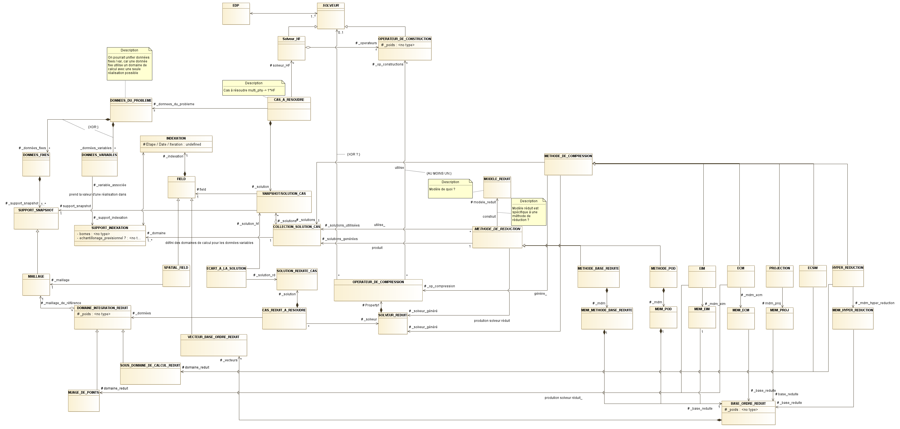

.. _old_class_diagrams:

Diagrammes de classe par séance de travail
==========================================

Diagramme de classe 1
---------------------

Fait en séance le 19/04/2018:

.. uml:: diagrams/class_diagram_1.uml

Diagramme de classe 2
---------------------

Fait en séance le 31/05/2018:

.. image:: images/class_diagram_2.png

Retranscription "légère":

.. image:: images/class_diagram_3.png

Archive contenant les sources modelio :download:`archive zip <data/Mordicus_Datamodel_old.zip>`.

Diagramme de classe 3
---------------------

Fait en séance le 28/06/2018:

Comparaisons plantuml/Modelio
=============================

.. warning:: 

   Ce qui suit a pour seul but d'illustrer que pour les grands diagrammes, Modelio est plus approprié que plantuml. En effet, on voit que les diagrammes ci-dessous faits avec plantuml sont difficilement lisibles.

Le diagramme fait en séance le 31/05/2018, avec plantuml:

.. uml:: diagrams/class_diagram_2.uml

Une tentative de fusion entre les diagrammes du 31/05/2018 et du 19/04/2018, avec plantuml:

.. uml:: diagrams/class_diagram_3.uml
